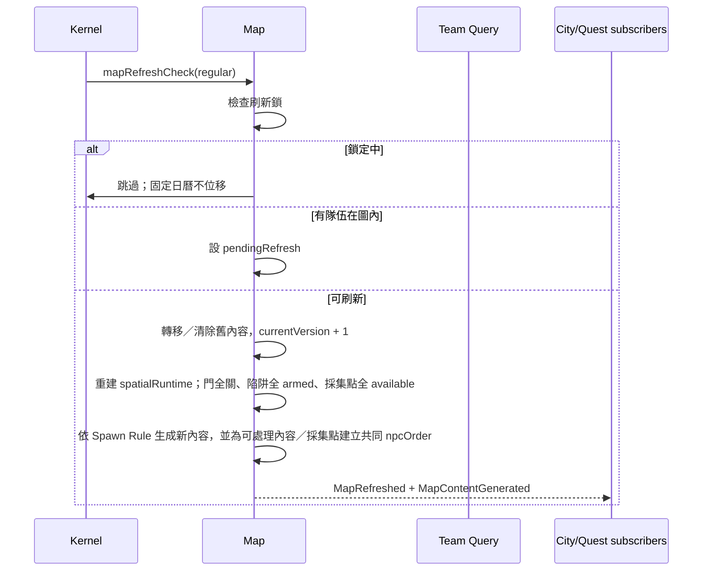

# Map 模組契約

> **模組 ID：** `map`
>
> **依賴：** [共用核心契約](00_shared_contracts.md)、Team Presence Query、World Query。
>
> **責任：** 管理可探索地圖的固定模板引用、本局版本、動態內容、刷新、Pending、刷新鎖與 NPC 可讀的內容序列。Map 不擁有隊伍位置、文化控制、委託狀態、背包、熟練度或戰鬥。

---

## 1. 邊界與所有權

### 1.1 Map 唯一可寫的 State

```ts
type MapState = {
  instances: Record<MapInstanceId, MapInstance>;
  contents: Record<ContentInstanceId, MapContentInstance>;
  contentIdsByMap: Record<MapInstanceId, ContentInstanceId[]>;
};
```

Map 不保存隊伍位置或隊伍名單。刷新時「是否有人在圖內」由 `TeamPresenceQuery` 唯讀查詢；隊伍離圖事件只用來觸發 Pending 的次日檢查，不能讓 Map 維護另一份位置真相。

### 1.2 Map 不擁有的事

| 事實 | 所有者 | Map 只做什麼 |
|---|---|---|
| 哪支隊伍在何處 | team | 用 Query 判斷地圖目前是否有人。 |
| 誰接了何種委託、是否到期 | quest | 收到保留／鎖定要求時更新地圖內容或刷新鎖。 |
| 道具最後歸誰 | inventory | 在刷新／內容處理後發出內容結果，不轉移背包。 |
| NPC 地牢的骰定進度 | dungeon | 提供有序內容查詢，並在結算要求到達時驗證與套用。 |
| 戰鬥是否勝利 | combat | 接收已確定的內容處理要求。 |
| 地點原生文化、目前控制國與人類敵人文化 | world | 刷新生成時透過 `WorldQuery` 取得，不保存副本。 |
| 採集者、產物種類／數量與採集 MXP | gathering workflow／progression | 保存固定節點與可採狀態；只接受已驗證的採集 Resolution。 |

---

## 2. 靜態資料契約

### 2.1 MapTemplateDefinition

`MapTemplateDefinition` 只描述不隨本局改變的空間結構，不包含本局怪物、寶箱或事件。

```ts
type MapTemplateDefinition = DefinitionHeader & {
  kind: 'outdoor' | 'interior';
  nationalDungeonForm?: 'outdoor' | 'subterranean' | 'building';
  refreshOffsetDays: number;       // 0..13
  floors: FloorDefinition[];
  rooms: RoomDefinition[];
  links: RoomLinkDefinition[];
  fixedTraps: FixedTrapDefinition[];
  gatheringNodes: GatheringNodeDefinition[];
  entranceRoomIds: RoomId[];
  exitRoomIds: RoomId[];           // 合計 1..3
  spawnRuleId: MapSpawnRuleId;
  explorationExperienceRuleId: ExperienceAwardRuleId;
};

type RoomLinkDefinition = {
  linkId: RoomLinkId;
  fromRoomId: RoomId;
  toRoomId: RoomId;
  fromCell: GridCell;
  toCell: GridCell;
  kind: 'passage' | 'redDoor';
  guardedPreferenceKinds?: Array<'chest' | 'event' | 'largeEnemy'>;
};

type FixedTrapDefinition = {
  trapId: FixedTrapId;
  roomId: RoomId;
  cell: GridCell;
  trapDefinitionId: TrapDefinitionId;
};

type GatheringNodeDefinition = {
  nodeId: GatheringNodeId;
  roomId: RoomId;
  cell: GridCell;
  gatheringRuleId: GatheringRuleId;
};
```

Map Schema／Rule Validation 必須驗證：

- `RoomId`、`RoomLinkId`、`FixedTrapId`、`GatheringNodeId` 都是 `TemplateLocalId`：只需在同一 `MapTemplateDefinition` 內唯一，必須由資料作者指定，禁止交給 Runtime ID Generator；Runtime Map State 以 `mapId + localId` 定位。
- 一般野外固定單層 8×8；一般內部圖每層為 4×4 或 5×5，上下層數由模板決定。
- 國家迷宮野外型固定單層 10×10。
- 國家迷宮地牢型每層固定 6×6，最多地上 1 層、地下 5 層。
- 國家迷宮建築型每層固定 6×6，最多地上 4 層、地下 2 層。
- `nationalDungeonForm` 存在時必須與 World 的 Adventure Site 標記相符；`outdoor` form 只能搭配 `kind: outdoor`，其餘兩種只能搭配 `kind: interior`。
- 房間可為 L、T、凹形等多格形狀；合併房間是一個移動節點。
- 通道與紅門只可連接合法房間；無連結的房間不可通行。
- 紅門是固定探索成本；每扇紅門至少一側房間應具有寶箱、事件或大型體型敵人的內容偏好。`guardedPreferenceKinds` 只供 Template／內容驗證與配置檢視使用，不保證本次刷新一定生成該內容。
- 上下樓梯使用相同的列、行座標。
- 入口、出口、樓梯與固定陷阱皆是互斥的 1×1 功能房間，且不得成為內容生成位置。
- 大型敵人偏好房間至少 2×2；事件偏好房間至少由兩格構成。
- 採集點位置與資源 Rule 是 Template 固定資料；採集點不得與入口、出口、樓梯、固定陷阱或其他互斥功能格重疊。
- 採集點本身占用一個房間的唯一內容槽：同一房間至多一個採集點，且不得再生成怪物群、Boss、寶箱、救援人物或其他 Map Content。`cell` 只負責圖示與小地圖對齊，不建立房內移動節點。

### 2.2 MapSpawnRuleDefinition

```ts
type MapSpawnRuleDefinition = DefinitionHeader & {
  localCultureContentRuleId: CultureContentRuleId;
  humanCultureContentRuleId: CultureContentRuleId;
  chestPoolId: ChestPoolId;
  mapEventPoolId: MapEventPoolId;
  spawnBudgets: SpawnBudgetDefinition[];
  npcSequenceRuleId: NpcSequenceRuleId;
};
```

- 非人類怪物與當地物品依所在地文化讀取。
- 人類敵人依目前佔領國文化讀取。
- 生成表只決定候選池、數量與偏好格規則；本局 RNG 結果屬 Runtime State。
- NPC 序列規則必須由資料指定，不能由地圖檔案名稱或程式特例推論；啟用 NPC Policy 的固定採集點與動態 Map Content 一起取得唯一 `npcOrder`。

### 2.3 MapDefinitionReader

```ts
interface MapDefinitionReader {
  getMapTemplate(id: MapTemplateId): MapTemplateDefinition;
  getMapSpawnRule(id: MapSpawnRuleId): MapSpawnRuleDefinition;
  getNpcSequenceRule(id: NpcSequenceRuleId): NpcSequenceRuleDefinition;
  getContentDefinition(id: DefinitionId): MapContentDefinition;
  getGatheringMapView(id: GatheringRuleId): {
    ruleId: GatheringRuleId;
    npcPolicy?:
      | { eligible: false }
      | { eligible: true; pointCost: number; resolverId: ResolverId };
  };
}
```

Map 不讀取道具、委託、採集產物或隊伍的完整資料；需要的內容標頭與 Gathering NPC 窄化 View 由資料編譯器提供。地點文化、對應城市與目前控制國由 `WorldQuery` 依 `adventureSiteId` 提供。

---

## 3. Runtime State

### 3.1 MapInstance

```ts
type MapInstance = {
  mapId: MapInstanceId;
  adventureSiteId: AdventureSiteId;
  templateId: MapTemplateId;
  currentVersion: number;

  refresh: {
    offsetDays: number;                 // 與 Template 一致；存檔用於驗證
    pendingSinceDay?: WorldDay;
    pendingCheckScheduledFor?: WorldDay;  // 亦為 pending mapRefreshCheck 的存活判定（見下）
    refreshLock?: RefreshLock;
    lastRefreshedOnDay?: WorldDay;
  };

  // pending `mapRefreshCheck` 的過期判定用 `refresh.pendingCheckScheduledFor`（Job 的 dueDay 須與它相符），
  // **不是** `MapInstance.revision`：後者被開門、陷阱、採集、內容結算等一般探索動作 bump，拿它當判定會讓
  // 排好的次日檢查被一扇門永久作廢，而且 no-op 路徑不會再排下一次，地圖從此不再刷新（複審 R9 #2）。
  // pendingCheckScheduledFor 只由 Pending 登記與刷新本身改動，因此同時仍能擋掉同日重複 Job（首筆刷新會把它
  // 清成 undefined、順延則改成新的一天，後續舊 Job 兩種都對不上）。regular（固定節奏）Job 不受此限。

  spatialRuntime: MapSpatialRuntime;
  revision: Revision;
};

type RefreshLock = {
  lockId: MapRefreshLockId;
  reason: 'suppression' | 'hunt';
  releaseOnDay: WorldDay;
  sourceQuestId: QuestId;
};

type MapSpatialRuntime = {
  mapVersion: number;
  doorStates: Record<RoomLinkId, DoorRuntimeState>;
  trapStates: Record<FixedTrapId, TrapRuntimeState>;
  gatheringNodeStates: Record<GatheringNodeId, GatheringNodeRuntimeState>;
};

type DoorRuntimeState = {
  linkId: RoomLinkId;
  mapVersion: number;
  state: 'closed' | 'open';
  openedOnDungeonMinute?: DungeonMinute;
  revision: Revision;
};

type TrapRuntimeState = {
  trapId: FixedTrapId;
  mapVersion: number;
  state: 'armed' | 'triggered' | 'disarmed';
  resolvedOnDungeonMinute?: DungeonMinute;
  revision: Revision;
};

type GatheringNodeRuntimeState = {
  nodeId: GatheringNodeId;
  mapVersion: number;
  state: 'available' | 'harvested';
  npcOrder?: number;
  npcPointCost?: number;
  npcResolverId?: ResolverId;
  harvestResolutionId?: GatheringResolutionId;
  harvestedByTeamId?: TeamId;
  harvestedOnDay?: WorldDay;
  harvestedOnDungeonMinute?: DungeonMinute;
  revision: Revision;
};
```

`currentVersion` 每次正式刷新後遞增。所有本局動態內容都必須記錄自己生成於哪個 Map Version。

`spatialRuntime` 是本次 Map Version 的可變空間狀態，不是玩家記憶：

- 每次正式刷新都以新 `currentVersion` 重建；所有紅門回到 `closed`，所有固定陷阱回到 `armed`。
- 同一版本內，紅門一旦成為 `open` 就不會重新關閉，也不會再次收取開門成本。
- 同一版本內，陷阱一旦成為 `triggered` 或 `disarmed` 就不會再次觸發。
- 同一版本內，每個採集點只可採集一次；正式刷新時依 Template 全部還原為 `available`。
- 採集點的精確產物不預先建立成 Item Instance；成功採集時才由 Gathering Workflow 解析並要求 Inventory 建立。
- 玩家永久看過哪些房間、門、陷阱與固定採集點不在 Map State；那是 Dungeon 的玩家探索知識／Template Projection，刷新不得清除。

空間狀態必須符合：

1. `spatialRuntime.mapVersion === currentVersion`。
2. `doorStates` 恰好對應模板內全部 `kind: redDoor` 的連線；一般通道不得建立 Door State。
3. `trapStates` 恰好對應模板內全部 `fixedTraps`。
4. `gatheringNodeStates` 恰好對應模板內全部 `gatheringNodes`；available 節點不得有 harvest 欄位，harvested 節點必須有唯一 `harvestResolutionId` 與 `harvestedByTeamId`。只有 Rule 啟用 NPC Policy 的節點能帶 `npcOrder`、`npcPointCost`、`npcResolverId`，三欄必須同時存在。
5. 刷新只能重建 Runtime 狀態，不能修改 Map Template，也不能要求 Dungeon 清除玩家探索知識。

### 3.2 MapContentInstance

```ts
type MapContentInstance = {
  contentId: ContentInstanceId;
  mapId: MapInstanceId;
  mapVersion: number;
  kind: 'monsterGroup' | 'chest' | 'mapEvent' | 'kidnap' | 'control' | 'boss';
  definitionId: DefinitionId;
  position: MapPosition;
  payload: MapContentPayload;

  npcOrder?: number;
  npcPointCost?: number;
  npcResolverId?: ResolverId;

  state: 'available' | 'resolved' | 'removedByRefresh';
  protectedByQuestIds: QuestId[];
  resolvedOnDay?: WorldDay;
  revision: Revision;
};

type MapContentPayload =
  | { kind: 'monsterGroup' | 'boss'; encounterGroupId: EncounterGroupDefinitionId }
  | { kind: 'chest'; itemIds: ItemInstanceId[] }
  | { kind: 'mapEvent'; contentEventDefinitionId: ContentEventDefinitionId }
  | { kind: 'kidnap'; captiveArchetypeId: CharacterArchetypeId; controllerContentIds: ContentInstanceId[] }
  | { kind: 'control'; controllerContentIds: ContentInstanceId[] };
```

### 3.3 內容不變量

1. `mapVersion` 必須等於所屬 MapInstance 的現行版本，除非內容已標記 `removedByRefresh` 作為歷史紀錄。
2. `position` 必須存在於模板且符合該內容的偏好／限制規則。
3. 同一張圖、同一版本、同一房間至多一筆 Map Content；房間是移動與內容單位，不因形狀占用多個小格而增加內容槽。
4. 同一張圖、同一版本的可 NPC 處理動態內容與採集點共用一條序列，所有 `npcOrder` 不可重複。
5. `npcPointCost` 必須大於 0；小怪／寶箱通常為 1、菁英為 2、大怪為 4，事件由 Definition 明確指定。
6. `resolved` 的內容不可再次被玩家、戰鬥或 NPC 結算。
7. 有 `protectedByQuestIds` 的內容不得因一般刷新移除；保護解除後才可於後續刷新清除。
8. `payload.kind` 必須與外層 `kind` 相容；Chest 的 Item ID 必須指向 Inventory 中 `location: mapContent(contentId)` 的 active 實體。
9. Map Content 不得配置到被固定採集點保留的房間。

---

## 4. 公開 Query

```ts
interface MapQuery {
  getMapInstance(mapId: MapInstanceId): MapInstanceView;
  getMapSpatialSnapshot(mapId: MapInstanceId): MapSpatialSnapshotView;
  getContent(contentId: ContentInstanceId): MapContentView | undefined;
  listAvailableContent(mapId: MapInstanceId): MapContentView[];
  listNpcSequence(mapId: MapInstanceId): NpcSequenceEntryView[];
  getDoorState(mapId: MapInstanceId, linkId: RoomLinkId): DoorRuntimeStateView;
  getTrapState(mapId: MapInstanceId, trapId: FixedTrapId): TrapRuntimeStateView;
  getGatheringNodeState(mapId: MapInstanceId, nodeId: GatheringNodeId): GatheringNodeRuntimeStateView;
  listAvailableGatheringNodes(mapId: MapInstanceId): GatheringNodeRuntimeStateView[];
  isContentAvailable(contentId: ContentInstanceId): boolean;
  isRefreshLocked(mapId: MapInstanceId, onDay: WorldDay): boolean;
}

interface TeamPresenceQuery {
  countTeamsInside(mapId: MapInstanceId): number;
  isTeamInside(mapId: MapInstanceId, teamId: TeamId): boolean;
}
```

```ts
type NpcSequenceEntryView =
  | {
      kind: 'mapContent';
      npcOrder: number;
      pointCost: number;
      resolverId: ResolverId;
      contentId: ContentInstanceId;
    }
  | {
      kind: 'gatheringNode';
      npcOrder: number;
      pointCost: number;
      resolverId: ResolverId;
      nodeId: GatheringNodeId;
      gatheringRuleId: GatheringRuleId;
      mapVersion: number;
    };
```

`listNpcSequence` 僅公開 NPC 可處理且按 `npcOrder` 排序的內容與採集點。Gathering Rule 若未啟用 NPC Policy，該節點不進入序列；Query 不公開玩家小地圖、未發現狀態或內部生成 RNG。

---

## 5. 輸入契約

### 5.1 ScheduledJob

| Job | 處理條件 | 成功結果 |
|---|---|---|
| `mapRefreshCheck(reason: regular)` | 當日符合該圖固定 14 日節奏。 | 刷新、標記 Pending，或因鎖定跳過。 |
| `mapRefreshCheck(reason: pending)` | 此前已登記 Pending 次日檢查。 | 無人且未鎖定時刷新；否則保留 Pending 並重排。 |

### 5.2 Internal Command

| Internal Command | Map 的反應 |
|---|---|
| `SetMapRefreshLock` | 為鎮壓／討伐建立或解除 41 日刷新鎖。 |
| `ProtectMapContent` | 依 `mode: protect / release` 更新指定 Quest 的內容保護。 |
| `ResolvePlayerMapContent` | 驗證玩家已合法處理指定內容與 `distributionId`，正式改變內容狀態。 |
| `ApplyNpcDungeonSettlement` | 對暫存結果與 `distributionId` 做原子驗證，正式套用仍有效的內容處理結果。 |
| `OpenMapDoor` | 驗證命令來源、Map Version、連線確為紅門且仍關閉後，將該門設為本版本永久開啟。玩家 Session 合法性由 Dungeon 先驗證；已開啟時 Map 冪等成功。 |
| `ResolveMapTrap` | 驗證 Map Version 與陷阱仍為 armed，將其設為 triggered 或 disarmed；對應效果由同一探索 Workflow 原子套用。 |
| `HarvestMapGatheringNode` | 驗證 Map Version、節點仍 available、Team 確實位於圖內且 `resolutionId` 未使用後，標記 harvested；產物 Item 由同一 Gathering Workflow 建立。 |

上述命令均有唯一 Map Handler，可以因版本、狀態或引用失效而拒絕。發送者必須將需要成功的命令標記為交易必要步驟。

### 5.3 訂閱 DomainEvent

| Event | Map 的反應 |
|---|---|
| `TeamLocationChanged` | 若隊伍離開 Pending 地圖且 `TeamPresenceQuery` 顯示已無人，登記**次日** Pending 檢查。 |

Map 不直接接收「玩家進入地圖」Command；進出地圖是 team 的位置與大動作責任。

---

## 6. 輸出事件

| Event | 最少 payload | 意義 |
|---|---|---|
| `MapRefreshed` | `mapId`、`oldVersion`、`newVersion` | 一次新版本已建立。 |
| `MapContentGenerated` | `mapId`、`mapVersion`、`contentIds` | 新怪群、寶箱、事件等世界事實已存在。 |
| `MapContentResolved` | `mapId`、`contentId`、`distributionId?`、`resolver`、`resolution` | 一筆內容正式被處理；玩家地牢來源必須附目前 Distribution。 |
| `MapRefreshPendingRegistered` | `mapId`、`checkDay` | Pending 已排到下一日，不代表已刷新。 |
| `NpcDungeonSettlementApplied` | `runId`、`distributionId`、`appliedResults`、`skippedResults` | NPC 暫存結果經地圖驗證後的實際結果。 |
| `MapRefreshLockChanged` | `mapId`、`lock?` | 刷新鎖建立或解除。 |
| `MapDoorOpened` | `mapId`、`mapVersion`、`linkId` | 紅門已在本版本開啟；後續通行不再支付開門成本。 |
| `MapTrapResolved` | `mapId`、`mapVersion`、`trapId`、`resolution` | 固定陷阱已在本版本觸發或解除，不得再次觸發。 |
| `MapGatheringNodeHarvested` | `mapId`、`mapVersion`、`nodeId`、`teamId`、`resolutionId` | 固定採集點已在本版本消耗；不代表 Item 已由 Map 建立。 |

`skippedResults` 用於處理 NPC 暫存期間內容已被玩家或其他結算處理的情況。第一版不做內容預約或 NPC 與玩家即時遭遇；正式結算時仍可用的內容才會被套用。

固定採集點不是 `MapContentInstance`，因此不包含在 `MapContentGenerated.contentIds`；其存在由 Template 決定、當前可用狀態由 `MapSpatialRuntime.gatheringNodeStates` 決定。

Map 只確認內容處理結果並發出上述事件，不直接決定物品去向。Player Content／NPC Settlement Workflow 依事件中已驗證的 `resolution` 建立結果：

- 一般戰利品送 `CreateItemInstance(location=assetDistributionEscrow)`／`TransferItem`，再把實際 Item ID 追加至對應 Distribution。
- 已接取 Purchase／Delivery／Exploration Quest 的精確指定品由 Quest Item Workflow 優先送 `MoveItemToTeamQuestCargo`，不得加入一般戰利品 Distribution。

`ItemInstanceCreated`／`InventoryTransferred` 才是實體 ID 與位置完成的事實。Map 不解讀物品屬性或任務期限，也不直接建立 ItemInstance。任一必要物品命令或 Distribution／Quest Cargo 追加失敗時，整筆內容處理交易回滾，連 Map Content 的 resolved 變更也不提交。

---

## 7. 核心流程

### 7.1 固定刷新



未被處理的非卷軸道具移入城市永久庫存時，Map 在同一刷新交易送出 `TransferItem` Internal Command；Inventory 成功移轉後發出 `InventoryTransferred`。Map 不直接寫 City 或 Inventory State。

### 7.2 Pending 次日檢查

```text
固定刷新日有人 → pendingRefresh = true
最後一隊離開 → 登記 dueDay = currentDay + 1 的 pending Job
次日：
  無人 + 無鎖 → 刷新並清除 Pending
  否則       → 保留 Pending，再登記下一日檢查
```

固定 14 日節奏永遠依 `refreshOffsetDays` 推導；Pending 成功刷新不會改寫下一個固定刷新日。

### 7.3 NPC 地牢結算要求

1. dungeon 送出 `ApplyNpcDungeonSettlement` Internal Command，包含 Run ID、Map ID、Map Version、Distribution ID 與暫存結果。
2. Map 逐筆檢查：Map Version 是否仍匹配、目標是否仍 `available`、目標類型是否仍可被該 Resolver 處理。
3. 合法結果依 `npcOrder` 順序套用；失效結果寫入 `skippedResults`。
4. 內容結果改寫 Map Content；採集結果則以其 `GatheringResolutionId` 改寫對應 Node State。
5. Map 發出 `NpcDungeonSettlementApplied`。
6. inventory、progression、quest 只根據 `appliedResults` 建立戰利品、發給 MXP 或更新任務；實際建立的 Item ID 與貨幣結果追加到該 Run 的 Distribution。採集只有在 Node Result 確實 applied 後才可送 `GrantGatheringMasteryExperience`（並由各擁有模組發出其事件）。

---

## 8. 測試 Fixture 與驗收

Map 模組最低必須提供：

1. 一張有固定偏移、無鎖定的最小地圖。
2. 一張有紅門、樓梯、多格房間與特殊房間限制的模板驗證 Fixture。
3. 一張包含小怪、菁英、大怪、寶箱與事件的 NPC 序列 Fixture。
4. Pending 地圖在最後隊伍離開後，**不於當日刷新、而於次日刷新**的測試。
5. 鎮壓／討伐 41 日鎖定跨過多個固定刷新日、不累積補刷的測試。
6. NPC 暫存結果與玩家先處理同一內容時，僅套用仍有效結果的測試。
7. 同一版本的紅門開啟後不再收費，刷新後重新關閉的測試。
8. 同一版本的陷阱觸發後不再觸發，刷新後重新 armed 的測試。
9. Map 刷新只重建 `spatialRuntime`，不得刪除 Dungeon 保存的玩家探索知識。
10. 採集點房間不生成其他內容、同版本只可成功採集一次，刷新後恢復 available 的測試。
11. 玩家與 NPC 同時指向同一採集點時，只接受第一筆合法 Resolution；另一筆進入 skipped／rejected 且不產生物品的測試。
12. 多格房間仍只有一個內容槽，且動態內容與 NPC-enabled 採集點的 `npcOrder` 全域不重複測試。

---

## 9. Map 模組交接清單

- [ ] `MapState`、`MapInstance`、`MapSpatialRuntime`、`GatheringNodeRuntimeState`、`MapContentInstance` Schema。
- [ ] Map Template、Spawn Rule、Sequence Rule JSON Schema。
- [ ] `MapDefinitionReader` 與 `MapQuery`。
- [ ] 固定刷新／Pending／刷新鎖 Job Handler。
- [ ] 內容生成、採集點保留／刷新／消耗、正式處理與 NPC 結算驗證。
- [ ] Map Internal Command Handler 與跨模組事件註冊。
- [ ] Fixture、資料驗證與快轉一致性測試。
