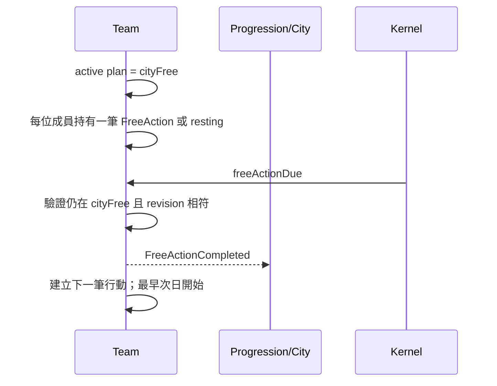

# Team 模組契約

> **模組 ID：** `team`
>
> **依賴：** [共用核心契約](00_shared_contracts.md)、Map／World／City／Character／Progression 的公開 Query。
>
> **責任：** 管理玩家與非玩家冒險者隊伍的成員歸屬、位置、戰鬥配置、大動作、城鎮自由活動與個人自由行動。所有隊伍使用同一套資料模型；玩家由 UI Command 發起行動，NPC 的意圖與動作串則由 [NPC Behavior](18_npc_behavior_module.md) 模組決定，Team 只執行已驗證的節點。

---

## 1. 邊界與所有權

### 1.1 Team 唯一可寫的 State

```ts
type TeamState = {
  playerTeamId: TeamId;
  teams: Record<TeamId, Team>;
  plans: Record<TeamPlanId, TeamPlan>;
  freeActions: Record<FreeActionId, MemberFreeAction>;
  recentActivities: Record<CharacterId, RecentAdventurerActivity[]>;
  pendingTravelInteractions: Record<InteractionId, PendingPlayerTravelInteraction>;
  pendingSuccession?: PendingSuccession;
  memberRetention: Record<TeamId, TeamMemberRetentionState>;
  combatFormations: Record<TeamId, TeamCombatFormation>;
};
```

Team 擁有「誰是隊友、隊伍此刻在哪、下次戰鬥採用哪份配置、隊伍正在做什麼、成員在城鎮自由時間做什麼」。

Team 永遠只是行動共同體：一般金錢、背包、裝備與住家物品全部屬個別 Character；招募、轉隊與解雇不得移轉這些個人資產。唯一帶 TeamId 的物品空間是 Inventory 擁有的 `teamQuestCargo` 任務託管區，它也不構成隊伍所有權。

### 1.2 Team 不擁有的事

| 事實 | 所有者 | Team 只做什麼 |
|---|---|---|
| 角色姓名、年齡、死亡、家族、基礎身分 | character | 持有 `CharacterId` 成員引用。 |
| 主屬、熟練度、技能與 MXP | progression | 在自由行動完成時發出結果，不自己加數值。 |
| 背包與實體物品 | inventory | 不直接改動任何個人物品；只引用特殊 `teamQuestCargo`。 |
| 個人帳戶與金錢 | economy | Team 不可成為 Account Owner，不保存餘額或自行扣款。 |
| 城市建築、教師與商店 | city | 透過 Query 驗證行動是否有合法場所。 |
| 城市、路線與通行狀態 | world | 透過 Query 驗證旅行目的地與路線。 |
| 地圖內容、刷新與 Pending | map | 透過位置事件讓 map 知道隊伍進出。 |
| NPC 地牢的 10 點處理與暫存結果 | dungeon | 以 TeamPlan 連結到 `NpcDungeonRunId`。 |
| 戰鬥 Runtime 站位、自動補位與戰鬥結果 | combat | 提供遭遇開始時的配置快照；接收隊伍可否繼續行動的結論。 |

Team 只引用 Character 的公開 ID 與 Query，不能把角色身分或生命週期資料偷塞進 Team State。

Team 也擁有所有隊伍共通的「成員留隊週期」：它只保存入隊日與依指定來源事件累計的工作淨收益，不擁有角色帳戶、物品實體或價格。這套機制同時適用玩家隊伍與 NPC 隊伍；NPC Behavior 只決定何時要開始下一段自由活動。

---

## 2. 靜態資料契約

### 2.1 TeamDefinitionReader

```ts
interface TeamDefinitionReader {
  getPlayerTravelMode(id: TravelModeId): PlayerTravelModeDefinition;
  getNpcTravelRule(id: NpcTravelRuleId): NpcTravelRuleDefinition;
  getFreeActionRule(id: FreeActionRuleId): FreeActionRuleDefinition;
  getTeamPlanRule(id: TeamPlanRuleId): TeamPlanRuleDefinition;
  getRecentActivityRule(id: RecentActivityRuleId): RecentActivityRuleDefinition;
  getMemberRetentionRule(id: MemberRetentionRuleId): MemberRetentionRuleDefinition;
  getRecruitmentRule(id: RecruitmentRuleId): RecruitmentRuleDefinition;
  getTeamFormationRule(id: TeamFormationRuleId): TeamFormationRuleDefinition;
  getNonPlayerMemberDailySocialPracticeRule(id: NonPlayerMemberDailySocialPracticeRuleId): NonPlayerMemberDailySocialPracticeRuleDefinition;
}
```

### 2.2 玩家／NPC 旅行規則

```ts
type PlayerTravelModeDefinition = DefinitionHeader & {
  durationDays: 3 | 6 | 9;
  segments: [number, number, number];  // 1/1/1、2/2/2、3/3/3
  travelExperienceRuleId: ExperienceAwardRuleId;
  travelExperienceMultiplier: number;  // 0.5、1、2
  travelEventWeightProfileId: PlayerTravelEventWeightProfileId;
};

type NpcTravelRuleDefinition = DefinitionHeader & {
  durationDays: 6;
  travelExperienceRuleId: ExperienceAwardRuleId;
  travelExperienceMultiplier: 1;
  eventPolicy: 'none';
};
```

只有 `control: player` 的隊伍使用 3／6／9 日模式、三個段落與旅行事件權重。所有 `control: npc` 隊伍固定使用 6 日規則，一趟只有抵達 Job，沒有段落事件、事件池、事件 RNG 或 Pending Interaction。這是兩種資料契約，不得實作成「NPC 也抽事件但自動略過」。兩者旅行 MXP 都只在抵達時發一次；NPC 固定 ×1。

### 2.3 FreeActionRuleDefinition

```ts
type FreeActionRuleDefinition = DefinitionHeader & {
  kind: 'craft' | 'train' | 'teach' | 'trade' | 'tavernVisit' | 'proposeToTeammate' | 'rest';
  requiredFreeDays?: number;
  completionResolverId?: ResolverId;
  requiresCityFacilityKind?: FacilityKind;
  npcMarriageRuleId?: NpcMarriageRuleId;
};
```

- `craft`、`train`、`teach` 有明確所需自由日數與完成 Resolver。
- 所有尚未完成的耗時自由行動都保留累積進度；離開 `cityFree` 只會凍結，不會取消、重抽或歸零。下一段自由時間繼續扣除剩餘日數，直到完成才結算並抽取下一件行動。
- `tavernVisit` 與 `rest` 是可持續的被動選項；它們不必每天建立完成 Job。選擇 `tavernVisit` 的 NPC 正式成員會出現在同城酒館名單。
- `npcMarriageRuleId` 只允許出現在 `kind: proposeToTeammate`；其他種類帶入即為資料驗證錯誤。玩家主角不從 NPC 自由行動池抽取此種類。
- 28 日傳授／訓練的 MXP 計算屬 progression；Team 只追蹤其時間進度。

```ts
type RecentActivityRuleDefinition = DefinitionHeader & {
  maxRecordsPerCharacter: number;
};

type MemberRetentionRuleDefinition = DefinitionHeader & {
  activationDaysAfterJoin: 60;
  expectedNetSettlementResolverId: ResolverId;
  departureChanceResolverId: ResolverId;
  excludedExpenseKinds: ['equipmentPurchase'];
  countedIncomeKinds: ['questReward', 'dungeonReward'];
  countedExpenseKinds: ['travelExpense', 'consumableUse'];
};

type RecruitmentRuleDefinition = DefinitionHeader & {
  successChanceResolverId: ResolverId;
  retryEligibilityResolverId: ResolverId;
};

type TeamFormationRuleDefinition = DefinitionHeader & {
  defaultPlacementResolverId: ResolverId;
};

type NonPlayerMemberDailySocialPracticeRuleDefinition = DefinitionHeader & {
  conversationExperienceRuleId: ExperienceAwardRuleId;
  commerceExperienceRuleId: ExperienceAwardRuleId;
};
```

NPC 的候選意圖、動作串與任務鎖定由 NPC Behavior 擁有。Team 只驗證要求它開始的 Plan／Free Action 是否仍符合城市、地圖與隊伍的真實 State。

`MemberRetentionRuleDefinition` 的結算式固定為：

```text
workNet = 任務獲得 + 地牢獲得 − 旅費 − 已消耗道具價值
```

購買或更換裝備的支出明確排除；尚未消耗的補品、背包內物品與帳戶餘額也不直接改寫本次工作淨收益。`expectedNetSettlementResolverId` 依成員／隊伍資料給出預期值；`departureChanceResolverId` 必須同時接收「低於預期的缺口」與隊長的 `memberDepartureResistance`，並隨缺口單調不減、隨抵抗值單調不增。Team 只提供結算輸入與擲骰，不把最終機率公式寫死。

招募不是符合硬條件後直接成功。`successChanceResolverId` 至少接收招募者、目標、玩家隊目前正式人數，以及招募者的 `inviteSuccessBonus`；只有 Resolver 擲骰成功才轉移成員。多人 NPC Team 成員仍在檢定前直接拒絕。重試間隔由 `retryEligibilityResolverId` 定義，正式公式與間隔尚未定案時不得以 UI 重複送出 Command 取代規則。

任何 Team 處於 `cityFree` 的每一完整自由日，對每名**非玩家主角**的正式成員發出一次 `NonPlayerMemberFreeDaySocialPractice`。因此 NPC Team 的所有正式成員、以及玩家 Team 的所有隊友都適用。該事件用 `NonPlayerMemberDailySocialPracticeRuleDefinition` 的兩條 Experience Rule，分別代表一次聊天與一次購物的交流經驗；它不是實際商店交易或酒館 Command，不轉移物品／金錢，也不受玩家主角的每日 6 次聊天與 6 次交易上限影響。這個例外只適用交流熟練度，不改動其他熟練度的既有取得規則。

---

## 3. Runtime State

### 3.1 Team

```ts
type Team = {
  teamId: TeamId;
  control: 'player' | 'npc' | 'child';
  memberIds: CharacterId[];             // 正式成員
  temporaryMemberIds: CharacterId[];    // 僅救援後需隨隊離圖的任務角色；護衛角色不加入 Team
  leaderId: CharacterId;
  location: TeamLocation;
  activePlanId?: TeamPlanId;
  revision: Revision;
};

type TeamCombatFormation = {
  teamId: TeamId;
  placements: Record<CharacterId, GridCell>;
  revision: Revision;
};

type TeamMemberRetentionState = {
  teamId: TeamId;
  memberJoinedOnDay: Record<CharacterId, WorldDay>;
  currentWorkSettlement: WorkSettlementLedger;
  revision: Revision;
};

type WorkSettlementLedger = {
  cycleStartedOnDay: WorldDay;
  questRewardValue: number;
  dungeonRewardValue: number;
  travelExpenseValue: number;
  consumedItemExpenseValue: number;
};

type TeamLocation =
  | { kind: 'city'; cityId: CityId }
  | { kind: 'adventureMap'; mapId: MapInstanceId }
  | {
      kind: 'travelling';
      routeId: RouteId;
      progress:
        | { kind: 'playerSegments'; segmentIndex: 0 | 1 | 2 }
        | { kind: 'npcDirect' };
    }
  | { kind: 'home'; homeId: HomeId };

// 玩家可控制（非 travelling）位置：抵達這些位置時觸發強制超載重算（見下方 encumbrance-transition-workflow）
type ControllableTeamLocation =
  | { kind: 'city'; cityId: CityId }
  | { kind: 'adventureMap'; mapId: MapInstanceId }
  | { kind: 'home'; homeId: HomeId };
```

- 一名 `CharacterId` 同時至多屬於一支活動隊伍，且不可同時存在於正式與暫時成員清單。
- `control: player | npc` 的正式成員數必須介於 1～9；沒有候補、預備隊或第十名成員。
- `playerTeamId` 必須指向 `control: player` 的唯一隊伍。
- `control: child` Team 必須恰有一名未成年正式成員、固定在其家中，不能旅行、進戰鬥、接任務或進入 NPC Behavior；它只執行 Child Study Plan。
- `location.kind: adventureMap` 是 Map 判斷有人在圖內的唯一來源。
- `leaderId` 必須是正式成員；任務暫時角色不可成為隊長、取得一般任務金錢報酬或參與戰利品分配。
- `memberJoinedOnDay` 必須對每名正式成員各有一筆；加入當日就是留隊兩個月門檻的起算點。
- `TeamCombatFormation` 是下一場遭遇的持久配置，不是 active Combat 的可移動站位；Combat 建立 Encounter 時只讀取一次快照。
- `control: player | npc` 的每筆配置必須恰好包含當下全部正式成員，每人占一個己方 3×3 合法且不重疊的格位。所有正式成員都是參戰者，不存在未配置候補；成員加入、離隊或不可用時必須在同一交易產生仍涵蓋全隊的合法配置，否則隊伍不能開始戰鬥。
- 新建隊伍或成功招募成員時，由 `TeamFormationRuleDefinition.defaultPlacementResolverId` 以目前配置與全體正式成員產生合法預設位置；不得在 Handler 寫死格位順序。玩家之後可用 `configureCombatFormation` 調整，但不存在「尚未放入所以先當候補」的中間狀態。
- `temporaryMemberIds` 不占九宮格、不參戰，也不會因正式隊員上限而成為第十名正式成員。

### 3.2 TeamPlan

```ts
type TeamPlan = {
  planId: TeamPlanId;
  teamId: TeamId;
  kind:
    | 'cityFree'
    | 'cityFacilityAction'
    | 'cityTravel'
    | 'enterAdventureMap'
    | 'returnToCity'
    | 'npcDungeonExploration'
    | 'escortTravel'
    | 'homeRest'
    | 'homeTeachingPost'
    | 'childStudy';
  startedOnDay: WorldDay;
  dueOnDay?: WorldDay;
  status: 'active' | 'completed' | 'cancelled';
  payload: TeamPlanPayload;
  revision: Revision;
};
```

`TeamPlanPayload` 只保存此大動作需要的 ID 與資料，例如目的城市、玩家旅行模式或 NPC Travel Rule、Map ID、護衛任務 ID、NPC 地牢 Run ID。它不嵌入城市、地圖、委託或角色的完整 State；NPC 旅行 payload 禁止保存玩家模式與任何事件欄位。

城市旅行 payload 必須使用判別聯集：

```ts
type CityTravelPlanPayload =
  | {
      kind: 'playerTravel';
      fromCityId: CityId;
      toCityId: CityId;
      routeId: RouteId;
      modeId: TravelModeId;
      segmentIndex: 0 | 1 | 2;
      nextSegmentDay: WorldDay;
    }
  | {
      kind: 'npcTravel';
      fromCityId: CityId;
      toCityId: CityId;
      routeId: RouteId;
      npcTravelRuleId: NpcTravelRuleId;
      arrivalDay: WorldDay;
    };
```

NPC payload 不得出現 `modeId`、`segmentIndex`、事件池或事件權重欄位。

### 3.3 MemberFreeAction

```ts
type MemberFreeAction = {
  freeActionId: FreeActionId;
  teamId: TeamId;
  memberId: CharacterId;
  ruleId: FreeActionRuleId;
  status: 'active' | 'resting' | 'completed' | 'cancelled';
  requiredFreeDays?: number;
  accumulatedFreeDays: number;
  activeSinceDay?: WorldDay;
  nextDueDay?: WorldDay;
  payload: FreeActionPayload;
  revision: Revision;
};

type FreeActionPayload =
  | { kind: 'craft'; recipeId: CraftingRecipeId }
  | { kind: 'train'; masteryId: MasteryId }
  | { kind: 'teach'; postId: HomeTeachingPostId }
  | { kind: 'trade'; marketIntentId: NpcMarketIntentId }
  | { kind: 'proposeToTeammate'; targetCharacterId: CharacterId; marriageRuleId: NpcMarriageRuleId }
  | { kind: 'tavernVisit' }
  | { kind: 'rest' };
```

`proposeToTeammate` 是 NPC／非玩家主角成員的零日自由子步驟。NPC Behavior 抽中時必須已固定目標；Team 只保存並完成這筆行動，不判斷婚姻或好感。無論提案接受或拒絕，同一成員下一件自由行動最早次日才可開始。

```ts
type PendingPlayerTravelInteraction = {
  interactionId: InteractionId;
  teamId: TeamId;
  planId: TeamPlanId;
  segmentIndex: 0 | 1 | 2;
  eventInstance: PlayerTravelEventInstance;
  state: 'awaitingChoice' | 'awaitingCombatResult';
  selectedOptionId?: ContentEventOptionId;
  encounterId?: EncounterId;
  openedOnDay: WorldDay;
  revision: Revision;
};

type PendingSuccession = {
  interactionId: InteractionId;
  formerLeaderId: CharacterId;
  eligibleSuccessorIds: CharacterId[];
  openedOnDay: WorldDay;
  reason: 'death' | 'retirement';
  revision: Revision;
};
```

玩家繼承人由玩家指定，且每次只可選出一人。`eligibleSuccessorIds` 只能包含：仍可用的成年正式隊友、成年子嗣、或成年伴侶；候選者即使目前位於單人 NPC Team，也可在選定時合法轉入玩家隊。未成年者、任務暫時角色、其他 NPC 隊伍成員與非伴侶／非子嗣居民一律不可列入。所有可繼承的個人資產與房屋只移轉給該唯一繼承人，不做多人拆分。

```ts
type PlayerTravelEventInstance = ContentEventInstance & {
  instanceId: PlayerTravelEventInstanceId;
  context: 'playerTravel';
  actorCharacterId: CharacterId; // 固定為目前玩家主角
  routeId: RouteId;
  segmentIndex: 0 | 1 | 2;
  selectedEscortQuestId?: QuestId;
};
```

旅行事件只為 `playerTeamId` 建立。事件實例是已由資料 Resolver 選定的可序列化快照，並沿用 `ContentEventInstance.rngStreamId` 作追蹤資訊；後續不再從此 Instance 抽 RNG，因此不保存 cursor。若事件需要一名護衛對象，抽中時即固定 `selectedEscortQuestId`，存讀檔、重送 Command 或多筆護衛並存時都不得重抽。不得保存函式或 React callback。

### 3.4 最近行動紀錄

```ts
type RecentAdventurerActivity = {
  activityId: ActivityRecordId;
  characterId: CharacterId;
  kind:
    | 'craft'
    | 'train'
    | 'teach'
    | 'social'
    | 'tavernVisit'
    | 'rest'
    | 'travel'
    | 'quest'
    | 'dungeon'
    | 'combat';
  startedOnDay?: WorldDay;
  completedOnDay: WorldDay;
  sourceId?: EntitySourceRef;
  summaryKey: LocalizationKey;
  summaryParams: Record<string, JsonScalar>;
};
```

Team 只保存資料規則指定數量的近期紀錄；超過上限時移除最舊項。酒館聊天顯示目前大動作／自由行動與這份真實歷史，不以 RNG 捏造「最近在做什麼」。

Team 在自己的 Plan／Free Action 完成時直接寫入紀錄；戰鬥、任務與地牢則只根據 committed Domain Event 寫入摘要。紀錄只引用來源 ID 與 Localization Key，不複製報酬、戰利品或其他模組 Entity。

### 3.5 自由時間不變量

1. 成員只有在所屬 Team 的 active plan 為 `cityFree` 時才累積自由日數。
2. 一名成員在一個時點最多有一筆 `active` 或 `resting` 的自由行動。
3. 離開 `cityFree` 時，Team 必須先將 `activeSinceDay` 到當日之間已實際取得的自由日數寫入 `accumulatedFreeDays`，再凍結行動；一般行程切換不得取消或歸零。
4. 回到 `cityFree` 時必須恢復同一筆未完成行動，繼續累積至 `requiredFreeDays`；只有角色死亡、資料失效等明確不可恢復原因才可取消。
5. `resting` 與持續中的 `tavernVisit` 不產生成長或 `freeActionDue` Job。
6. 新抽出的自由行動最早從次日開始累積，不得在同一日連續完成多筆行動。
7. `leaderId` 必須是可用的正式成員；玩家 Leader 死亡／退休時可暫時由 `pendingSuccession` 取代，但不得開始新的長期行動。
8. 成員留隊判定只在「準備開始新的自由活動期」發生；入隊未滿 60 日、隊長與任務暫時角色一律不參與離隊骰定。
9. 任一 Team 的 `cityFree` 每一完整自由日，每位當日仍是正式成員且非玩家主角的角色恰好各取得一次聊天與一次購物交流練習；中斷、結束或回溯不得重複發放。

---

## 4. 公開 Query

```ts
interface TeamQuery {
  getTeam(teamId: TeamId): TeamView;
  getPlayerTeamId(): TeamId;
  getPlayerControlledCharacterId(): CharacterId;   // 玩家控制角色的唯一真相 = 玩家隊 leaderId；不另存 Avatar State
  getLocation(teamId: TeamId): TeamLocation;
  listTeamsAtCity(cityId: CityId): TeamId[];
  countTeamsInside(mapId: MapInstanceId): number;
  isTeamInside(mapId: MapInstanceId, teamId: TeamId): boolean;
  getActivePlan(teamId: TeamId): TeamPlanView | undefined;
  listFreeActions(teamId: TeamId): MemberFreeActionView[];
  listFormalMembers(teamId: TeamId): CharacterId[];
  getFormalMemberJoinedOnDay(teamId: TeamId, characterId: CharacterId): WorldDay | undefined;
  getCombatFormation(teamId: TeamId): TeamCombatFormationView;
  listTavernVisitorIds(cityId: CityId): CharacterId[];
  getRecentAdventurerActivity(characterId: CharacterId): RecentAdventurerActivityView[];
  getPendingPlayerTravelInteraction(teamId: TeamId): PendingPlayerTravelInteractionView | undefined;
  getPendingSuccession(): PendingSuccessionView | undefined;
}
```

`Map` 只能以 `countTeamsInside`／`isTeamInside` 查詢地圖占用；不得讀取 Team 的 travel、成員或自由行動內部資料。

---

## 5. 輸入契約

### 5.1 玩家 Command

| Command | 前置條件 | Team 的責任 |
|---|---|---|
| `startCityTravel` | 玩家隊伍在城市，目的地與 3／6／9 日玩家旅行模式合法。 | 建立 `kind: playerTravel` 的 `cityTravel` Plan 與第一個段落 Job。 |
| `enterAdventureMap` | 玩家隊伍在對應城市。 | 建立 1 日 `enterAdventureMap` Plan。 |
| `returnToCity` | 玩家隊伍位於冒險地圖。 | 建立 1 日 `returnToCity` Plan。 |
| `chooseCityFreeAction` | 隊伍在城市、目前為 `cityFree`，且指定成員沒有尚未完成的耗時自由行動。 | 建立指定成員的自由行動；不得用新選擇覆蓋仍在累積的製作、鍛鍊或傳授。 |
| `beginCityFreePeriod` | 玩家隊伍在城市，且沒有進行中的非自由 Team Plan。 | 在開始自由活動前結算上一段工作、對符合資格隊員擲留隊骰，成功後才建立玩家的 `cityFree`，並為玩家隊友安排首個自由日交流 Tick。 |
| `rest` | 地點與休息方式合法。 | 建立耗時的 Team Plan；不直接恢復數值。 |
| `selectPlayerSuccessor` | 有匹配的 Succession Interaction，角色仍符合繼承政策。 | 必要時從原 NPC Team 合法轉入玩家隊，設為新 Leader、清除互動並發出繼承事實。 |
| `recruitTavernAdventurer` | 發令者為玩家隊長、玩家隊未滿 9 名正式成員、目標是同城酒館可見的真實 NPC 冒險者，且 Recruitment Retry Rule 允許本次嘗試。 | 多人 Team 的任何成員一律以 `alreadyInTeam` 拒絕；單人 Team 仍須以 Recruitment Rule 和招募者的交流加成擲骰。只有成功才關閉來源 Team 並轉入玩家隊；失敗不得改動任何成員或資產。 |
| `dismissMember` | 發令者為該隊隊長、目標是非隊長正式成員，且沒有進行中的 Combat、玩家 Pending Interaction 或尚未完成的玩家資產分配。 | 立即移出正式成員並建立同位置的 NPC 行動單位；不花世界時間、不做拒絕檢定。 |
| `configureCombatFormation` | 發令者為隊長、沒有 active Combat；所有配置角色均為可配置的正式成員，格位合法且不重疊。 | 原子替換該隊的持久戰鬥配置並遞增 revision；不消耗世界時間，也不改變任何 active Encounter。 |

`resolveTravelInteraction` 由 `app/workflows/player-travel-event` 擁有，因為它可能同時要求 Economy、Inventory、Character、Combat 或 World 執行效果。Team 只透過 Internal Command 保存／轉換 Pending 與旅行進度。道具購買、委託接取、技能學習等 Command 同樣由擁有模組驗證；它們可能要求 Team Query 提供位置與成員資料。

### 5.2 ScheduledJob

| Job | Team 的反應 |
|---|---|
| `teamPlanDue` | 驗證 plan revision；玩家旅行只完成一個段落並發布 `TravelSegmentReached`，NPC 旅行只有開始後第 6 日的一次抵達，其他大動作照各自規則完成。 |
| `freeActionDue` | 完成對應個人自由行動，emit 完成結果，依規則安排下一筆行動。 |
| `nonPlayerMemberCityFreeDayTick` | 僅在 Team 仍處於 `cityFree` 時執行；對每名非玩家主角的正式成員發出一筆聊天與一筆購物交流練習，並安排下一個自由日的 Tick，直到自由期結束。 |

### 5.3 訂閱 DomainEvent

| Event | Team 的反應 |
|---|---|
| `NpcDungeonSettlementApplied` | 保持 `npcDungeonExploration` Plan，等待該 Run 的成果分配完成。 |
| `AssetDistributionCompleted` | 若來源為對應 NPC Dungeon Run，關閉／轉換 Plan 並安排離開冒險地；玩家 Distribution 則只解除隊伍異動限制。 |
| `QuestSettled` | 對 `beneficiaryCharacterIds` 寫入一筆 quest 近期行動。 |
| `CombatEncounterResolved` | 對事件列出的正式參戰角色寫入一筆 combat 近期行動。 |
| `QuestStateChanged` | 護衛任務到期、完成、對象死亡或所屬隊伍戰敗時，調整護衛 Plan；護衛角色本來就不在 `temporaryMemberIds`。救援任務才調整任務暫時成員。 |
| `CharacterAvailabilityChanged` | 成員死亡、離隊或不可行動時，更新 Team 成員與合法 Plan；玩家 Leader 死亡時依 Succession Policy 建立 Pending Interaction。 |
| `CharacterRetired` | 玩家 Leader 退休時建立 Succession Interaction；NPC 隊依 Decision Policy 選新 Leader 或解散。 |
| `TemporaryCharacterRecovered` | 若為已救出並加入隊伍的救援角色，從 `temporaryMemberIds` 移除；護衛角色無 Team Membership 可移除。 |
| `CombatTeamOutcome` | 戰鬥後決定隊伍是否能繼續目前動作。 |
| `ItemConsumed` | 若 `consumerCharacterId` 是正式成員且 Item 為消耗品，依 `intrinsicValuePerUnit × quantity` 記入該 Team 的 `consumableUse`；裝備取得／購買永不入帳。 |
| `RouteAccessChanged` | 依 Travel Rule 決定既有旅程繼續、於下一段中止或返還；新旅行一律使用最新通行狀態。 |

### 5.4 Internal Command

| Internal Command | Team 的反應 |
|---|---|
| `StartReturnFromDungeon` | 驗證隊伍、地圖與出口結果，建立 1 日返城 Plan。 |
| `StartTimedCityAction` | 依 payload 的 `scope` 建立隊伍級 `cityFacilityAction` Plan，或建立／替換成員的自由行動；只保存設施與規則 ID。 |
| `StartChildStudyPlan` | 僅接受 Progression；驗證 Team 為單人 `control: child` 且位於家中，建立 14 日 `childStudy` Plan。 |
| `CreateNpcTeam` | 驗證角色皆可用且尚未入隊，在指定城市建立 NPC Team；NPC Behavior 在角色建立 Workflow 中建立 Controller 並安排首次 `npcDecisionDue`。 |
| `StartNpcTeamPlan` | 僅接受 NPC Behavior；驗證 Chain 節點、位置與前置條件後建立 NPC 的 Team Plan。若 `kind=cityFree`，先結算留隊、建立首個 `nonPlayerMemberCityFreeDayTick`，且期限必須為資料化的 2～7 日。 |
| `OpenPlayerTravelInteraction` | 只接受 Player Travel Event Workflow；驗證 Team 是 `playerTeamId`、段落與 Plan revision 相符後，保存已擲定事件實例並暫停旅行。 |
| `CompletePlayerTravelSegmentWithoutEvent` | 只接受 Player Travel Event Workflow；驗證同一 Plan／段落的 no-event Resolution，直接安排下一段或第三段後抵達，不建立 Pending。 |
| `MarkPlayerTravelInteractionAwaitingCombat` | 驗證 Pending 正在等待選項且 Encounter 來源為同一 Event Instance，保存選項與 Encounter ID。 |
| `CompletePlayerTravelInteraction` | 驗證即時效果或 Encounter 結果已提交，清除 Pending；隊伍仍可旅行才安排下一段，否則依 `CombatTeamOutcome` 結束目前 Plan。 |
| `AssignNpcMemberFreeAction` | 僅接受 NPC Behavior；驗證 Team 正在 `cityFree`，為指定正式成員建立 craft／train／trade／proposeToTeammate／rest。提案目標必須是同隊正式成員，但婚姻資格由 Marriage Workflow 重驗。 |
| `RecordTeamWorkSettlementValue` | 僅接受 Quest／Dungeon／Travel Workflow；以冪等 `entryId` 將任務報酬、地牢所得或旅費寫入當前工作結算。禁止傳入裝備購買支出。 |
| `AttachQuestTemporaryMember` | 僅接受已救出的救援角色；驗證 Character 的 Quest Temporary Origin 與 Quest ID 後加入指定隊伍的 `temporaryMemberIds`。護衛角色一律拒絕。 |

---

## 6. 輸出事件

| Event | 最少 payload | 訂閱者 |
|---|---|---|
| `TeamPlanChanged` | `teamId`、`planId`、`oldKind?`、`newKind` | dungeon、ui/app。 |
| `TeamPlanCompleted` | `teamId`、`planId`、`kind`、`payload` | city、character、progression、quest、npc-behavior、ui/app。 |
| `TeamLocationChanged` | `teamId`、`from`、`to` | map、dungeon、quest、npc-behavior、encumbrance-transition workflow。 |
| `FreeActionCompleted` | `teamId`、`memberId`、`ruleId`、`payload` | progression、city、crafting、npc-behavior、npc-marriage workflow。 |
| `FreeActionChanged` | `freeActionId`、`status`、`progress` | ui/app。 |
| `TravelCompleted` | `teamId`、`fromCityId`、`toCityId`、`travelKind: player | npc`、`modeId?`、`experienceRuleId`、`experienceMultiplier` | progression、quest。NPC 固定 6 日與 ×1。 |
| `TravelSegmentReached` | `teamId`、`routeId`、`segmentIndex`、`eventProfileId` | player-travel-event workflow、ui/app；只由玩家旅行發布。 |
| `PlayerTravelEventResolved` | `interactionId?`、`eventInstanceId?`、`optionId?`、`outcome: noEvent | immediate | combatVictory | combatDefeat` | ui/app、debug；不作為 Quest 或 MXP 的替代事實。 |
| `PlayerInteractionOpened` | `interactionId`、`teamId`、`kind: travelEvent \| succession` | engine session、ui/app。 |
| `HomeYearRestCompleted` | `teamId`、`memberIds`、`elapsedDays: 365` | character。 |
| `PlayerSuccessorSelected` | `teamId`、`formerLeaderId`、`successorId`、`reason` | inheritance workflow、ui/app。玩家控制角色 = 玩家隊 leaderId（Team 擁有此真相，不另設 Avatar State 或 Player 模組）；此事件後由 Inheritance Workflow 原子編排資產移轉，任一步驟失敗全部回滾。 |
| `TeamMemberJoined` | `teamId`、`characterId`、`reason: recruited \| succession` | city、quest、ui/app。 |
| `TeamMemberDeparted` | `teamId`、`characterId`、`reason: recruitedAway \| dismissed \| unavailable \| economicDeparture`、`spawnedTeamId?` | city、quest、ui/app、npc-behavior。 |
| `TeamWorkSettlementChanged` | `teamId`、`entryId`、`kind`、`amount` | ui/app、debug。 |
| `TeamCombatFormationChanged` | `teamId`、`placements`、`revision` | combat、ui/app。 |
| `AdventurerActivityRecorded` | `characterId`、`kind`、`completedOnDay`、`summaryKey` | city、ui/app。 |
| `NonPlayerMemberFreeDaySocialPractice` | `teamId`、`characterId`、`worldDay`、`conversationExperienceRuleId`、`commerceExperienceRuleId` | progression、ui/app。 |

`FreeActionCompleted` 只表示時間要求達成；對應 Workflow 再讓 crafting／city／progression Resolver 判定成品、MXP、訓練上限與失敗結果。若要建立或消耗實體物品，必須送出 Inventory Internal Command。

### 6.1 開始自由活動前的留隊判定

任何 Team（玩家或 NPC）建立新的 `cityFree` 前，先以 `currentWorkSettlement` 計算：

```text
net = questRewardValue + dungeonRewardValue
    - travelExpenseValue - consumedItemExpenseValue
```

對入隊滿 60 日的每位非隊長正式成員，資料 Resolver 以 `net`、其預期金額，以及目前隊長的交流 `memberDepartureResistance` 算離隊機率；缺口越大機率越高，抵抗值越高機率越低。擲中者立即離隊，並在目前城市成為自己為隊長的一人 NPC Team。這同樣適用玩家隊友；不移轉任何個人物品／帳戶。精確公式仍屬待定數值設計。

完成判定後，舊 Ledger 以新的 `cycleStartedOnDay` 歸零。一次開始自由期每名成員最多骰一次；不能藉由零日城內互動重複觸發。旅費只在旅行付款成功後記入；地牢所得只在戰利品分配完成後記入；任務所得只在原公會結案且報酬分配成功後記入；消耗品僅於真正使用時以 `ItemDefinition.intrinsicValue` 記入。

### 6.2 輸出 Internal Command

| Internal Command | 最少 payload | 唯一處理者 |
|---|---|---|
| `StartNpcDungeonRun` | `teamId`、`mapId`、`planId` | dungeon。 |

---

## 7. 核心流程

### 7.1 城鎮自由活動



玩家把時間切成 14 次 1 日行為，或一次推進 14 日，隊友的 `accumulatedFreeDays` 與完成結果必須一致。

`StartTimedCityAction` 的 `scope: member` 進入上述自由行動；`scope: team`（住宿、年度休息等）則暫停個人自由日累積，改用獨立 TeamPlan。City、Progression 與 Character 只能在 `TeamPlanCompleted`／`FreeActionCompleted` 後套用結果，不能因 UI 按下按鈕就提前完成。

### 7.2 NPC 隊伍的城鎮行為

1. NPC Behavior 在自己的 `npcDecisionDue` 選擇 Intent／ActionChain，再以 Internal Command 要求 Team 開始對應 Plan。
2. 若 Chain 進入 `cityFree`，NPC Behavior 為每名正式成員各自指派製作、鍛鍊、買賣、向合法隊友求婚或休息。
3. 每個人只依自己的 `nextDueDay` 結算，其他成員不被拖慢；交易本身是由 NPC Behavior／City Workflow 完成的零日子步驟。
4. 每個完整自由日另由 `nonPlayerMemberCityFreeDayTick` 對每位非玩家主角的正式成員發出一次聊天與一次購物交流練習；這與其自由行動和實際交易完全分離。玩家隊友與其他 NPC 的處理相同。
5. Team 完成 Plan 或 Free Action 後只發出事實；NPC Behavior 次日才推進 Chain 或重新決策。
6. 若離開 `cityFree`，所有可恢復的個人進度凍結，直到下一次取得自由時間。

### 7.3 進出冒險地

```text
城市 → enterAdventureMap Plan（1 日） → TeamLocationChanged(adventureMap)
  → NPC 隊伍：送出 StartNpcDungeonRun Internal Command
  → 玩家隊伍：可開始玩家探索 Command

冒險地 → returnToCity Plan（1 日） → TeamLocationChanged(city)
```

Map 只根據 `TeamLocationChanged` 與 `TeamQuery` 判斷地圖是否有人；Team 不直接修改 Pending 或刷新。

**位置轉換事件保證（供強制超載重算）：**

- 城際抵達必發布 `TeamLocationChanged(travelling → city)`；同一交易可另發布一次 `TravelCompleted`（後者只供旅行 MXP／任務，不作位置真相）。
- 城市、房屋與冒險地之間的抵達也發布 `TeamLocationChanged`。
- `encumbrance-transition-workflow` 訂閱 `TeamLocationChanged`，於 `teamId === playerTeamId && to.kind !== 'travelling'`（即 `ControllableTeamLocation`）時送出 required `EvaluateTeamEncumbrance`；不使用 `TravelCompleted`，因為 `TeamLocationChanged` 才是所有位置轉換的共同真相。

### 7.4 玩家三段旅行與 NPC 固定旅行

玩家每趟旅行固定分前／中／後三段；3／6／9 日只是每段分別經過 1／2／3 日。每段到期發布 `TravelSegmentReached`，由 Player Travel Event Workflow 使用 Route 的玩家事件池、Travel Mode 權重、World 當下修正與 Quest 的窄化護衛 Query 解析：

- 「護衛刺殺」不由 Quest 動態修改池；事件 Entry 常駐資料池，以「玩家隊有未完成護衛 Quest」Condition 決定本次是否成為候選。
- 若同時有多筆護衛，事件抽中時以穩定 RNG 固定一筆 `selectedEscortQuestId` 並寫入 Event Instance。
- 無事件結果由 Workflow 送 `CompletePlayerTravelSegmentWithoutEvent` 直接安排下一段；需要選擇時要求 Team 建立 Pending，核心停止快轉。
- 即時效果全部提交後結束 Pending；戰鬥選項則保存 `awaitingCombatResult`，等同源 `CombatEncounterResolved` 後才完成事件。
- 第三段事件完成後才抵達並發布一次 `TravelCompleted`。

所有 NPC 隊伍不分任務或隊伍規模，一律建立固定 6 日的 `npcTravel` Plan。它沒有三段、沒有旅行事件候選池、沒有 `TravelSegmentReached`、沒有 Pending，也不因護衛任務建立刺殺事件；第 6 日直接抵達。玩家與 NPC 的旅行 MXP 都不是每日取得，玩家乘模式倍率，NPC 固定 ×1。

### 7.5 玩家繼承

```text
玩家 Leader 死亡／退休
  → Team 取消不再合法的 Plan，建立 PendingSuccession
  → 候選只列出成年正式隊友、成年子嗣與成年伴侶
  → PlayerInteractionOpened，停止長時間快轉
  → 玩家送 selectPlayerSuccessor
  → Team 重新驗證候選並發出 PlayerSuccessorSelected
  → inheritance workflow 以 required Internal Command 移轉物品、房屋與必要帳戶
  → 全部成功才提交新 Leader；任一步驟失敗保持原 Succession Interaction
```

NPC 隊伍不顯示玩家繼承畫面；它們依 Decision Policy 選合法新 Leader，找不到時解散隊伍。

### 7.6 酒館、招募與解雇

```text
NPC 正式成員位於城市
  → 自由行動為 tavernVisit
  → TeamQuery.listTavernVisitorIds 對同城玩家公開
  → Tavern Projection 顯示目前行動與近期真實 Activity

玩家隊長嘗試招募
  → 驗證同城酒館可見；所有可見冒險者都可成為嘗試對象
  → 若來源 NPC Team 不是「目標為唯一正式成員且唯一隊長」：typed rejection = alreadyInTeam，State 不變
  → 若玩家隊已有 9 人：typed rejection = teamFull
  → 若為單人 Team：執行 Recruitment Rule 機率檢定
  → 檢定成功：關閉來源 Team，目標加入玩家正式成員並建立涵蓋全隊的新合法配置
  → 檢定失敗：成員、隊伍與個人資產完全不變
  → 個人帳戶、背包、裝備與物品 Owner 全部不變

隊長解雇正式成員
  → 立即從原隊移除
  → 以相同實體位置建立 NPC Team
  → 城市中進入 cityFree；旅行中承接剩餘旅程；冒險地中安排返城
  → 個人帳戶、背包、裝備與物品 Owner 全部不變
```

酒館聊天是零時間 Read Interaction：UI 以 City Query 驗證酒館開放，再由 `app/read-models/` 組合 Character 與 Team 的近期行動。單純查看不建立 DomainEvent、不推進世界日。

---

## 8. 測試 Fixture 與驗收

Team 模組最低必須提供：

1. 一支玩家隊伍與一支 NPC 隊伍的最小 Fixture。
2. 玩家一次 3／6／9 日旅行各自恰有三段 Job；NPC 任意旅行恰有一筆第 6 日抵達 Job，且 State／Job／RNG 都不含事件池的測試。
3. 城鎮自由活動中，不同成員有不同所需日數且互不等待的測試。
4. 「一次推進 14 日」與「連續 14 次推進 1 日」的自由行動一致性測試。
5. 城鎮自由活動被旅行中斷後，累積進度正確凍結與恢復的測試。
6. 玩家隊伍抵達／離開冒險地正確發出位置事件的測試。
7. 舊 Plan Job 因 revision 不符而被安全跳過的測試。
8. 玩家三個旅行段各骰一次、互動會中止快轉、無事件可直接續行、戰鬥事件會等 Encounter 結果、整趟只發一次旅行 MXP 的測試。
9. 隊伍級住宿期間不累積個人自由日，完成後才發出 `TeamPlanCompleted` 的測試。
10. 玩家 Leader 死亡／退休建立可存檔的 Succession Interaction，NPC 隊不建立玩家互動的測試。
11. 繼承候選在選擇前失效時拒絕 Command，且不改 Leader 的測試。
12. 酒館中每個可見冒險者都能聊天與招募，聊天內容只來自目前／近期真實行動的測試。
13. 嘗試招募所有酒館可見冒險者皆可送出 Command；單人 Team 仍須通過 Recruitment Rule，多人 Team 成員以 `alreadyInTeam`、玩家隊滿 9 人以 `teamFull` 拒絕，任一失敗都不得改動來源隊伍或個人資產的測試。
14. 玩家與 NPC 隊伍所有正式成員恰好各占九宮格一格、正式人數不得超過 9，且不存在候補參戰者的測試。
15. 隊長解雇成員立即建立同位置 NPC 行動單位，角色個人資產完全不變的測試。
16. 任務暫時角色不可被招募、解雇為獨立 NPC、領取均分或參加戰利品分配的測試。
17. `StartNpcTeamPlan`／`AssignNpcMemberFreeAction` 只執行合法 NPC Behavior 節點、無法越過 Team 位置與成員不變量的測試。
18. 玩家隊友與 NPC 隊員入隊滿／未滿 60 日、各類工作收支、裝備支出排除、缺口遞增與交流抵抗降低離隊機率，以及離隊後生成單人 Team 的測試。
19. 戰鬥配置可保留第 1、3 排之間的空排；成員離隊會移除其配置，且 active Combat 不受後續配置修改影響的測試。
20. 非隊長、戰鬥中修改、重疊格位、漏配正式成員與非正式成員配置均被拒絕且不留下部分寫入的測試。
21. `getFormalMemberJoinedOnDay` 只回傳目前正式隊員的加入日；NPC 求婚可由雙方加入日推導共隊天數，Team 不建立 pairwise 相處紀錄的測試。
22. 玩家有／無未完成護衛任務時，刺殺事件候選正確出現／消失；多筆護衛只在抽中時固定一筆 Quest ID，讀檔不重抽的測試。
23. NPC 接取護衛任務後仍固定 6 日直達且完全不建立旅行事件；抵達、期限與其他 Quest 規則照常生效的測試。

---

## 9. Team 模組交接清單

- [ ] `Team`、`TeamCombatFormation`、`TeamPlan`、`MemberFreeAction`、`RecentAdventurerActivity` Schema。
- [ ] Player Travel Mode、NPC 固定 Travel Rule、Player Travel Pending、Free Action、Recruitment、Retention 與 Formation Schema。
- [ ] `TeamQuery`、Map／World／City／Character／Progression Social Benefit 的窄化 Reader。
- [ ] 玩家三段旅行與 Pending Internal Command、NPC 固定 6 日旅行、進出冒險地、休息、自由行動、戰鬥配置、招募與解雇 Handler。
- [ ] NPC Team Plan、Free Action Job Handler；NPC Decision 與 ActionChain 由 NPC Behavior 實作。
- [ ] 位置、Plan、自由行動事件與 `StartNpcDungeonRun` Internal Command。
- [ ] Fixture、快轉一致性與中斷恢復測試。
