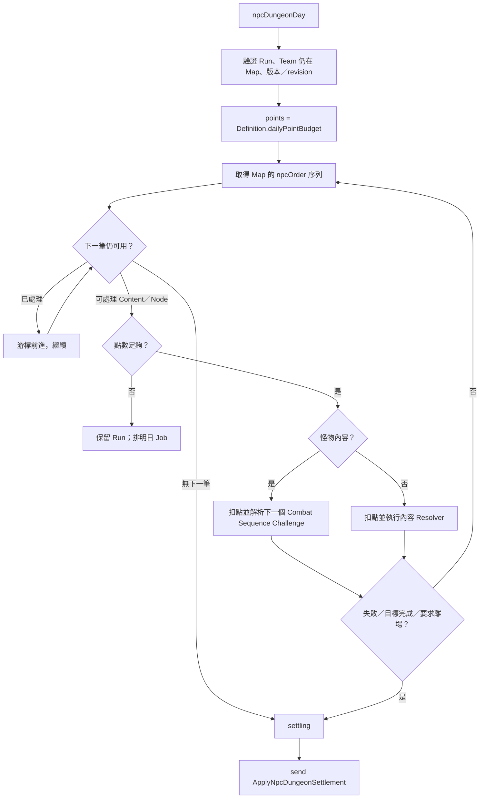

# Dungeon 模組契約

> **模組 ID：** `dungeon`
>
> **依賴：** [共用核心契約](00_shared_contracts.md)、Map／Team／Asset Distribution／Combat Sequence 的公開 Query，以及 Gathering Workflow 契約。
>
> **責任：** 管理玩家的迷宮分鐘制探索 Session，以及非玩家冒險者的 `NpcDungeonRun`。Dungeon 不擁有地圖內容、不直接發放或分配物品、貨幣與經驗，也不直接更新委託。

---

## 1. 邊界與所有權

### 1.1 Dungeon 唯一可寫的 State

```ts
type DungeonState = {
  playerSessions: Record<TeamId, PlayerExplorationSession>;
  playerMapKnowledge: Record<PlayerMapKnowledgeId, PlayerMapKnowledge>;
  npcRuns: Record<NpcDungeonRunId, NpcDungeonRun>;
};
```

### 1.2 Dungeon 不擁有的事

| 事實 | 所有者 | Dungeon 的角色 |
|---|---|---|
| 地圖模板、內容、內容位置、刷新與 Pending | map | 讀取可用內容序列；送出處理／結算要求。 |
| 隊伍位置、進出冒險地、旅行時間 | team | 以 Team Plan 與位置事件作為 Session／Run 前置條件。 |
| 戰鬥九宮格與玩家實際戰鬥結果 | combat | 玩家選擇詳細戰鬥時交由 combat。 |
| 單場／多場簡易戰鬥、戰力擲骰與整串經驗 | combat-sequence | Dungeon 只在走到怪物內容時要求解析下一個 Challenge，並在 Map 正式套用後提交 accepted Result。 |
| 戰利品實體與容器轉移 | inventory | 僅在 Map 正式套用內容結果後處理。 |
| 貨幣帳戶與金錢 | economy | 僅在正式結算後由 Workflow 要求移轉。 |
| 隊內戰利品競拍、NPC 分配與現金均分 | distribution | Session／Run 只保存 Distribution ID；Dungeon 決定何時開始、追加正式成果與關閉收集。 |
| 熟練度與 MXP | progression | 僅在正式結算後依結果發放。 |
| 任務完成與公會結案 | quest | 接收已正式處理的目標結果。 |
| 採集者、採集產物與採集 MXP | gathering workflow／inventory／progression | 驗證探索位置與互動分鐘後，要求原子解析採集來源。 |

---

## 2. 靜態資料契約

### 2.1 DungeonDefinitionReader

```ts
interface DungeonDefinitionReader {
  getNpcExplorationRule(id: RuleId): NpcExplorationRuleDefinition;
  getNpcResolver(id: ResolverId): NpcDungeonTargetResolverDefinition;
  getDungeonInteractionRule(id: InteractionRuleId): DungeonInteractionRuleDefinition;
  getGatheringInteractionView(id: GatheringRuleId): {
    ruleId: GatheringRuleId;
    dungeonInteractionMinutes: number;
  };
}

type DungeonInteractionRuleDefinition = DefinitionHeader & {
  traversalMinutesPerCell: number;       // 第一版為 30
  redDoorOpenMinutes: number;
  trapResolverId: ResolverId;
};
```

### 2.2 NPC 探索規則

```ts
type NpcExplorationRuleDefinition = DefinitionHeader & {
  dailyPointBudget: number;      // 第一版基礎資料為 10
  stopPolicyId: NpcStopPolicyId;
};

type NpcDungeonTargetKind =
  | { kind: 'mapContent'; contentKind: MapContentKind }
  | { kind: 'gatheringNode' };

type NpcDungeonTargetResolverDefinition = DefinitionHeader & {
  supportedTargetKinds: NpcDungeonTargetKind[];
  outcomeRuleId: OutcomeRuleId;
  successBehavior: 'continue' | 'leave';
};
```

NPC 的每日點數與小怪／菁英／大怪／寶箱／事件成本由資料決定；**任一內容嘗試失敗就結束本次地牢探索**，不得由資料改成失敗後繼續：

```json
{
  "id": "base.npc-dungeon-exploration",
  "dailyPointBudget": 10
}
```

Map 公開的每筆 NPC 探索目標都帶有 `pointCost` 與 `resolverId`；目標可以是動態 Map Content 或啟用 NPC Policy 的固定採集點。Dungeon 不依怪物個體數、門、陷阱或玩家實際格距重新推算成本。

### 2.3 Combat Sequence Port

```ts
interface CombatSequenceHostPort {
  start(input: StartCombatSequence): CombatSequenceId;
  resolveNext(sequenceId: CombatSequenceId, expectedContentId: ContentInstanceId): CombatSequenceChallengeResult;
  skipNext(sequenceId: CombatSequenceId, expectedContentId: ContentInstanceId): void;
  stop(sequenceId: CombatSequenceId, reason: CombatSequenceStopReason): void;
  commitSourceResults(input: CommitCombatSequenceSourceResults): void;
  invalidate(sequenceId: CombatSequenceId, reason: CombatSequenceInvalidReason): void;
}
```

這是 [Combat Sequence](21_combat_sequence_module.md) 的命令 Port，不是逐場戰鬥模擬器。Dungeon 擁有內容與點數游標；Combat Sequence 擁有戰力骰、補品重骰、成功戰鬥數與整串經驗累積。兩邊只以 `combatSequenceId`、`contentId` 與 Result ID 關聯。

---

## 3. Runtime State

### 3.1 玩家探索 Session

```ts
type PlayerExplorationSession = {
  teamId: TeamId;
  mapId: MapInstanceId;
  mapVersion: number;
  distributionId: AssetDistributionId;
  currentRoomId: RoomId;
  entryCell: GridCell;
  elapsedDungeonMinutes: DungeonMinute;
  status: 'exploring' | 'inCombat' | 'leaving' | 'closed';
  pendingInteraction?: PendingDungeonInteraction;
  revision: Revision;
};

type PendingDungeonInteraction = {
  interactionId: InteractionId;
  contentId: ContentInstanceId;
  contentEventInstance: ContentEventInstance;
  openedOnDungeonMinute: DungeonMinute;
  revision: Revision;
};
```

- Team 必須已位於 `adventureMap` 才能有 Player Session。
- 玩家在房間內不逐格移動；移動到其他房間時，Dungeon 依模板與 `entryCell` 算出實際小格距離，套用每格 30 分鐘。
- 紅門的查看／開啟成本由 `DungeonInteractionRuleDefinition` 定義；固定陷阱與門不屬 NPC Run 的處理範圍。
- 固定採集點的互動分鐘由 `GatheringRuleDefinition` 定義；Dungeon 只負責在要求解析前計入 Session 時間。
- 跨越午夜時，Dungeon 關閉目前分鐘片段並呼叫核心推進下一世界日。

### 3.2 玩家永久探索知識

```ts
type PlayerMapKnowledge = {
  knowledgeId: PlayerMapKnowledgeId;
  teamId: TeamId;
  mapId: MapInstanceId;
  revealedRoomIds: RoomId[];
  discoveredLinkIds: RoomLinkId[];
  knownTrapIds: FixedTrapId[];
  revision: Revision;
};
```

這份資料代表玩家「已經看過的地圖」，與 Map Version 分離：

1. 未包含在 `revealedRoomIds` 的房間，其所有實際小格在小地圖一律顯示為黑格。
2. 一個多格、L、T 或凹形房間仍是一個移動節點；房間被揭露時，其組成的全部小格一起在小地圖打開。
3. 進入探索地時立即揭露入口房間；成功移入新房間時揭露該房間。
4. 紅門的定位是「支付一次成本查看並通過門後房間」。成功開門後立即揭露相鄰房間、該連線與當前版本的可見怪物、物品與事件，不必先移入；固定陷阱與其他隱藏內容不因開門揭露。同一 Map Version 再經過該門不收開門成本，地圖刷新後則重新關閉。
5. 玩家實際走入固定陷阱房間、觸發或解除陷阱後，將 `trapId` 寫入 `knownTrapIds`。
6. `PlayerMapKnowledge` 不因 Map 刷新、離開地圖、角色死亡或玩家世代交替而清除；只可因存檔 migration 或明確的新遊戲重置而改建。
7. Map 刷新後，已揭露的格子與已知陷阱位置仍可顯示；UI 另外組合 Map Query 的新版本門／陷阱狀態，顯示門已重新關閉、陷阱已重新啟用。
8. 永久記憶只保存地形、已知門與已知陷阱位置，不複製怪物、寶箱、事件或其他動態內容。刷新後的新內容必須在當前版本重新進入視野或重新開門查看。
9. 同一 `teamId + mapId` 至多一筆 Knowledge，且只允許玩家隊伍建立；所有 Room／Link／Trap ID 必須存在於該 Map Template。
10. 採集點位置屬固定 Map Template：房間揭露後即可永久顯示其位置；是否可採仍讀取 Map 當前版本的 Node State，刷新後會重新顯示 available。

### 3.3 NPC 地牢 Run

```ts
type NpcDungeonRun = {
  runId: NpcDungeonRunId;
  teamId: TeamId;
  teamPlanId: TeamPlanId;
  participantCharacterIds: CharacterId[];
  mapId: MapInstanceId;
  mapVersion: number;
  explorationRuleId: RuleId;
  distributionId: AssetDistributionId;
  combatSequenceId?: CombatSequenceId;

  cursorNpcOrder: number;
  pendingResults: PendingDungeonResult[];
  settlementProgress: {
    mapApplied: boolean;
    combatSequenceSettled: boolean;
    distributionCompleted: boolean;
  };
  status: 'exploring' | 'settling' | 'closed' | 'invalid';
  startedOnDay: WorldDay;
  lastProcessedOnDay?: WorldDay;
  revision: Revision;
  rngContext: RngContext;
};

type PendingDungeonResult = {
  target:
    | { kind: 'mapContent'; contentId: ContentInstanceId; contentRevision: Revision }
    | {
        kind: 'gatheringNode';
        nodeId: GatheringNodeId;
        nodeRevision: Revision;
        gatheringResolution?: GatheringResolution;
      };
  npcOrder: number;
  attemptedOnDay: WorldDay;
  outcome: 'success' | 'failure' | 'skip';
  resolverId: ResolverId;
  combatSequenceResultId?: CombatSequenceChallengeResultId;
  pendingRewardRefs: PendingRewardRef[];
};
```

`pendingResults` 是 NPC 在多日探索中已骰出的暫存結果；在 Run 進入 `settling` 前，它們不會改變 Map、Inventory、Progression 或 Quest State。怪物內容必須引用同一 Run 的 Combat Sequence Result；Dungeon 不複製戰力 roll 或經驗資料。採集成功時必須把完整的 deterministic `GatheringResolution` 暫存在結果內，不能只存 Resolution ID 後於結算日重骰；失敗或 skip 時不得帶 Gathering Resolution。

### 3.4 Run 不變量

1. 一支 NPC Team 在同一時點最多有一筆 `exploring` 或 `settling` Run。
2. Run 的 `mapVersion` 必須等於開始時的 Map Version；版本不符時不可盲目套用結果。
3. 每筆 `pendingResults` 的 `npcOrder` 必須嚴格遞增，且同一 Content／Gathering Node 至多嘗試一次。
4. `cursorNpcOrder` 只可向前，不可因次日結算倒退或重骰。
5. `dailyPointBudget` 每次 `npcDungeonDay` 重新取得，不可跨日累積。
6. `settling` 或 `closed` Run 不得再建立 `npcDungeonDay` Job。
7. Session／Run 的 `distributionId` 必須引用同一 Team、同一地圖來源且尚未 invalid 的 Distribution；`participantCharacterIds` 只在開始探索時快照一次，必須等於當時全部 1～9 名正式成員，且與 Distribution 的參與者一致。沒有候補或自行留城的正式成員。
8. 採集成功結果的 `GatheringResolution.participantCharacterIds` 必須等於 Run 快照；貢獻者、等級與產物不得在 Settlement 日重新解析。
9. 地圖有至少一筆怪物內容時，`combatSequenceId` 必須引用同一 Team、同一 Run 的 `dungeonSweep` Sequence，且兩邊怪物游標必須指向同一個下一個 Content；沒有怪物時不得建立空 Sequence，`settlementProgress.combatSequenceSettled` 從開始即為 true。
10. 怪物 Pending Result 的 `combatSequenceResultId` 必須存在且來源 Content 相同；寶箱、事件與採集結果不得帶此欄位。
11. Run 只有在 Map、Combat Sequence 與 Distribution 三項 Settlement 都完成後才能 `closed`。

---

## 4. 公開 Query

```ts
interface DungeonQuery {
  getPlayerSession(teamId: TeamId): PlayerExplorationSessionView | undefined;
  getPlayerMapKnowledge(teamId: TeamId, mapId: MapInstanceId): PlayerMapKnowledgeView | undefined;
  getNpcRun(runId: NpcDungeonRunId): NpcDungeonRunView | undefined;
  getNpcRunForTeam(teamId: TeamId): NpcDungeonRunView | undefined;
  getNpcProgress(runId: NpcDungeonRunId): NpcDungeonProgressView;
  getPendingInteraction(teamId: TeamId): PendingDungeonInteractionView | undefined;
}
```

Dungeon Query 不公開其他隊伍的 RNG seed、未結算獎勵細節或可被玩家利用的 NPC 隱藏結果；UI 只取得需要顯示的進度摘要。

---

## 5. 輸入契約

### 5.1 玩家 Command

| Command | 前置條件 | Dungeon 的責任 |
|---|---|---|
| `startPlayerExploration` | 玩家 Team 位於冒險地，沒有既有 Session。 | 建立 Player Session，並以當下正式成員快照建立 collecting 的玩家地牢 Distribution。 |
| `moveDungeonRoom` | Session 為 exploring、目標房間可通行。 | 計算分鐘、更新房間與入口小格、必要時推進世界日。 |
| `openDungeonDoor` | Session 為 exploring、門連接目前房間、Map Version 相符。 | 若門仍關閉，支付一次開門分鐘、要求 Map 開門並揭露門後房間；已開門時不再收費。 |
| `gatherDungeonNode` | Session 為 exploring、玩家位於節點所屬房間、Map Version 相符、節點 available，且無戰鬥／Pending Interaction。 | 依 Gathering Rule 增加迷宮分鐘，使用探索開始時的正式參與者快照**啟動 Gathering Workflow**（`ResolveGatheringSource` 入口）；任何必要步驟失敗時整筆回滾。 |
| `useDungeonExit` | Session 位於合法出口房間，且沒有戰鬥或內容互動。 | 將 Session 改為 leaving，關閉 Distribution 收集；無待分配成果時可立即完成，有玩家競拍時等 `AssetDistributionCompleted` 後才關閉 Session 並返城。 |
| `interactDungeonContent` | 玩家位於合法位置且內容可用。 | 依互動類型建立 combat／內容處理 Internal Command。 |
| `resolveDungeonInteraction` | Session 有匹配的 Pending Interaction，選項仍合法。 | 套用資料化結果、清除互動並恢復探索。 |

### 5.2 ScheduledJob

| Job | Dungeon 的反應 |
|---|---|
| `npcDungeonDay` | 取 1 日探索點，依 Map NPC 序列從游標往後嘗試內容。 |

### 5.3 Internal Command

| Internal Command | Dungeon 的反應 |
|---|---|
| `StartNpcDungeonRun` | 建立 NPC Run、collecting 的 NPC 地牢 Distribution，以及引用所有怪物內容的 `dungeonSweep` Combat Sequence；排入下一日 `npcDungeonDay`。 |

### 5.4 訂閱 DomainEvent

| Event | Dungeon 的反應 |
|---|---|
| `NpcDungeonSettlementApplied` | 只將 `appliedResults` 的正式戰利品追加至 Distribution，關閉收集並令 Run 等待自動分配。 |
| `AssetDistributionCompleted` | 若對應玩家 Session 正在 leaving，關閉 Session並開始返城；若對應 NPC Run 正在 settling，關閉 Run 並通知 Team。 |
| `CombatSequenceChallengeResolved` | 以 `sourceRef` 建立對應怪物 Pending Result；success 繼續，failure 立即令 Run 進入 settling。 |
| `CombatSequenceReadyForSourceCommit` | 若 Run 尚未 settling，依 termination reason 進入 settling 並要求 Map 套用暫存結果。 |
| `CombatSequenceSettled` | 若對應 NPC Run 正在 settling，標記戰鬥串結算完成；其餘兩項 Settlement 也完成時才關閉 Run。 |
| `CombatSequenceInvalidated` | 將對應 Run 標為 invalid；已實際消耗的重骰補品不回復。 |
| `TeamLocationChanged` | 若隊伍非預期離開地圖，將相關 Session／Run 標記 invalid 並停止排程。 |
| `CombatEncounterResolved` | 對玩家內容處理結果發出 Map 請求，或將 Session 從 inCombat 恢復。 |
| `MapRefreshed` | 若影響進行中 Session／Run 的版本，依規則標記 invalid；正常情況下地圖內有人不應發生。 |

---

## 6. 輸出事件

| Event | 最少 payload | 訂閱者 |
|---|---|---|
| `PlayerDungeonSessionStarted` | `teamId`、`mapId`、`mapVersion` | ui/app。 |
| `PlayerDungeonTimeAdvanced` | `teamId`、`minutes`、`worldDayCrossed?` | ui/app、kernel。 |
| `PlayerInteractionOpened` | `interactionId`、`teamId`、`kind: dungeonEvent` | engine session、ui/app。 |
| `MapExplorationCompleted` | `teamId`、`mapId`、`mapVersion`、`explorationKey`、`experienceRuleId` | progression、quest。 |
| `NpcDungeonRunProgressed` | `runId`、`processedTargetRefs`、`nextCursor`、`remainingPoints` | ui/app、debug。 |
| `NpcDungeonRunClosed` | `runId`、`teamId`、`reason` | team、ui/app。 |

Dungeon 不會自行 emit `InventoryTransferred`、`MasteryExperienceGranted` 或 `QuestStateChanged`。

### 6.1 輸出 Internal Command

| Internal Command | 最少 payload | 唯一處理者 |
|---|---|---|
| `ResolvePlayerMapContent` | `teamId`、`mapId`、`contentId`、`distributionId`、`resolution` | map。 |
| `StartCombatEncounter` | `teamId`、`mapId`、`contentId`、`encounterGroupId` | combat。 |
| `StartCombatSequence` | `source: dungeonSweep`、`teamId`、配置／戰力快照、依 npcOrder 排序的怪物 Challenge | combat-sequence。 |
| `ResolveNextCombatSequenceChallenge` | `sequenceId`、`expectedContentId`、`attemptedOnDay` | combat-sequence。 |
| `SkipNextCombatSequenceChallenge` | `sequenceId`、`expectedContentId` | combat-sequence。 |
| `StopCombatSequence` | `sequenceId`、`reason` | combat-sequence。 |
| `CommitCombatSequenceSourceResults` | `sequenceId`、由 `appliedResults` 對應出的 accepted successful Result IDs、`sourceCommitId` | combat-sequence。 |
| `InvalidateCombatSequence` | `sequenceId`、`reason` | combat-sequence。 |
| `ReleaseCombatSequence` | `sequenceId`、`expectedRevision`；Run 關閉後才送出 | combat-sequence。 |
| `StartReturnFromDungeon` | `teamId`、`mapId`、`exitId` | team。 |
| `ApplyNpcDungeonSettlement` | `runId`、`mapId`、`mapVersion`、`distributionId`、`pendingResults` | map。 |
| `StartAssetDistribution` | `distributionId`、`source: dungeonLoot`、`teamId`、`participantCharacterIds`、`ruleId` | distribution。 |
| `AppendAssetDistributionResult` | `distributionId`、正式產生的 `itemIds`／`currencyInputs`、`sourceResultId` | distribution。 |
| `FinalizeAssetDistributionCollection` | `distributionId` | distribution。 |
| `OpenMapDoor` | `teamId`、`mapId`、`mapVersion`、`linkId`、`openedOnDungeonMinute` | map。 |
| `ResolveMapTrap` | `teamId`、`mapId`、`mapVersion`、`trapId`、`resolution`、`resolvedOnDungeonMinute` | map。 |
| `ResolveGatheringSource`（啟動 Gathering Workflow，非 Internal Command） | `source: mapNode`、`teamId`、探索參與者快照、`distributionId`、`rngContext` | Gathering Workflow 入口。 |

---

## 7. NPC 每日 10 點流程



### 7.1 結算與競爭

第一版不做內容預約、NPC 實體遭遇或即時搶奪。

1. NPC 可跨多日累積 `pendingResults`；怪物內容只保存 Combat Sequence Result ID。
2. Run 進入 `settling` 時先停止 Combat Sequence，再請 Map 一次性驗證並套用結果。
3. 若玩家或另一筆已先結算的 Run 已處理某內容，Map 將該筆列入 `skippedResults`。
4. Dungeon 將 `appliedResults` 中的成功怪物 Result ID 送入 `CommitCombatSequenceSourceResults`；Combat Sequence 只對這個 accepted 子集彙總攻擊／防禦預算與成功場次，並一次發出成長來源。Progression 不再直接平均分配 `NpcDungeonSettlementApplied`。
5. Inventory、Quest 只看 `NpcDungeonSettlementApplied.appliedResults`；成果 Workflow 同時把正式 Item／Currency 追加至該 Run 的 Distribution。Gathering Node 只有在 applied 後才建立產物並發出採集 MXP 來源。
6. NPC Distribution 逐件 RNG 指派物品、把貨幣平均分給開始 Run 時的正式成員；Map、Combat Sequence、Distribution 三者都完成後 Dungeon 才關閉 Run。

這讓背景 NPC 每個怪群只做一次戰力骰與可能的補品重骰；不模擬 HP、傷勢、招式或逐人輸出，同時不會讓競爭失效的怪群發放經驗。

### 7.2 離場條件

Run 在下列任一狀況進入 `settling`：

- NPC 序列已全部走完（全清）。
- 任一內容 Resolver 得到失敗。
- 已達成該 Run 的目標（如 Boss、救援目標）。
- 資料 Resolver 指定成功後離場。
- Team Plan 被取消或隊伍失去行動能力；此時進入 `invalid`，不結算未套用的結果。

---

## 8. 玩家探索分鐘與日結算的交界

```text
玩家移動／紅門／採集互動
  → Dungeon 增加 elapsedDungeonMinutes
  → 成功進入新房間時永久更新 PlayerMapKnowledge
  → 若進入 armed 固定陷阱房間，以同一交易 ResolveMapTrap 並套用陷阱結果
  → 若未跨午夜：只更新 Session
  → 若跨午夜：先固定目前 Session 分鐘結果，呼叫 advanceWorldToDay(nextDay)
  → 每日世界結算完成後，玩家繼續原 Session
```

玩家戰鬥本身不消耗迷宮分鐘；戰鬥結束後再依實際內容結果向 Map 請求處理。玩家與 NPC 因此共用 Map 內容真相，但採不同的探索解析方式。

### 8.1 固定採集點

```text
已揭露房間中的 available 採集點
  → gatherDungeonNode
  → 增加 Gathering Rule 指定分鐘；跨午夜時照常推進世界日
  → ResolveGatheringSource
  → Map Node 標記 harvested
  → 產物 Item 進入本次 Distribution Escrow
  → GrantGatheringMasteryExperience 只給最高採集等級成員 MXP

同版本再次互動
  → Node 已 harvested，拒絕且不扣分鐘

地圖正式刷新
  → Node 恢復 available
  → 固定位置仍保留在永久小地圖
```

### 8.2 玩家戰利品收集與離場

```text
startPlayerExploration
  → 快照正式成員
  → StartAssetDistribution(source=dungeonLoot, controller=playerAuction)

每筆 Map 內容正式成功
  → 一般戰利品由 Inventory 建立／移入 assetDistributionEscrow
  → Quest 精確指定品改進 teamQuestCargo，不加入一般戰利品
  → Economy 將地牢金幣放入 Distribution Account
  → AppendAssetDistributionResult

useDungeonExit
  → Session = leaving
  → FinalizeAssetDistributionCollection
  → 玩家逐件競拍；流標物按原價值 80% 直售
  → 競拍款 + 直售款 + 地牢金幣平均分給探索開始時的正式成員
  → AssetDistributionCompleted
  → Session = closed
  → StartReturnFromDungeon
```

玩家在 `awaitingPlayerBid` 期間仍算位於冒險地，會阻止該 Map 刷新；不可開始返城、解雇成員或開始其他隊伍大動作。若探索中新增／離開成員，不回溯修改這次分配的參與者快照。

### 8.3 開門、陷阱與採集點的一次性狀態

```text
關閉的紅門
  → openDungeonDoor
  → Dungeon 增加資料指定的開門分鐘
  → required OpenMapDoor
  → Map 將本版本門狀態改為 open
  → Dungeon 永久揭露門、門後房間

已開啟的紅門
  → 直接依一般移動規則通行
  → 不再增加開門分鐘

armed 固定陷阱
  → 玩家進入陷阱房間
  → required ResolveMapTrap + required 陷阱效果命令
  → 全部成功後 Map 狀態成為 triggered／disarmed
  → Dungeon 永久記錄 knownTrapIds

地圖正式刷新
  → Map 的門重設 closed、陷阱重設 armed、採集點重設 available
  → Dungeon 的 PlayerMapKnowledge 完全不變
```

---

## 9. 測試 Fixture 與驗收

Dungeon 模組最低必須提供：

1. 玩家跨房間移動、實際小格距離 × 30 分鐘的測試。
2. 玩家跨午夜後只觸發一次每日世界結算的測試。
3. 一條 NPC 序列：小怪 1、寶箱 1、菁英 2、大怪 4，驗證 10 點可在同日處理的範圍。
4. 點數不足時保留 `cursorNpcOrder` 與 `pendingResults`、次日再繼續的測試。
5. NPC 首次失敗後停止並進入結算的測試。
6. Map 結算時部分內容已被玩家處理，NPC 僅獲 `appliedResults` 的測試。
7. 快轉與逐日推進得到同一份 NPC Run 結果的測試。
8. NPC Run 因隊伍提前離圖或 Map Version 不符而安全失效的測試。
9. 未揭露房間在小地圖保持黑格；揭露多格房間時所有組成格同時打開的測試。
10. 玩家離圖、刷新與世代交替後，`PlayerMapKnowledge` 仍保留的測試。
11. 同版本開門只收一次成本；刷新後門重新關閉但小地圖不變的測試。
12. 同版本陷阱只結算一次；刷新後重新 armed 且仍顯示為已知陷阱位置的測試。
13. 玩家探索取得的物品在離場前只存在 Distribution Escrow，完成競拍與均分後才返城的測試。
14. NPC 多日 Run 只把 `appliedResults` 加入 Distribution，逐件 RNG 給正式成員並完成後才關閉 Run 的測試。
15. 探索開始後招募／離隊不改變該次 Distribution 參與者快照的測試。
16. 玩家採集依資料增加分鐘、只使用探索參與者快照選最高等級者，產物進 Distribution 而非個人背包的測試。
17. 同版本重複採集不扣分鐘不發 MXP；刷新後節點恢復且永久小地圖位置不消失的測試。
18. NPC 採集結果只在 Settlement applied 後建立物品；被玩家搶先採集時安全 skip 的測試。
19. Dungeon 怪物內容與 Combat Sequence Challenge 游標永遠一致；寶箱／事件／採集不進戰鬥串的測試。
20. 多日 Run 只在最後對 Map accepted 的成功怪物 Result 一次結算總攻擊、防禦與成功場次的測試。
21. 怪物戰力擲骰失敗立即停止 Run；在 15% 內補品重骰成功時只記一場正式成功的測試。
22. Map、Combat Sequence、Distribution 任一尚未完成時 Run 不得關閉的測試。

---

## 10. Dungeon 模組交接清單

- [ ] `PlayerExplorationSession`、`PlayerMapKnowledge`、`NpcDungeonRun`、`PendingDungeonResult` 與 Distribution reference Schema。
- [ ] NPC 探索／Resolver／迷宮互動 JSON Schema。
- [ ] Map、Team、Combat Sequence 的窄化 Query／Command Port。
- [ ] 玩家 Session 移動、門、陷阱、採集與離場 Command Handler。
- [ ] `npcDungeonDay` Job Handler、Combat Sequence 串接與三方 Run 結算流程。
- [ ] 玩家內容處理、NPC 結算、Distribution 收集、分配完成後返城的 Internal Command 與 Run 事件。
- [ ] Fixture、跨午夜、快轉與內容競爭測試。
