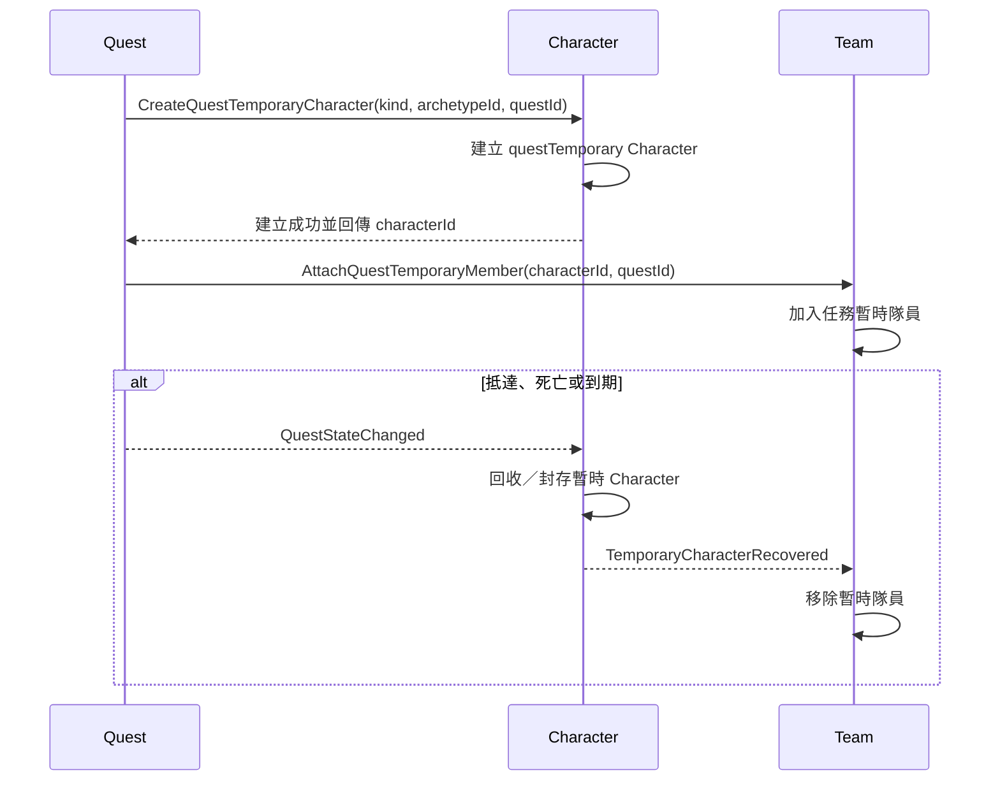

# Character 模組契約

> **模組 ID：** `character`
>
> **依賴：** [共用核心契約](00_shared_contracts.md)。Character 透過由 Composition Adapter 實作的窄化 `CharacterStatsQuery` 讀取角色最大生命／魔力；Adapter 使用 [Derived Statistics](16_derived_statistics.md)，Character 不直接依賴 progression、inventory、combat、team 或 quest 的內部 State。
>
> **責任：** 管理所有真實角色的身分、出生與死亡、家族關係、可用性、生命／魔力、暫時狀態、聲望與暫時角色生命週期。它是世代遊戲的角色真相來源。

---

## 1. 邊界與所有權

### 1.1 Character 唯一可寫的 State

```ts
type CharacterState = {
  characters: Record<CharacterId, Character>;
  familyLinks: Record<FamilyLinkId, FamilyLink>;
  relationshipFacts: Record<RelationshipFactId, CharacterRelationshipFact>;
};
```

### 1.2 Character 不擁有的事

| 事實 | 所有者 | Character 的角色 |
|---|---|---|
| 隊伍歸屬、位置與行動 | team | 以 `CharacterAvailabilityChanged` 通知能否繼續留隊。 |
| 熟練度、主屬、技能與可學習書籍 | progression | 不寫成長；最大生命／魔力透過跨模組 Stats Projection 取得。 |
| 裝備實體與背包 | inventory | 不保存裝備或道具 ID。 |
| 戰鬥版面、技能冷卻與傷害公式 | combat | 接收已確定的生命／魔力／狀態變化。 |
| 委託狀態與護衛／救援任務結束條件 | quest | 依 Internal Command 建立角色，依 Quest 事實回收暫時角色。 |
| 城市的家、旅館與設施 | city | 依設施完成事件恢復條件或觸發年度休息結果。 |

### 1.3 真實角色與資料原型

- **CharacterDefinition／Archetype：** 資料檔中的角色原型，例如富商、貴族、雲華冒險者。
- **Character：** 本局實際存在的個體；有永久 `CharacterId`、出生資料、狀態與家族關係。
- **任務暫時角色：** 護衛角色在接取時建立；救援角色在玩家實際救出時建立。它有 CharacterId，但 `origin = questTemporary`；送達、離圖、死亡或到期後由 Character 回收，不成為常駐世界 NPC。

不是每位居民都建立 Character。當地居民發布怪物委託、城市人口與一般商業需求可由 City／Quest 的聚合規則表示；只有會進隊伍、戰鬥、成長、建立家族／關係或需要持久互動的個體才建立真實 Character。

---

## 2. 靜態資料契約

### 2.1 CharacterDefinitionReader

```ts
interface CharacterDefinitionReader {
  getArchetype(id: CharacterArchetypeId): CharacterArchetypeDefinition;
  getLifecycleRule(id: LifecycleRuleId): LifecycleRuleDefinition;
  getStatusDefinition(id: StatusId): StatusDefinition;
  getBirthRule(id: BirthRuleId): BirthRuleDefinition;
  getTemporaryCharacterRule(id: TemporaryCharacterRuleId): TemporaryCharacterRuleDefinition;
}
```

### 2.2 角色原型與生命週期

```ts
type CharacterArchetypeDefinition = DefinitionHeader & {
  roleTags: CharacterRoleTag[];
  cultureId?: CultureId;
  lifecycleRuleId: LifecycleRuleId;
  innateTraitPoolId?: CharacterTraitPoolId;
  canBecomeAdventurer: boolean;
  temporaryOnly: boolean;
};

type LifecycleRuleDefinition = DefinitionHeader & {
  adulthoodAgeDays: number;
  naturalLifeEndAgeDays: number;
  playableAgeStartDays: number;
  playableAgeEndDays: number;
  ageModifierRuleId: AgeModifierRuleId;
  retirementResolverId?: ResolverId;
  naturalDeathResolverId: ResolverId;
};
```

- 第一版角色養成的主要活動區間是 15～55 歲；精確換算天數與是否可超過該年齡由 `LifecycleRuleDefinition` 定義，不寫死在程式。
- 角色出生、成人、退休／自然死亡等門檻必須由同一條生命週期資料決定。

### 2.3 狀態與恢復規則

```ts
type StatusDefinition = DefinitionHeader & {
  category: 'temporaryCondition';
  clearByRest: boolean;
  stackPolicy: 'replace' | 'refresh' | 'stack';
  effects: EffectDefinition[];
};
```

**禁止建立 `fatigue`／`stamina`／`endurance` 這類會累積並限制行動的角色資源。**

角色可恢復狀態只有：

- 生命。
- 魔力。
- 由資料定義、可由休息解除的暫時狀態。

### 2.4 年度休息與生育規則

```ts
type BirthRuleDefinition = DefinitionHeader & {
  requiredRestDays: number;       // 第一版為 365
  eligibilityResolverId: ResolverId;
  birthResolverId: ResolverId;
};
```

年度休息只提供「檢查生育可能」的入口；伴侶條件、機率、子女原型、初始天賦與繼承細節都必須由資料 Resolver 決定，不能由 Team 或 UI 偷塞邏輯。

---

## 3. Runtime State

### 3.1 Character

```ts
type Character = {
  characterId: CharacterId;
  archetypeId: CharacterArchetypeId;
  origin: 'playerLineage' | 'worldAdventurer' | 'worldResident' | 'questTemporary';

  birthDay: WorldDay;
  lifeState: 'alive' | 'dead' | 'retired';
  availability: 'available' | 'incapacitated' | 'temporary' | 'unavailable';

  parentIds: CharacterId[];       // 0..2；出生後不可修改
  childIds: CharacterId[];
  innateTraitIds: CharacterTraitDefinitionId[];
  homeId?: HomeId;
  reputation: number;
  playerQuestCrimeRecords: Record<QuestId, PlayerQuestCrimeRecord>;

  condition: CharacterCondition;
  temporaryOrigin?: TemporaryCharacterOrigin;
  revision: Revision;
};

type PlayerQuestCrimeRecord = {
  sourceQuestId: QuestId;
  recordedOnDay: WorldDay;
  expiresOnDay: WorldDay;
};

type CharacterCondition = {
  health: number;
  mana: number;
  statuses: CharacterStatusInstance[];
};

type CharacterStatusInstance = {
  statusInstanceId: string;
  statusId: StatusId;
  sourceId?: GameId;
  appliedOnDay: WorldDay;
  expiresOnDay?: WorldDay;
  stacks: number;
};

type TemporaryCharacterOrigin = {
  kind: 'escort' | 'rescue';
  sourceQuestId: QuestId;
  recoveryTrigger: 'arrival' | 'leftAdventureMap' | 'death' | 'questExpiry';
};
```

### 3.2 FamilyLink

`FamilyLink` 保留伴侶、監護、收養等未來關係，不將其混入隊伍或委託資料。

```ts
type FamilyLink = {
  familyLinkId: FamilyLinkId;
  kind: 'partner' | 'guardian' | 'adoption';
  characterIds: CharacterId[];
  activeFromDay: WorldDay;
  activeToDay?: WorldDay;
  revision: Revision;
};
```

### 3.3 Relationship Fact

```ts
type CharacterRelationshipFact = {
  relationshipFactId: RelationshipFactId;
  subjectCharacterId: CharacterId;
  counterpart:
    | { kind: 'character'; characterId: CharacterId }
    | { kind: 'organization'; organizationId: OrganizationId };
  kind: RelationshipFactKind;
  sourceId: GameId;
  state: 'unresolved' | 'resolved';
  openedOnDay: WorldDay;
  resolvedOnDay?: WorldDay;
  revision: Revision;
};
```

Relationship Fact 只記「跟誰有一件尚未了結的事」，不建立高成本的完整社交模擬。好感度、折扣或後續事件要由資料 Resolver 解讀公開 Query，不把任意文字當規則。

### 3.4 Character 不變量

1. `birthDay` 與 `parentIds` 建立後不可修改。
2. 親子關係不可形成循環；子女的 `parentIds` 與父母的 `childIds` 必須對稱。
3. `lifeState: dead` 的角色必須 `availability: unavailable`，且不能加入任何新隊伍或開始行動。
4. `origin: questTemporary` 必須有 `temporaryOrigin.sourceQuestId`；非暫時角色不得有該欄位。
5. `condition.health`、`condition.mana` 不可為負值；最大值由 `CharacterStatsQuery` 計算，Character 在變更時驗證上限。
6. 狀態堆疊與休息清除規則只能依 `StatusDefinition` 執行。
7. Character State 不得出現疲勞、耐力或其等價倒數欄位。
8. 未達 `adulthoodAgeDays` 的子女不可加入冒險隊伍；成年事件後才依資格改為 available。
9. `innateTraitIds` 在出生完成後不可修改；它只影響資料 Resolver，不直接寫主屬。
10. 同一 `sourceId`、subject、counterpart 與 kind 至多一筆未解決 Relationship Fact。
11. `playerQuestCrimeRecords` 只可存在於目前玩家主角；Key 必須是唯一 `sourceQuestId`，每筆都持有自己的期限，彼此不累加、不覆蓋。逾期紀錄可保留作歷史，但不再是 active crime。

---

## 4. 公開 Query 與 Reader Port

```ts
interface CharacterQuery {
  getCharacter(id: CharacterId): CharacterView;
  isAvailable(id: CharacterId): boolean;
  getCondition(id: CharacterId): CharacterConditionView;
  getAgeDays(id: CharacterId, onDay: WorldDay): number;
  listChildren(id: CharacterId): CharacterId[];
  getInnateTraits(id: CharacterId): CharacterTraitDefinitionId[];
  listUnresolvedRelationships(id: CharacterId): CharacterRelationshipFactView[];
  listPlayerQuestCrimeRecords(id: CharacterId): PlayerQuestCrimeRecordView[];
  getTemporaryOrigin(id: CharacterId): TemporaryCharacterOrigin | undefined;
}

interface CharacterStatsQuery {
  getStats(id: CharacterId): {
    maxHealth: number;
    maxMana: number;
  };
}
```

`CharacterStatsQuery` 是 Character 所需要的 Port。Composition Adapter 組合 Progression／Inventory 的 Snapshot DTO，再交給唯一的 Derived Statistics Calculator；Adapter 本身不放公式，Character 只看最終結果。

---

## 5. 輸入契約

### 5.1 Internal Command

| Internal Command | Character 的反應 |
|---|---|
| `CreateQuestTemporaryCharacter` | 驗證任務類型、原型與 Quest ID，建立護衛／救援暫時 Character。 |
| `CreateWorldAdventurerBatch` | 依城市文化、數量與生成規則建立真實世界冒險者，回傳 Character ID 清單。 |
| `ApplyCharacterReputationEffect` | 依已驗證 Effect 與來源調整聲望並發出變更事實。 |
| `RecordQuestFailureCrime` | 只接受玩家隊伍的已確認委託失敗來源；在當前玩家主角下以 Quest ID 建立一筆獨立犯罪紀錄與期限。不得改寫 NPC 或既有其他 Quest 的紀錄。 |
| `OpenCharacterRelationshipFact` | 建立一筆具來源與對象的未了結關係。 |
| `ResolveCharacterRelationshipFact` | 將指定關係標為已解決；重複處理必須冪等。 |
| `ApplyCombatCondition` | 套用生命、魔力與暫時狀態改變；生命歸零時處理死亡／不可行動。 |
| `ApplyFoodStatusEffects` | 僅接受 Crafting Workflow；以 `characterId`、`foodStatusRevision`、`operation: apply \| remove` 與 FoodStatus 已解析的 Effect ID 原子套用／移除狀態。不得由 UI 或任意一般道具偽造 FoodStatus 效果。 |

### 5.2 訂閱 DomainEvent

| Event | Character 的反應 |
|---|---|
| `FacilityRestCompleted` | 恢復生命、魔力並依 Status Definition 移除可由休息解除的狀態。 |
| `HomeYearRestCompleted` | 依 Birth Rule 對符合資格的家族關係執行生育判定。 |
| `QuestStateChanged` | 護衛抵達、到期或失敗時回收對應暫時 Character。 |
| `ProgressionCapacityChanged` | 重新查詢 Stats Projection，驗證當前 Condition 上限。 |
| `EquipmentChanged` | 重新查詢 Stats Projection，驗證當前 Condition 上限。 |

### 5.3 Character 自己處理的 Job

不為每位角色建立每日 Job。年齡由 `worldDay - birthDay` 推導；建立角色時只排資料門檻所需的 `characterLifecycleDue`，例如成年、退休檢查與自然死亡檢查。Job 帶 Character Revision；自然死亡 Resolver 若安排下一次檢查，也只建立下一個明確到期 Job。

| Job payload kind | Character 的反應 |
|---|---|
| `adulthood` | 驗證實際年齡，更新可用性並發出 `CharacterBecameAdult`。 |
| `retirementCheck` | 依 Lifecycle Resolver 退休或排下一次明確檢查。 |
| `naturalDeathCheck` | 依 Lifecycle Resolver 死亡或排下一次明確檢查。 |

---

## 6. 輸出事件

| Event | 最少 payload | 訂閱者 |
|---|---|---|
| `CharacterCreated` | `characterId`、`origin`、`archetypeId` | character-provisioning workflow、team、ui/app。 |
| `CharacterAvailabilityChanged` | `characterId`、`oldAvailability`、`newAvailability`、`reason` | team、quest、ui/app。 |
| `CharacterConditionChanged` | `characterId`、`health`、`mana`、`statusChanges` | combat、ui/app。 |
| `CharacterDied` | `characterId`、`deathDay`、`reason` | team、quest、progression、ui/app。 |
| `CharacterBorn` | `characterId`、`parentIds`、`birthDay` | team、progression、ui/app。 |
| `CharacterBecameAdult` | `characterId`、`ageDays` | team、progression、population workflow、ui/app。 |
| `CharacterRetired` | `characterId`、`retiredOnDay` | team、succession workflow、ui/app。 |
| `TemporaryCharacterRecovered` | `characterId`、`sourceQuestId`、`reason` | team、quest。 |
| `CharacterReputationChanged` | `characterId`、`oldValue`、`newValue` | quest、ui/app。 |
| `CharacterCrimeChanged` | `characterId`、`sourceQuestId`、`recordedOnDay`、`expiresOnDay` | quest、ui/app。 |
| `CharacterRelationshipChanged` | `relationshipFactId`、`subjectCharacterId`、`state` | city、quest、content-event workflow、ui/app。 |

---

## 7. 核心流程

### 7.1 任務暫時角色



護衛資料在任務生成時只有身分原型，接取後才建立實體；救援目標在地圖中只是 Map Content，救出時才建立實體。這避免未接取或未救出的任務人物污染真實 NPC 世界。

### 7.2 恢復與死亡

```text
combat／事件結果
  → ApplyCombatCondition Internal Command
  → Character 套用 HP／MP／狀態
  → HP 歸零時 CharacterDied + CharacterAvailabilityChanged
  → team、quest 依公開事件清理隊伍與任務

旅館／家中休息完成
  → FacilityRestCompleted
  → Character 依資料恢復 HP／MP、清除可休息解除狀態
```

### 7.3 年度休息與子女

```text
Team 的 homeRest（365 日）完成
  → HomeYearRestCompleted
  → Character 以 Birth Rule 檢查資格與 RNG
  → 成功：依父母與 Birth Rule 選出 innateTraitIds，建立 CharacterBorn 與親子 FamilyLink
  → progression 將新生兒熟練度初始化為 0
  → 若屬玩家家系：Team 建立單人 control: child Team，Progression 建立第一個 14 日 Child Study Cycle
  → 若屬非玩家冒險者家系：不建立 Child Team 或逐日教育，只保留成年到期 Job
  → 未成年期間不能加入冒險隊；成年時依 Progression 的玩家／非玩家子女規則轉換
```

---

## 8. 測試 Fixture 與驗收

Character 模組最低必須提供：

1. 一名可用冒險者、一名死亡角色，以及護衛／救援暫時角色 Fixture。
2. 生命／魔力恢復與可休息解除狀態的測試；確認不存在疲勞欄位。
3. 角色生命歸零後，正確 emit 死亡與不可用事件的測試。
4. 護衛角色只在接取後生成、救援角色只在救出時生成，並在各自完成、死亡、到期後回收的測試。
5. 年度休息生育成功與失敗的固定 seed 測試。
6. 父母／子女雙向關係與禁止循環的驗證測試。
7. 最大生命／魔力變更後，當前資源被正確限制的測試。
8. 子女熟練度初始為 0、成年前不可入隊、成年 Job 後可用的測試。
9. 年齡修正與自然死亡只在到期 Job 檢查，不每日掃描的測試。
10. 同一關係來源的重複建立／解決具冪等性，且 Query 只回傳未了結項目的測試。

---

## 9. Character 模組交接清單

- [ ] `CharacterState`、`Character`、`FamilyLink`、Relationship Fact、Condition Schema。
- [ ] Archetype、Lifecycle、Status、Birth、Temporary Character JSON Schema。
- [ ] `CharacterQuery`、`CharacterStatsQuery` consumer Port 與 Derived Statistics Adapter 契約。
- [ ] 戰鬥 Internal Command 與休息／年度休息／護衛事件 Subscriber。
- [ ] 死亡、出生、暫時角色回收與可用性事件。
- [ ] Fixture、家族關係、恢復與生命週期測試。
