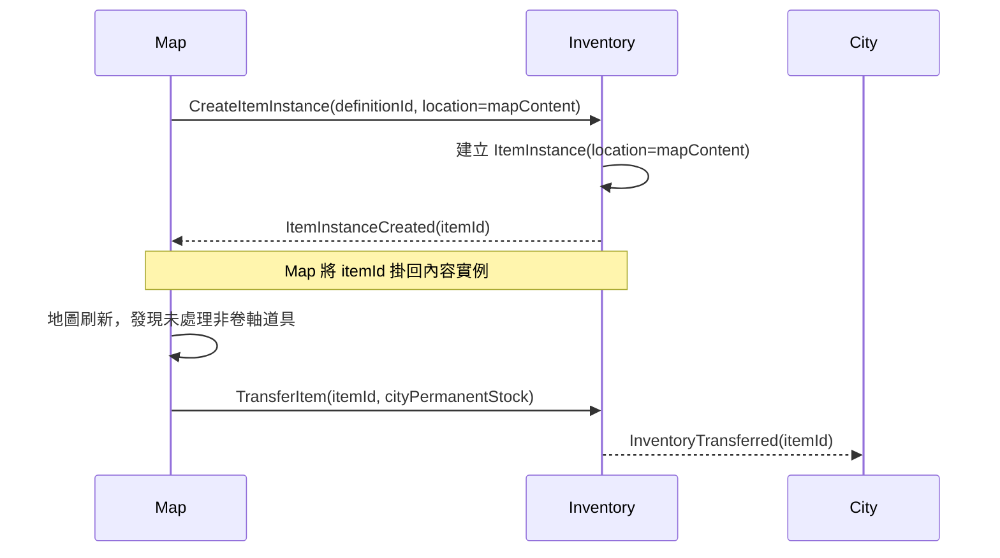

# Inventory 模組契約

> **模組 ID：** `inventory`
>
> **依賴：** [共用核心契約](00_shared_contracts.md)、Item／Equipment Definition Reader。Inventory 不依賴城市、委託、地圖或戰鬥的內部 State；它只處理已驗證的物品建立、移轉、保留、消耗與裝備要求。
>
> **責任：** 管理所有實體物品、其唯一 ID、位置、所有權、保留狀態、消耗與裝備位置。任何能被拿取、販售、運送、購買、交付、裝備或回收的物品，必須先成為 Inventory 所擁有的 `ItemInstance`。

---

## 1. 邊界與所有權

### 1.1 Inventory 唯一可寫的 State

```ts
type InventoryState = {
  items: Record<ItemInstanceId, ItemInstance>;
  equipmentLoadouts: Record<CharacterId, CharacterEquipmentLoadout>;
};
```

Inventory 不保存城市商店的售價、委託期限、地圖位置、隊伍成員、角色屬性或戰鬥冷卻；它只保存「這個實體物品是什麼、在哪裡、能否被移動或消耗」。

### 1.2 Inventory 不擁有的事

| 事實 | 所有者 | Inventory 的角色 |
|---|---|---|
| 地圖內容與寶箱位置 | map | 將物品放到／移出 `mapContent` 位置。 |
| 永久庫存有哪些實體、物品目前位於哪個貨架 | inventory | `ItemLocation` 是唯一真相；City 透過 Query 取得清單。 |
| 商店刷新政策、貨架 Offer、數量上限與售價 | city | City 決定選取與價格，再以 Internal Command 要求移轉。 |
| 委託兩期限、完成與到期 | quest | 依 Quest 的明確請求保留、釋放或回收指定實體物品。 |
| 隊伍、角色、裝備後的能力 | team / character / progression | 只以角色 ID 表示個人物品所有權；Team 是行動共同體，不是物品所有者。 |
| 戰鬥技能與使用延遲的最終結算 | combat | 驗證並消耗道具；Combat 讀取使用延遲資料後套用行動效果。 |
| 製造配方與熟練度經驗 | city / progression | 接收已驗證的輸入／輸出物品轉移。 |
| 採集點可用狀態、採集者與產物 RNG | map / gathering workflow | 只依已驗證的 Gathering Resolution 建立產物實體並放入指定 Escrow。 |
| 角色是否已學會技能 | progression | 武器組只保存 Skill ID 配置；合法性由組裝 Workflow 透過 Progression Query 驗證。 |

---

## 2. 靜態資料契約

### 2.1 ItemDefinitionReader

```ts
interface ItemDefinitionReader {
  getItem(id: ItemDefinitionId): ItemDefinition;
  getEquipment(id: EquipmentDefinitionId): EquipmentDefinition;
  getUseDelayRule(id: UseDelayRuleId): UseDelayRuleDefinition;
  getNonCombatUseRule(id: NonCombatUseRuleId): NonCombatUseRuleDefinition;
  getBook(id: BookDefinitionId): BookDefinition;
}
```

### 2.2 ItemDefinition 分類

```ts
type ItemDefinition = DefinitionHeader & {
  kind:
    | 'equipment'
    | 'combatConsumable'
    | 'nonCombatConsumable'
    | 'generalItem'
    | 'book'
    | 'material';
  stackPolicy: 'single' | 'stackable';
  maxStack?: number;
  tradePolicy: TradePolicy;
  display: ItemDisplayDefinition;
  intrinsicValue: {
    currencyId: CurrencyId;
    amount: number;
  };
  generalItemCategoryId?: GeneralItemCategoryId;
  combatUseDelayRuleId?: UseDelayRuleId;
  nonCombatUseRuleId?: NonCombatUseRuleId;
  useEffectIds?: EffectDefinitionId[];
  unresolvedMapDisposition: 'toCityPermanentStock' | 'removeOnRefresh';
};
```

`generalItem` 是不可直接使用、但可作為委託、運送、購買、探索與交易目標的重要物品。其子分類由資料定義，例如：玉壺、陶俑、家具、宣紙、文書、收藏品、商貨、任務物件。

Rule Validation 必須保證：

- `combatConsumable` 必須有 `combatUseDelayRuleId` 與效果。
- `nonCombatConsumable` 必須有 `nonCombatUseRuleId` 與效果。
- `generalItem` 必須有 `generalItemCategoryId`，且不得有任何使用規則。
- 裝備、書籍與材料依自己的專用流程處理，不能偽裝成一般消耗品。
- 第一版卷軸類書籍必須是 `removeOnRefresh`；其他可入庫物品依內容資料標為 `toCityPermanentStock`。
- `intrinsicValue.amount` 必須是該貨幣最小單位的非負整數；內部競拍與八折直售只讀此值，不讀商店報價。

### 2.3 EquipmentDefinition

```ts
type EquipmentDefinition = ItemDefinition & {
  kind: 'equipment';
  equipmentKind: EquipmentKind;
  rarity: 'common' | 'fine' | 'epic' | 'legendary' | 'mythic';
  occupiedSlots: EquipmentSlotId[];
  primaryAttributeCoefficients: PrimaryAttributeCoefficients;
  secondaryAttributeCoefficients: SecondaryAttributeCoefficients[];
  skillEffectRefs: EquipmentSkillEffectRef[];
};
```

- 主屬／副屬係數、品級預算、雙手裝備取捨與技能觸發效果都屬 Definition，不寫在實作邏輯內。
- `occupiedSlots` 以資料表達單手、雙手、盾牌、鎧甲等互斥規則；Inventory 只驗證位置是否合法。
- 裝備效果沒有普通攻擊前提；若需觸發，必須引用技能條件／Tag／行為資料。

### 2.4 CombatConsumable 的使用延遲資料

```ts
type UseDelayRuleDefinition = DefinitionHeader & {
  baseDelay: number;
  reductions: AttributeReductionRule[];
  minimumDelay: number;
};

type AttributeReductionRule = {
  primaryAttribute: PrimaryAttributeId;
  reductionPerPoint: number;
};
```

戰鬥消耗品使用延遲由資料公式決定，例如「基礎值 − 肌／點 × X − 協／點 × Y，最低 Z」。Combat 讀取此資料後，將結果加到使用者的 `currentCtb`；Inventory 不自己計算戰鬥時間。

### 2.5 BookDefinition

```ts
type BookDefinition = ItemDefinition & {
  kind: 'book';
  tier: 'basic' | 'advanced' | 'supreme';
  teaches: BookLearningTarget[];
  learningPolicy: 'retainAfterLearning' | 'consumeOnLearning';
};
```

- 基礎書籍由書店供應；高級書只在探索取得；極品書只由 Boss 掉落。
- 是否符合熟練度門檻、能否學會內容由 progression 判定；Inventory 只驗證玩家是否持有此實體書與是否依資料消耗。

### 2.6 非戰鬥使用時間

```ts
type NonCombatUseRuleDefinition = DefinitionHeader & {
  timing:
    | { kind: 'zeroTime' }
    | { kind: 'dungeonMinutes'; minutes: number }
    | { kind: 'teamPlanDays'; durationDays: number };
  allowedContextIds: ItemUseContextId[];
};
```

非戰鬥消耗品不套用戰鬥行動條。它究竟零時間、消耗迷宮分鐘或建立整日 TeamPlan，必須由資料明確選一種；Inventory 只提交實體消耗，時間由 Dungeon／Team 的 Workflow 處理。

---

## 3. Runtime State

### 3.1 ItemInstance

```ts
type ItemInstance = {
  itemId: ItemInstanceId;
  definitionId: ItemDefinitionId;
  quantity: number;
  ownerCharacterId?: CharacterId;
  location: ItemLocation;
  reservation?: ItemReservation;
  state: 'active' | 'consumed' | 'removed';
  instanceData?: ItemInstanceData;
  revision: Revision;
};
```

### 3.2 ItemLocation

```ts
type ItemLocation =
  | { kind: 'characterBag'; characterId: CharacterId }
  | { kind: 'homeStorage'; homeId: HomeId; characterId: CharacterId }
  | { kind: 'cityPermanentStock'; cityId: CityId }
  | { kind: 'shopShelf'; cityId: CityId; shopId: ShopId }
  | { kind: 'mapContent'; contentId: ContentInstanceId }
  | { kind: 'equipped'; characterId: CharacterId; slotId: EquipmentSlotId; weaponSetId?: WeaponSetId }
  | { kind: 'questEscrow'; questId: QuestId }
  | { kind: 'teamQuestCargo'; teamId: TeamId; questId: QuestId }
  | { kind: 'assetDistributionEscrow'; distributionId: AssetDistributionId }
  | { kind: 'removed'; reason: ItemRemovalReason };
```

Team 永遠不是一般 Item Owner，也不存在可自由使用的共享 `teamCargo`：

- `characterBag`、`equipped`、`homeStorage` 中的物品必須有相同角色的 `ownerCharacterId`。
- 招募、轉隊與解雇只改 Team Membership，不改角色的物品所有權、背包、裝備或住家存放物。
- 地圖、商店、任務與地牢結算暫存中的物品可以暫時沒有角色 Owner；正式分配給角色時，`TransferItem` 必須在同一交易設定新 Owner。
- `teamQuestCargo` 是唯一帶有 TeamId 的特殊任務託管位置，不是隊伍財產。其中物品沒有角色 Owner，只能由綁定 Quest 的生命週期命令交付、回收，或在 Quest expired 後送入全隊分配流程。

```ts
type ItemReservation = {
  kind: 'questTarget' | 'craftingInput' | 'pendingTransfer';
  ownerId: GameId;
  reservedQuantity: number;
};
```

### 3.3 角色裝備與三組武器配置

```ts
type CharacterEquipmentLoadout = {
  characterId: CharacterId;
  armorSlots: Record<EquipmentSlotId, ItemInstanceId | undefined>;
  weaponSets: [WeaponSetLoadout, WeaponSetLoadout, WeaponSetLoadout];
  revision: Revision;
};

type WeaponSetLoadout = {
  weaponSetId: WeaponSetId;
  mainHandItemId?: ItemInstanceId;
  offHandItemId?: ItemInstanceId;
  selectedSkillIds: [SkillDefinitionId?, SkillDefinitionId?, SkillDefinitionId?];
};
```

Inventory 擁有「哪件裝備與哪三招被配置到哪一組」；Progression 仍擁有角色是否學會技能，Combat 只在 Encounter 開始時取得驗證後的快照。雙手裝備以 Definition 的 `occupiedSlots` 同時占用主／副手，不另外複製第二件 Item。

### 3.4 實體物品不變量

1. 每個 `ItemInstanceId` 永久唯一，且同一時點只有一個 `location`。
2. `quantity > 0` 的 active Item 才可被持有、販售、裝備、使用或作為任務目標。
3. `stackPolicy: single` 的實體 `quantity` 必須為 1。
4. 委託目標一律綁定實際 `ItemInstanceId`；若來源是可堆疊物，建立委託時必須先拆出獨立實體，不能只以 Definition ID 比對。
5. `reservation` 中的數量不可大於實體數量；保留中的物品不可被任意販售、消耗、拆分或換位置。
6. `location.kind: equipped` 的 slot 必須符合 Equipment Definition；同一角色同一 slot 至多一個 Item。
7. `state: consumed` 或 `removed` 的物品不可再被轉移或作為任務完成條件。
8. 每名角色恰有三組武器配置，每組最多三個技能；所有 Item ID 必須指向同角色 `equipped` 位置。
9. 武器手部位置必須有 `weaponSetId`；鎧甲等共用裝備位置不得有 `weaponSetId`。
10. TeamId 不得成為 Item Owner；ItemLocation 只允許在 `teamQuestCargo` 出現 TeamId，其他隊伍持有查詢只能聚合成員個人物品。
11. `assetDistributionEscrow` 的物品不得裝備、使用、交易或作為一般任務持有條件，直到分配 Workflow 正式處理。
12. `teamQuestCargo` 只接受 purchase、delivery、exploration 三類 Quest 綁定的指定 ItemInstance；其中物品不得裝備、使用、販售、丟棄、拆堆、製作或轉給個人。

---

## 4. 公開 Query

```ts
interface InventoryQuery {
  getItem(itemId: ItemInstanceId): ItemInstanceView | undefined;
  getLocation(itemId: ItemInstanceId): ItemLocation | undefined;
  getOwningCharacter(itemId: ItemInstanceId): CharacterId | undefined;
  getIntrinsicValue(itemId: ItemInstanceId): MoneyValue;
  listAtLocation(location: ItemLocationSelector): ItemInstanceView[];
  characterOwnsItem(characterId: CharacterId, itemId: ItemInstanceId): boolean;
  characterHasBook(characterId: CharacterId, bookId: ItemInstanceId): boolean;
  isReserved(itemId: ItemInstanceId): boolean;
  getEquippedItem(
    characterId: CharacterId,
    slotId: EquipmentSlotId,
    weaponSetId?: WeaponSetId,
  ): ItemInstanceView | undefined;
  getEquipmentLoadout(characterId: CharacterId): CharacterEquipmentLoadoutView;
}
```

一般條件若要判定「隊伍有人持有指定實體」，先由 Team Query 取得正式成員，再以 `getOwningCharacter` 驗證 Owner 是否在清單中；任務物則直接驗證精確 `teamQuestCargo(teamId, questId)`。兩者都不得建立隊伍物品所有權，也不得用「任意同類型物品」取代指定 ItemInstance。

---

## 5. 輸入契約

### 5.1 玩家 Command

| Command | 前置條件 | Inventory 的責任 |
|---|---|---|
| `equipItem` | 角色可用、持有合法裝備、slot／weaponSet 合法。 | 移動 Item 到 equipped；發出裝備變更。 |
| `unequipItem` | 指定 slot／weaponSet 有可移除裝備。 | 移回同一角色背包，Owner 不變。 |
| `configureWeaponSet` | 裝備由角色持有、slot 相容，且選擇的技能已由 Workflow 驗證。 | 原子更新指定武器組的雙手配置與三個技能引用。 |
| `useItem` | 持有可於非戰鬥使用的 Item、未被保留。 | 驗證並交給對應 Resolver；依結果消耗或保留。 |
| `splitStack` | Item 可堆疊且數量足夠。 | 建立新 ItemInstance，保持來源與位置規則。 |

購買、賣出、交付、製造與學習書籍的玩家 Command 由 city、quest、progression 先驗證商業／任務／門檻；Inventory 接收其正式移轉要求。

### 5.2 Internal Command

| Internal Command | Inventory 的反應 |
|---|---|
| `CreateItemInstance` | 依已驗證的 Definition、數量、初始位置、初始 Owner 與原因建立 ItemInstance。 |
| `RemoveItemInstance` | 依明確原因將實體標為 removed；拒絕仍被非法保留或裝備的 Item。 |
| `TransferItem` | 驗證來源、目的地、Owner 變更、保留與數量後移轉指定實體。 |
| `ReserveQuestItem` | 以 Quest ID 保留指定實體。 |
| `ApplyQuestItemLifecycle` | 依未接取、完成、到期等明確指令回收、釋放或保留實體。 |
| `MoveItemToTeamQuestCargo` | 驗證 Quest、Team、指定 Item 與任務類型後，清除個人 Owner 並移入該 Quest 的任務物資空間。 |
| `ReleaseExpiredQuestCargo` | Quest expired 時清除任務保留，將仍存在的任務物資移入指定 Asset Distribution Escrow，並回傳實際移動的 Item ID 清單。 |
| `ConsumeBookForLearning` | 驗證持有權並依 Book Policy 保留或消耗書籍。 |
| `TransformCraftingItems` | 驗證／消耗材料並建立產物實體。 |
| `CommitCombatItemUse` | 驗證戰鬥道具、消耗實體並回傳延遲／效果資料。 |

### 5.3 Item 使用與戰鬥

Combat 在發命令前先驗證角色能否執行該行動；實體物品的提交流程為：

```text
combat 送出 CommitCombatItemUse(itemId, userId)
  → inventory 驗證位置、保留、數量與 Definition，更新 Item
  → emit CombatItemUseCommitted（含 useDelayRuleId、效果資料）
  → combat 在同一 EngineTransaction 增加 currentCtb 並套用效果
  → 任一步驟違反不變量時整筆交易回滾
```

這避免 UI 或 Combat 直接扣除背包物品，也不會留下「道具已扣但效果未套用」的半成品狀態。

---

## 6. 輸出事件

| Event | 最少 payload | 訂閱者 |
|---|---|---|
| `ItemInstanceCreated` | `itemId`、`definitionId`、`ownerCharacterId?`、`location` | map、city、quest、ui/app。 |
| `InventoryTransferred` | `itemId`、`from`、`to`、`oldOwner?`、`newOwner?`、`reason` | quest、city、dungeon、ui/app。 |
| `ItemReservationChanged` | `itemId`、`reservation?` | quest、ui/app。 |
| `ItemConsumed` | `itemId`、`quantity`、`reason` | quest、ui/app。 |
| `ItemRemoved` | `itemId`、`previousLocation`、`reason` | city、quest、map、ui/app。 |
| `EquipmentChanged` | `characterId`、`slotId`、`weaponSetId?`、`itemId?` | character、combat、ui/app。 |
| `WeaponSetConfigured` | `characterId`、`weaponSetId`、`itemIds`、`skillIds` | combat、ui/app。 |
| `CombatItemUseCommitted` | `itemId`、`userId`、`useDelayRuleId?`、`effectRefs` | combat。 |
| `BookUseCommittedForLearning` | `itemId`、`characterId`、`knowledgeId`、`policy` | progression。 |
| `CraftingItemsTransformed` | `inputItemIds`、`outputItemIds`、`recipeId` | city、crafting workflow。 |

`TransferItem` 等 Internal Command 的失敗使用具型別的 Command Rejection 回覆，不發出 `*Rejected` DomainEvent，也不進入 committed Outbox。
---

## 7. 物品生命週期的跨模組流程

### 7.1 地圖生成與未處理道具



卷軸是否轉入永久庫存由 Item Definition 的資料旗標決定；第一版既定規則為卷軸不走此轉移。

### 7.2 採集產物

```text
Gathering Workflow 已解析合法 GatheringResolution
  → Map Node／其他來源在同一交易確認可消耗
  → 逐筆 CreateItemInstance(location = 指定 Distribution Escrow)
  → AppendAssetDistributionResult
  → 全部成功後才發出 GatheringResolved
```

未採集的固定節點沒有 Item Instance；刷新時只重設 Map Node。地牢採集產物在競拍／NPC RNG 分配完成前沒有個人 Owner，採集者不因提供最高熟練度而跳過分配流程。

### 7.3 委託指定實體物品

```text
Quest 建立需求
  → 指定一個 ItemInstanceId（必要時拆堆）
  → ReserveQuestItem

未接取到接受期限
  → 若仍在任務保留位置／指定店面：ApplyQuestItemLifecycle(remove)
  → 若已被合法買走：ApplyQuestItemLifecycle(releaseAndKeep)

已接取且完成
  → ApplyQuestItemLifecycle(reclaim)

已接取但實際結束期限到達前未完成
  → ApplyQuestItemLifecycle(releaseAndKeep)
  → 該實體若後來賣進店裡，City 下次月刷新可要求清除
```

Inventory 只執行已明確的生命周期指令；「為何委託到期」與「何時視為完成」永遠是 Quest 的責任。

### 7.4 書籍與學習

```text
progression 驗證熟練度門檻
  → ConsumeBookForLearning(bookItemId, characterId)
  → inventory 驗證該角色是實體書 Owner
  → 依 BookDefinition.learningPolicy 保留或消耗書
  → BookUseCommittedForLearning
  → progression 寫入已學習技能／製作內容
```

---

## 8. 測試 Fixture 與驗收

Inventory 模組最低必須提供：

1. 一件單手裝備、一件雙手裝備、一個戰鬥消耗品、一個書籍、一個宣紙類一般物品的 Fixture。
2. 單手／雙手 slot 互斥與裝備移轉測試。
3. 戰鬥消耗品延遲規則由 Definition 讀取、Inventory 不自行算延遲的測試。
4. 地圖未處理非卷軸道具轉入城市永久庫存、卷軸不轉入的測試。
5. 指定 ItemInstance 的委託保留、完成回收、未完成到期保留流程測試。
6. Purchase 目標在接取前被買走後，接受期限到達不沒收買家物品的測試。
7. 可堆疊物被指定為任務目標時先拆成獨立實體的測試。
8. 書籍持有驗證與保留／消耗策略測試。
9. 舊 Job／重複事件不得讓同一 Item 重複轉移或重複消耗的測試。
10. 採集節點消耗與全部產物建立具原子性；失敗時不留下 Item，成功後產物只存在指定 Distribution Escrow 的測試。
11. 採集者不是產物 Owner；完成 Asset Distribution 後才設定合法個人 Owner 的測試。
10. 三組武器、雙手占位與每組三技能配置的合法／非法測試。
11. 招募、轉隊與解雇後，角色的背包、裝備、住家物品與 Owner 完全不變的測試。
12. `assetDistributionEscrow` 物品在正式分配前不能使用，分配後 Owner 與角色位置同時改變的測試。
13. 全部 Item Definition 都有非負 `intrinsicValue`，且內部競拍不套用商店價格修正的測試。
14. 三種任務物品進入 `teamQuestCargo` 後無法買賣、使用或轉給個人，合法交付／到期分配是唯二出口的測試。

---

## 9. Inventory 模組交接清單

- [ ] `ItemInstance`、`ItemLocation`、`ItemReservation`、`CharacterEquipmentLoadout` Schema。
- [ ] Item、Equipment、Book、Use Delay JSON Schema。
- [ ] `InventoryQuery` 與 Item 定義 Reader。
- [ ] 裝備、使用、拆堆 Command Handler。
- [ ] 地圖、城市、委託、書籍、製造與戰鬥的 Internal Command Handler。
- [ ] Item 建立、移轉、保留、消耗、裝備事件。
- [ ] Fixture、唯一性、任務實體與月刷新測試。
