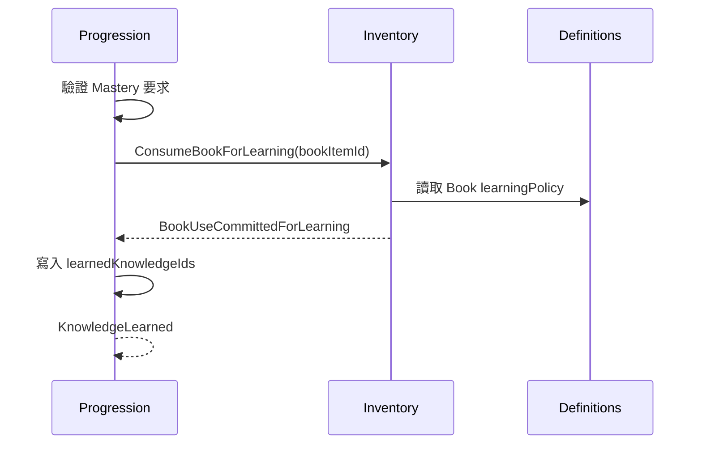

# Progression 模組契約

> **模組 ID：** `progression`
>
> **依賴：** [共用核心契約](00_shared_contracts.md)、Character／Team／Inventory 的公開 Query。Progression 不擁有戰鬥傷害、物品實體、城市設施或隊伍時間；它只把已確認的成長來源轉成熟練度、主屬與已學習知識。
>
> **責任：** 管理熟練度 MXP、Lv.0～Lv.10、五項主屬、自動與書籍解鎖的技能／魔法／製作知識、傳授 Session 與所有成長上限。

---

## 1. 邊界與所有權

### 1.1 Progression 唯一可寫的 State

```ts
type ProgressionState = {
  characterProgress: Record<CharacterId, CharacterProgression>;
  teachingSessions: Record<TeachingSessionId, TeachingSession>;
  childStudySessions: Record<ChildStudySessionId, ChildStudySession>;
};
```

### 1.2 Progression 不擁有的事

| 事實 | 所有者 | Progression 的角色 |
|---|---|---|
| 角色身分、年齡、生命／魔力、死亡 | character | 讀取年齡階段並回傳最大生命／魔力變動。 |
| 隊伍、旅行、自由行動與 28 日時間進度 | team | 接收完成事件，或在建立傳授 Session 時記錄起始資料。 |
| 傷害、承傷、戰鬥勝負與九宮格 | combat | 接收已確認的攻擊／防禦 MXP 資料。 |
| 裝備實體、書籍持有與材料 | inventory | 請求驗證／消耗書籍，不直接操作 Item。 |
| 製造環境、城市教師、訓練所 | city | 讀取教師／設施資料或接收完成事件。 |
| 委託完成與公會結案 | quest | 只有 Quest 結案才送出任務熟練度來源。 |

---

## 2. 靜態資料契約

### 2.1 ProgressionDefinitionReader

```ts
interface ProgressionDefinitionReader {
  getMastery(id: MasteryId): MasteryDefinition;
  getMasteryCurve(id: MasteryCurveId): MasteryCurveDefinition;
  getSkill(id: SkillId): SkillDefinition;
  getTeachingRule(id: TeachingRuleId): TeachingRuleDefinition;
  getExperienceAwardRule(id: ExperienceAwardRuleId): ExperienceAwardRuleDefinition;
  listSocialMasteryBenefits(): SocialMasteryBenefitDefinition[];
  getAttackMasteryAwardRule(id: AttackMasteryAwardRuleId): AttackMasteryAwardRuleDefinition;
  getDefenseMasteryRoutingRule(id: DefenseMasteryRoutingRuleId): DefenseMasteryRoutingRuleDefinition;
  getSupportMasteryAwardRule(id: SupportMasteryAwardRuleId): SupportMasteryAwardRuleDefinition;
  getAgeExperienceRule(id: AgeExperienceRuleId): AgeExperienceRuleDefinition;
  getChildEducationRule(id: ChildEducationRuleId): ChildEducationRuleDefinition;
}
```

本模組**不在架構文件中自行發明熟練度清單**。實際武器、魔法、生活、任務、探索、旅行等 Mastery ID 由內容資料檔登錄；Progression 只提供統一的等級、經驗與主屬處理模型。

### 2.2 Mastery 與等級曲線

```ts
type MasteryDefinition = DefinitionHeader & {
  curveId: MasteryCurveId;
  primaryAttributeGainsByLevel: PrimaryAttributeGains[];
  automaticKnowledgeUnlocks: AutomaticKnowledgeUnlock[];
};

type MasteryCurveDefinition = DefinitionHeader & {
  maxLevel: 10;
  cumulativeExperienceThresholds: number[]; // Lv.0..Lv.10
};

type SocialMasteryBenefitDefinition = DefinitionHeader & {
  masteryId: MasteryId;
  personalTradeBonusGainsByLevel: [0.5, 0.5, 1, 1, 1.5, 1.5, 2, 3, 4, 5];
  inviteSuccessBonusGainsByLevel: [0.5, 0.5, 1, 1, 1.5, 1.5, 2, 2, 3, 3];
  memberDepartureResistanceGainsByLevel: [0.5, 0.5, 1, 1, 1.5, 1.5, 2, 2, 3, 3];
};

type SocialMasteryBenefitsView = {
  personalTradeBonus: number;
  inviteSuccessBonus: number;
  memberDepartureResistance: number;
};
```

- 熟練度固定 Lv.0～Lv.10。
- 玩家沒有任何自由配點介面；主屬只由 Mastery 等級資料自動帶來。
- 每個 Mastery 的各級主屬增加值都由資料定義，可採後期增加較多的曲線。
- 總來源可超過主屬 100；最終顯示／計算值仍各自 clamp 到 100，不把溢出轉給其他屬性。
- 交流的三條效果均採各級新增值累加；Lv.10 總計依序為 20、16、16。價格與機率公式由使用它的模組 Resolver 定義，Progression 只提供個人累加值。

### 2.3 技能、魔法、製作知識與書籍

```ts
type SkillDefinition = DefinitionHeader & {
  requiredMasteries: MasteryRequirement[];
  acquisition:
    | { kind: 'automatic' }
    | { kind: 'book'; acceptedTiers: BookTier[] };
  combatMetadata?: SkillCombatMetadata;
};

type SkillCombatMetadata = {
  masteryExperienceMode: 'damage' | 'fixedSupport';
  attackMasteryAwardRuleId?: AttackMasteryAwardRuleId;
  supportMasteryAwardRuleId?: SupportMasteryAwardRuleId;
};
```

規則固定：

- 基礎技能可由熟練度門檻自動取得。
- 其他技能、魔法與製作內容必須閱讀書籍，且仍要符合熟練度門檻。
- 書籍三級為基礎／高級／極品；來源由 City、Map、Boss 內容資料決定。
- 技能與魔法不可傳授；傳授只給熟練度 MXP。
- `damage` 技能必須且只能引用 Attack Mastery Award Rule；`fixedSupport` 技能必須且只能引用 Support Mastery Award Rule。Combat 與 Combat Sequence 的窄化 Skill View 都由這一份 metadata 編譯。

### 2.4 經驗來源資料

```ts
type ExperienceAwardRuleDefinition = DefinitionHeader & {
  masteryId: MasteryId;
  baseExperience: number;
  ageExperienceRuleId?: AgeExperienceRuleId;
};

type SupportMasteryAwardRuleDefinition = DefinitionHeader & {
  fixedExperiencePerUse: number;
  masterySplits: Array<{
    masteryId: MasteryId;
    ratio: number;
  }>;
};

type AttackMasteryAwardRuleDefinition = DefinitionHeader & {
  masterySplits: Array<{
    masteryId: MasteryId;
    ratio: number;
  }>;
};

type DefenseMasteryRoutingRuleDefinition = DefinitionHeader & {
  resolverId: ResolverId;
};

type DefenseMasteryRoutingInput = {
  characterId: CharacterId;
  equippedDefenseMasteryIds: MasteryId[];
};

type DefenseMasteryRoutingResult = {
  masterySplits: Array<{
    masteryId: MasteryId;
    ratio: number;
  }>;
};

type AgeExperienceRuleDefinition = DefinitionHeader & {
  stages: {
    minAgeDays: number;
    maxAgeDays?: number;
    experienceMultiplier: number;
  }[];
};
```

`ExperienceAwardRuleDefinition` 是所有固定熟練度經驗的唯一資料表：規則指定受益 Mastery 與基礎 MXP；Progression 再統一套用年齡倍率與冪等來源檢查。它不負責重算戰鬥傷害、站位權重或支援技能使用次數；那些結果必須先由 Combat／Combat Sequence 結算為專用 Mastery Event。

固定而不隨內容個體變動的行為（玩家聊天、玩家買賣、非玩家主角自由日聊天／買賣）也必須從來源模組的資料規則取得 `experienceAwardRuleId`，並在正式 Event payload 中傳給 Progression；City 與 Team 不得把 MXP 寫死在 Handler。採集點、食譜、旅行模式、探索單位與任務等每筆內容可能不同的來源，同樣在其自身資料或正式 Event 中直接引用 `experienceAwardRuleId`。

### 2.5 熟練度經驗來源矩陣

| 行為事實 | 事實發出者 | Rule 取得方式 | 受益者與限制 |
|---|---|---|---|
| 玩家主角成功隊友交流／酒館聊天／打聽情報 | Social `PlayerConversationCompleted` | Social 的 Player Conversation Rule | 玩家主角；三種來源共用每日最多 6 次。 |
| 玩家主角成功買入／賣出 | City `CommerceInteractionCompleted` | City 的 Player Commerce Practice Rule | 玩家主角；每日最多 6 次。 |
| 玩家隊友或 NPC 的完整自由日 | Team `NonPlayerMemberFreeDaySocialPractice` | Team 的 Non-player Daily Social Practice Rule | 每名非玩家主角正式成員各一次；不模擬實際交易或聊天。 |
| 採集點、旅行資源、敵人採集型掉落 | Gathering `GatheringResolved` | payload／採集點資料的 `experienceAwardRuleId` | 唯一最高採集者一次；節點、事件或戰利品來源決定 Rule。 |
| 自製料理 | Crafting `CuisineConsumed` | 食譜的 `cookingExperienceRuleId` | 製作者；倍率 1。 |
| 餐館基礎料理 | Crafting `CuisineConsumed` | 同一食譜 Rule | 用餐者；倍率固定 1/3。 |
| 耗時製作 | Crafting `CraftingCompleted` | 配方的 Experience Rule | 製作者；成功或資料定義的失敗結果都依同一 Rule。 |
| 旅行、探索、任務與傳授 | 各自正式完成 Event | 對應內容資料或 Event 的 Rule | 依既定的一趟一次、同版一次、原接取公會結案與傳授規則。 |

Social 的 `PlayerConversationDailyUsage` 與 City 的 `PlayerDailyCommerceUsage` 都以 `worldDay` 作為狀態 key。世界日改變即讀取／建立新日的計數，不需要另設「重置次數」Job。

資料規則必須可表達既定設計：

- 武器／攻擊魔法依對怪物造成的傷害比例取得攻擊 MXP；每個傷害技能引用 `AttackMasteryAwardRule`，因此法杖與攻擊魔法可依資料分配 50／50。簡易戰鬥串若配置多個攻擊技能，先平均分給這些技能，再套用各技能的相同 Rule。
- 防禦預算是否取得與份額大小只依開戰初始站位：由前至後略過空排，第一／二／三個有人排每人權重固定為 3／2／1，不因是否持盾而失去參與資格。角色份額再由共用 `DefenseMasteryRoutingRule` 對其開始快照中的防禦裝備 Mastery 候選分配；Detailed 與 Combat Sequence 必須使用同一結果。
- 鍛造／裁縫／工藝／製藥／廚藝的成長事件由 Crafting 結算後送入；實際配方、產量、詞條與餐館規則不由 Progression 擁有。
- 旅行每趟固定經驗，不依天數重複發放。玩家隊伍依 3／6／9 日模式乘 ×0.5／×1／×2；非玩家隊伍固定 6 日與 ×1，且不需要旅行事件結果才能發放。
- 招式本身沒有熟練度或招式練習值。無傷害的支援魔法／樂器技能使用 `SupportMasteryAwardRule` 給固定 Mastery MXP；同一角色、同一技能在同一 detailed Encounter 最多取得 3 次。Combat Sequence 則是每個正式成功戰鬥節點視為一次，因此整串可超過 3 次。第一版法杖魔法可將每次固定值依 50／50 拆給法杖與魔法 Mastery；其他支援技能的受益 Mastery 由資料 `masterySplits` 定義。攻擊型樂器技能仍屬傷害技能。所有 Attack／Support Rule 的 `masterySplits.ratio` 必須大於 0，且總和必須恰為 1。
- 每張地圖版本的每個可取得探索單位，只可取得一次探索經驗。
- 任務熟練度只在回到**原接取公會**結案成功後發放。
- 子女 15 歲成年前的較快成長由 Age Experience Rule 套用；出生與成年不直接贈送主屬。

---

## 3. Runtime State

### 3.1 CharacterProgression

```ts
type CharacterProgression = {
  characterId: CharacterId;
  masteries: Record<MasteryId, MasteryProgress>;
  learnedKnowledgeIds: DefinitionId[];
  claimedExplorationRewards: ExplorationRewardKey[];
  revision: Revision;
};

type MasteryProgress = {
  masteryId: MasteryId;
  experience: number;
  level: number;                 // 快取；必須可由 curve + experience 驗證
  revision: Revision;
};

```

`learnedKnowledgeIds` 可包含 Skill、Magic、Recipe 等 Definition ID；它表示角色已學會，不表示目前可否裝備或施放。角色沒有技能／招式熟練度 State；戰鬥技能造成的所有成長都必須落在既有 Mastery。

### 3.2 主屬計算

```ts
type PrimaryAttributeId =
  | 'muscle'
  | 'intelligence'
  | 'reaction'
  | 'coordination'
  | 'charisma';

type PrimaryAttributes = Record<PrimaryAttributeId, number>;
```

主屬是**推導值**：

```text
每項主屬 = min(100, 所有 Mastery 依目前等級提供的該屬加總)
```

不得把主屬當成可被 UI 直接加點的獨立可寫欄位。若需要快取，快取必須能由 Mastery 重建。

### 3.3 TeachingSession

```ts
type TeachingSession = {
  teachingSessionId: TeachingSessionId;
  learnerId: CharacterId;
  teacher: TeachingSource;
  masteryId: MasteryId;
  ruleId: TeachingRuleId;
  startedOnDay: WorldDay;
  learnerEntryExperience: number;
  learnerEntryLevel: number;
  status: 'active' | 'completed' | 'cancelled';
  revision: Revision;
};

type TeachingSource =
  | { kind: 'character'; characterId: CharacterId }
  | { kind: 'cityTeacher'; cityId: CityId; facilityId: FacilityId; teacherMasteryLevel: number };
```

### 3.4 ChildStudySession

```ts
type ChildEducationRuleDefinition = DefinitionHeader & {
  teacherMinimumPostDays: 28;
  childStudyCycleDays: 14;
  selfStudyParentMasteryRate: number; // 數值待試算，必須遠低於 1
  npcChildParentMasteryShare: 0.2;
};

type ChildStudySession = {
  childStudySessionId: ChildStudySessionId;
  childTeamId: TeamId;
  learnerId: CharacterId;
  source:
    | { kind: 'homeTeacherPost'; postId: HomeTeachingPostId; teacherId: CharacterId; masteryId: MasteryId }
    | { kind: 'selfStudy' };
  startedOnDay: WorldDay;
  scheduledEndOnDay: WorldDay;
  status: 'active' | 'settled' | 'interrupted';
  revision: Revision;
};
```

玩家家系的未成年子女各自是一支 `control: child`、單人成員的 Child Team。它每次執行 14 日 Child Study Cycle：有可用 Home Teaching Post 時，依資料規則抽取教師與欲學 Mastery；14 日結束後結算並立即重抽下一個對象。教師 Post 至少維持 28 日，玩家主角也是同一規則；教師中途離開崗位時，當前 Cycle 依實際已經過日數比例結算，隨即重抽。沒有教師可用時，Child Team 進入 14 日自習；自習對每一項 Mastery 分別取得「父母同項熟練度加總 × `selfStudyParentMasteryRate`」的經驗。

非玩家冒險者的子女不建立 Child Team 或逐周期模擬；成年當日，對每項 Mastery 直接給予父母各自該項累積 MXP 的 1/5 相加，之後才進入一般角色／隊伍流程。

### 3.5 Progression 不變量

1. 每個 Mastery 的 `level` 必須與其 Curve、Experience 一致，且介於 0～10。
2. 主屬推導結果必須介於 0～100；不可被其他模組直接覆寫。
3. 同一角色同一時點至多有一筆 active TeachingSession。
4. TeachingSession 建立時的 `learnerEntryExperience`／`learnerEntryLevel` 不可改寫；跨級上限必須以它們為準。
5. `claimedExplorationRewards` 同一地圖版本／探索單位不可重複。
6. 學會技能不等於能繞過武器、熟練度、位置或資源需求施放；那些是 Combat／Team 的驗證責任。
7. 不存在「技能傳授」或「主屬加點」資料路徑。
8. 一名玩家家系未成年子女同一時點至多有一筆 active ChildStudySession，且周期恆為 14 日；非玩家冒險者子女不得建立 ChildStudySession。

---

## 4. 公開 Query

```ts
interface ProgressionQuery {
  getMastery(characterId: CharacterId, masteryId: MasteryId): MasteryProgressView;
  getPrimaryAttributes(characterId: CharacterId): PrimaryAttributes;
  getSocialMasteryBenefits(characterId: CharacterId): SocialMasteryBenefitsView;
  knows(characterId: CharacterId, knowledgeId: DefinitionId): boolean;
  meetsRequirements(characterId: CharacterId, requirements: MasteryRequirement[]): boolean;
  getTeachingSession(characterId: CharacterId): TeachingSessionView | undefined;
}
```

Progression 只公開主屬、Mastery 與已學知識真相，不宣稱自己擁有完整角色能力。Composition Adapter 會組合 Progression／Inventory／Character 的 Snapshot DTO，交給 [Derived Statistics](16_derived_statistics.md)，再實作 Character 所需的 `CharacterStatsQuery`。

---

## 5. 輸入契約

### 5.1 訂閱 DomainEvent

| Event | Progression 的反應 |
|---|---|
| `CombatAttackMasteryEarned` | 依 Combat／Combat Sequence 已分配的 Character Award 發放攻擊 MXP；使用 `CombatMasterySource` 冪等。 |
| `CombatDefenseMasteryEarned` | 依 Combat／Combat Sequence 已分配的 Character Award 發放防禦 MXP；使用 `CombatMasterySource` 冪等。 |
| `CombatSupportMasteryEarned` | 依 Support Mastery Award Rule 將 `creditedUseCount` 轉成對應 Mastery MXP；Encounter 來源必須為 0～3，Combat Sequence 來源可等於正式成功場次。未學會或開始快照不合法視為不變量錯誤。 |
| `CraftingCompleted` | 依已結算配方的 Crafting Experience Rule 發放對應生活技藝 MXP；若配方定義失敗結果，成功與失敗使用同一規則。 |
| `CuisineConsumed` | 依 payload 的食譜 Experience Rule 發放廚藝 MXP；餐館僅套用 payload 的固定 `1/3` 倍率。 |
| `GatheringResolved` | 只對 payload 的 `contributorCharacterId`，依已驗證 `masteryId` 與 `experienceAwardRuleId` 發放一次採集 MXP；不平均分給隊伍。 |
| `CommerceInteractionCompleted` | 僅接受玩家主角成功買入／賣出的事件，依 payload 的 Commerce Experience Rule 對付款或收款角色發固定交流 MXP。 |
| `PlayerConversationCompleted` | 僅接受 Social 已提交的玩家隊友交流／酒館聊天／情報事件，依 payload 的 Experience Rule 對玩家主角發固定交流 MXP。 |
| `NonPlayerMemberFreeDaySocialPractice` | 對 payload 的非玩家主角正式隊員（玩家隊友或 NPC），依兩條 Experience Rule 各發一次聊天與購物交流 MXP；不要求也不模擬實體交易。 |
| `TravelCompleted` | 每趟只發一次旅行 MXP；`travelKind=player` 使用玩家模式倍率，`travelKind=npc` 只接受固定 ×1。 |
| `MapExplorationCompleted` | 檢查地圖版本／探索單位是否已領取，再發探索 MXP。 |
| `QuestSettled` | 原接取公會成功結案時發任務 Mastery MXP。 |
| `FreeActionCompleted` | 只在 payload 指向 Progression 擁有的 TeachingSession 時完成傳授；城市製作／訓練等待 City 的專用完成事件，避免重複發放。 |
| `TeamPlanCompleted` | 若為 `childStudy`，結算該子女 14 日學習 Cycle，並要求 Team 建立下一個 Cycle。 |
| `HomeTeachingPostChanged` | Post released 或 interrupted 時，將使用該 Post 的 Child Study Session 按實際經過日數部分結算，並要求重抽下一個 Cycle。 |
| `CityTrainingCompleted` | 套用固定 Lv.5 城鎮教師的訓練結果；仍使用相同傳授差額與跨級上限。 |
| `BookUseCommittedForLearning` | 寫入已學習技能／魔法／配方。 |
| `CharacterBorn` | 為新生兒建立全部為 0 的 Progression State；不因父母熟練度直接贈送等級。 |
| `CharacterBecameAdult` | 玩家家系子女停止 Child Study；非玩家冒險者子女對每項 Mastery 取得父母各自累積 MXP 的 1/5 相加，之後的經驗來源自然改用成年 Age Experience Stage。 |

### 5.2 Internal Command

| Internal Command | Progression 的反應 |
|---|---|
| `GrantContentEventMasteryExperience` | 只接受已註冊 Content Event Workflow；依 Event Instance／Effect ID、目標角色與 Experience Award Rule 發放一次，套用既有年齡倍率、上限與冪等來源檢查。 |

### 5.3 玩家 Command

| Command | 前置條件 | Progression 的責任 |
|---|---|---|
| `learnFromBook` | 角色符合 Mastery 門檻且指定實體書可用。 | 啟動學書 Workflow，送出 `ConsumeBookForLearning`，成功後寫入知識。 |
| `startTeaching` | 教師、學員、Mastery、場所與 28 日時間皆合法。 | 建立 TeachingSession，記錄起始經驗／等級。 |

城市訓練、家中傳授與生活技藝訓練的時間一律由 Team 的自由行動／Plan 處理；Progression 不自建 28 日計時器。

---

## 6. 傳授規則

### 6.1 TeachingRuleDefinition

```ts
type TeachingRuleDefinition = DefinitionHeader & {
  durationDays: number;                 // 第一版為 28
  adultDifferenceRate: number;          // 第一版為 0.0015
  childDifferenceRate: number;          // 第一版為 0.00225
  cityTeacherMasteryLevel: number;      // 第一版為 5
  maxLevelGainPerSession: number;       // 第一版為 1
};
```

### 6.2 完成公式

```text
原始 MXP = max(0, 教師 MXP − 學員目前 MXP) × 年齡對應比例

本次最終上限 =
  起始等級 N 的「進入 N+2 所需門檻 − 1」
  （Lv.10 則為最大值）

實際 MXP = min(學員目前 MXP + 原始 MXP, 本次最終上限)
```

UI 可將「剛好距離下一級只差 1」顯示為 `N+1 Lv. 99.99%`；內部永遠使用真實門檻值。這個上限每次 28 日 Session 重新計算，避免一次傳授跨越兩級以上。

城市老師的熟練度固定由 `cityTeacherMasteryLevel` 資料提供；教師較強時，差額自然較大。教師不高於學員時，原始 MXP 為 0。

---

## 7. 核心流程

### 7.1 戰鬥與製造 MXP

```text
combat／city／gathering 已完成事實
  → *MasteryEarned、CraftingCompleted 或 GatheringResolved
  → Progression 依 Definition 分配 MXP
  → 更新 Mastery Experience／Level
  → 重新推導五主屬（各自最多 100）
  → 發出 MasteryExperienceGranted、MasteryLevelChanged、ProgressionCapacityChanged
```

詳細 Combat 與 [Combat Sequence](21_combat_sequence_module.md) 都先把來源解析成同一組 `Combat*MasteryEarned` 事件，Progression 不重算傷害、戰力骰或隊伍權重。Detailed 使用真實傷害與每技能每場最多 3 次；Combat Sequence 使用整串正式成功的總攻擊／防禦預算及成功場次，並已依開始快照完成六分制攻擊權重、3／2／1 站位權重與每場一次支援技能計算。

採集是明確例外：`GatheringResolved` 已依參與者快照選出唯一最高採集等級者，Progression 不重新選人、不平均，也不依產物數量重複發放。一次 Resolution 恰好使用一次 Experience Award Rule。

### 7.2 技能與書籍



自動技能在 Mastery 升級後由 Progression 立即依 `automaticKnowledgeUnlocks` 檢查；書籍取得不會自動學會，仍需明確學習 Command。

### 7.3 地圖探索一次性獎勵

```text
dungeon 發出 MapExplorationCompleted(mapId, mapVersion, explorationKey, experienceRuleId)
  → Progression 查 claimedExplorationRewards
  → 未領過：發 MXP 並寫入 Key
  → 已領過：安全跳過
```

這確保同一張地圖版本的同一探索單位不能反覆刷探索經驗。

---

## 8. 輸出事件

| Event | 最少 payload | 訂閱者 |
|---|---|---|
| `MasteryExperienceGranted` | `characterId`、`masteryId`、`amount`、`source` | ui/app、debug。 |
| `MasteryLevelChanged` | `characterId`、`masteryId`、`oldLevel`、`newLevel` | ui/app、combat。 |
| `PrimaryAttributesChanged` | `characterId`、`attributes` | combat、ui/app。 |
| `ProgressionCapacityChanged` | `characterId` | character。 |
| `AutomaticKnowledgeUnlocked` | `characterId`、`knowledgeId` | ui/app。 |
| `KnowledgeLearned` | `characterId`、`knowledgeId`、`source` | combat、city、ui/app。 |
| `TeachingSessionChanged` | `sessionId`、`status`、`gainedExperience` | team、ui/app。 |

### 8.1 輸出 Internal Command

| Internal Command | 最少 payload | 唯一處理者 |
|---|---|---|
| `ConsumeBookForLearning` | `characterId`、`bookItemId`、`knowledgeId` | inventory。 |

---

## 9. 測試 Fixture 與驗收

Progression 模組最低必須提供：

1. 不同主屬成長曲線、五項屬性各自超過 100 後 clamp 的測試。
2. Lv.0～Lv.10 門檻與自動技能解鎖的測試。
3. 武器傷害比例、全員防禦 MXP、法杖／攻擊魔法分配的資料化測試。
4. 製作詞條上限、消耗品產量、工藝品售價品質，以及配方失敗時仍取得同一 Crafting MXP 的測試。
5. 旅行每趟只發一次；玩家 3／6／9 模式套用正確倍率、NPC 固定 6 日與 ×1，且 NPC 不依賴旅行事件的測試。
6. 地圖同版本探索獎勵只取得一次的測試。
7. 28 日成人／子女傳授差額公式、城市 Lv.5 教師與最多跨一級 99.99% 的測試。
8. 書籍來源不影響熟練度門檻、技能不可傳授的測試。
9. Combat Sequence 只接受來源正式提交的成功 Result；暫存、失敗、skip 與競爭失效內容不發 MXP 的測試。
10. 支援技能固定 Mastery MXP、detailed 同技能每場最多 3 次、Combat Sequence 每個正式成功節點一次，以及攻擊型樂器走攻擊權重的測試。
11. 玩家主角交易／聊天事件僅在 City 成功提交後發放；每位非玩家主角的正式隊員在自由日各固定得到一次聊天與一次購物 MXP，且不會隨交易 Intent 次數增加；此例外不得影響其他熟練度來源。
12. 採集同級以穩定 ID 選出的唯一角色取得一次 MXP；其他隊員、重送 Resolution、NPC skipped 結果皆不取得的測試。

---

## 10. Progression 模組交接清單

- [ ] Mastery、Curve、Skill、Attack／Support Mastery Award、Defense Mastery Routing、Recipe、Teaching、Experience Award JSON Schema。
- [ ] `CharacterProgression`、`TeachingSession`、探索獎勵 State Schema。
- [ ] `ProgressionQuery` 與 Character Stats Projection 所需的公開欄位。
- [ ] MXP 分配、等級、主屬推導與自動技能 Handler。
- [ ] 書籍學習、城市訓練、家中傳授與 NPC 成長處理。
- [ ] 全部成長來源的 Fixture 與快轉一致性測試。
