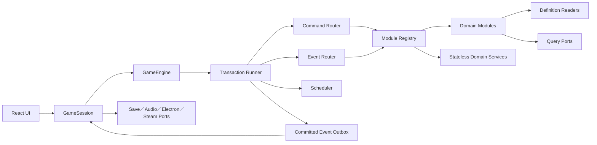
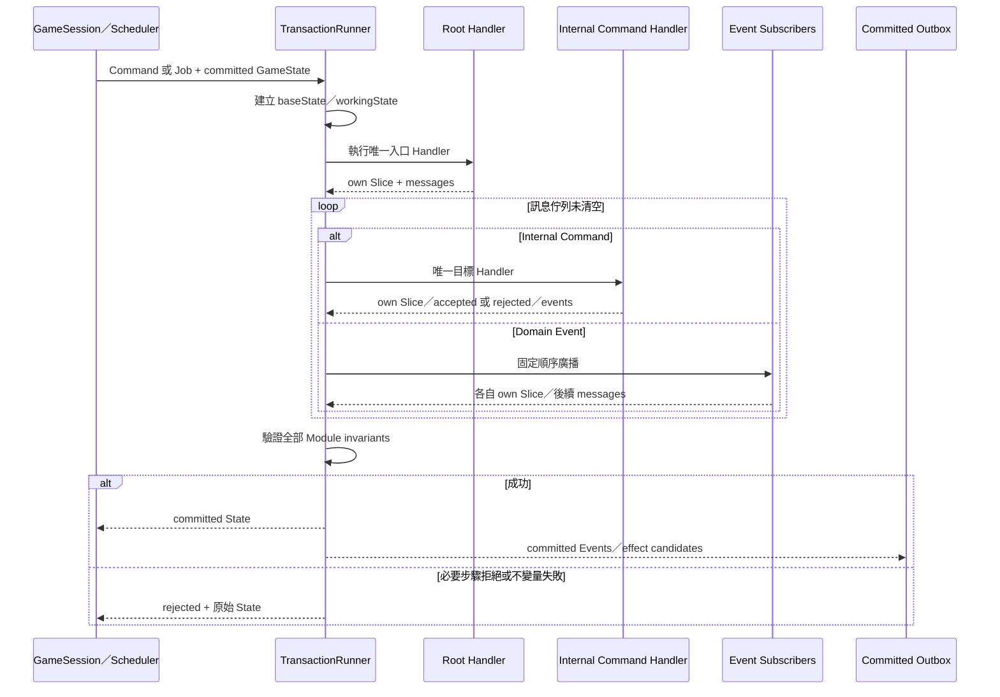

# Engine Runtime 與交易契約

> **模組 ID：** `kernel`／`app`
>
> **依賴：** [共用核心契約](00_shared_contracts.md)。
>
> **責任：** 定義遊戲核心如何組合模組、執行玩家命令、處理每日 Job、路由 Internal Command／DomainEvent、提交原子交易，以及在提交後交付 UI 與平台副作用。
>
> **非責任：** 不定義戰鬥、委託、城市、地圖、成長或任何玩法公式。

---

## 1. Runtime 元件與所有權



| 元件 | 擁有的責任 | 明確禁止 |
|---|---|---|
| `GameSession` | 序列化 UI 輸入、保存目前 committed snapshot、驅動存檔與通知。 | 不驗證玩法、不修改 State。 |
| `GameEngine` | 建立交易、處理玩家 Command、推進世界日。 | 不知道 React、Electron、Steam。 |
| `TransactionRunner` | working state、訊息佇列、提交或拒絕。 | 不放模組規則。 |
| `CommandRouter` | 將命令送給唯一 Handler。 | 不廣播命令。 |
| `EventRouter` | 依固定 Registry 順序執行零到多個 Subscriber。 | 不把事件當可拒絕命令。 |
| `Scheduler` | 保存、排序、驗證及重建 Job。 | 不保存 callback／Promise。 |
| `ModuleRegistry` | 註冊 State contribution、Handler、Subscriber、Query 與 migration。 | 不以 import 順序決定行為。 |
| `DomainServiceRegistry` | 註冊無 State 的純計算能力與其 Definition Reader。 | 不讓 Service 取得完整 GameState 或平台 I/O。 |
| `Workflow` | 編排跨模組 Internal Command 與必要／可選步驟。 | 不擁有 State 或玩法公式。 |
| `Outbox` | 暫存已提交事件與平台效果候選。 | 不接收未提交事件。 |

---

## 2. 公開 Engine 入口

```ts
interface GameEngine {
  executePlayerCommand(
    state: GameState,
    envelope: GameCommandEnvelope<GameCommand>,
  ): CommandExecutionResult;

  advanceWorldToDay(
    state: GameState,
    targetDay: WorldDay,
  ): WorldAdvanceResult;
}

type WorldAdvanceResult = {
  state: GameState;
  requestedTargetDay: WorldDay;
  reachedDay: WorldDay;
  status: 'completed' | 'awaitingPlayerInput';
  pendingInteractionId?: InteractionId;
  committedOutbox: CommittedOutbox;
};
```

兩個入口皆為同步、可重播的純核心操作。資料讀取、RNG、ID 產生器與時間都由 `EngineContext` 明確注入，不得直接呼叫系統時間、`Math.random()`、檔案系統或平台 API。

```ts
type EngineContext = {
  definitions: GameDefinitionReaders;
  moduleRegistry: ModuleRegistry;
  rngFactory: DeterministicRngFactory;
  idGenerator: RuntimeIdGenerator;
  limits: EngineSafetyLimits;
};
```

---

## 3. 交易生命週期

一個玩家 Command 或一筆到期 Job 對應一筆交易。



### 3.1 提交規則

1. `baseState` 永遠不可變。
2. Handler 只回傳自己 Slice 的 `nextSlice`；Router 組成 `workingState`。
3. 交易中所有 Query 都讀取最新 `workingState`，因此後續步驟可觀察同交易前段的暫定變更。
4. `workingState` 不能逃出 TransactionRunner。
5. 訊息佇列清空後，依 Module Registry 固定順序驗證所有受影響 Slice。
6. 成功時一次提交 State、Job drafts 與 Event Outbox。
7. 拒絕時回傳原始 State；不得保留一部分 Slice、Job 或事件。
8. Handler 產生的 `outgoingMessages` 保留相對順序，並優先於呼叫者尚未處理的後續訊息；直接因果會先完整收斂。
9. 一筆 Event 的所有 Subscriber 先依固定順序完成，Router 再把它們產生的訊息作為下一層因果處理。

### 3.2 拒絕與程式錯誤

| 情況 | 結果 |
|---|---|
| 玩家前置條件不符 | `CommandRejected`，State 不變。 |
| Required Internal Command 被拒絕 | 整筆交易拒絕，回傳來源可理解原因。 |
| Optional Internal Command 被拒絕 | Workflow 走明確資料化替代路徑；不能默默忽略。 |
| DomainEvent Subscriber 違反不變量 | 視為程式錯誤，交易中止並輸出 diagnostics。 |
| 找不到 Command Handler | 啟動／註冊錯誤；不得進入遊戲。 |
| Event 沒有 Subscriber | 合法；事件仍可供 UI／紀錄使用。 |

---

## 4. Workflow 契約

多模組操作不能由 UI 串接，也不能由一個模組直接寫另一個 Slice。`app/workflows/` 負責交易內的定向編排。

```ts
type WorkflowDefinition = {
  workflowId: WorkflowId;
  startsFrom: GameCommandType | ScheduledJobType | DomainEventType;
  steps: WorkflowStepDefinition[];
};

type WorkflowStepDefinition = {
  internalCommandType: InternalCommandType;
  requirement: 'required' | 'optional';
  onAccepted: WorkflowTransition;
  onRejected: WorkflowTransition;
};
```

Workflow 可決定：

- 先驗證哪個公開能力。
- 下一個 Internal Command 要帶哪些前一步結果 ID。
- 哪些步驟必須成功。
- 可選步驟失敗時走哪個明確分支。
- 以自己的 `workflowId` 作為 Internal Command 的 `source`，但不能偽裝成領域模組。

Workflow 不可決定：

- 傷害、售價、經驗、刷新或任務期限公式。
- 某筆 Command 是否符合目標模組的不變量。
- 直接建立或 patch 任一領域 Entity。

第一版必須明確建立至少下列 Workflow：

1. 購買／販售物品。
2. 學習書籍。
3. 裝備、消耗品與工藝品製作。
4. 委託物品保留、交付、回收與釋放。
5. 玩家內容處理與戰利品。
6. NPC 地牢結算。
7. 戰鬥消耗品使用。
8. 護衛／救援任務與暫時角色建立／回收。
9. 任務結案、報酬金錢與熟練度來源。
10. 城市耗時行動與完成結果。
11. 旅行三段 ContentEvent 與玩家 Pending Interaction。
12. 城市人口需求、世界冒險者建立與 NPC 組隊。
13. 玩家繼承人選擇，以及金錢、物品與房屋的原子移轉。
14. 任務報酬均分、expired Quest Cargo 釋放與個人化分配。
15. 玩家／NPC 地牢成果收集、玩家競拍、流標直售、NPC RNG 與最終現金均分。
16. 真實冒險者建立後的個人 Economy Account 與初始 Inventory 容器配置。
17. NPC 自主生活循環：意圖抽選、動作串、任務鎖定與資料化市場交易。
18. 料理：自製／餐館用餐、FoodStatus 效果套用與到期、NPC 獨立料理決策。

---

## 5. 訊息路由與順序

### 5.1 唯一 Handler

每個 Game Command、Internal Command、ScheduledJob 的 `type` 在 Registry 中必須恰好有一個 Handler。重複或缺少 Handler 都是啟動錯誤。

### 5.2 Event Subscriber

Event 可有零到多個 Subscriber。順序由 manifest 明確宣告：

```ts
type EventSubscription = {
  eventType: DomainEventType;
  subscriber: MessageSourceId; // ModuleId 或 WorkflowId
  priority: number;
};
```

固定排序為：

```text
priority → subscriber → registrationId
```

不得使用 bundler、檔名或 import 發生順序決定結果。

### 5.3 因果追蹤

所有訊息必須保留：

- `transactionId`：同一原子提交。
- `correlationId`：同一玩家意圖或世界流程。
- `causationId`：直接產生本訊息的 Command、Job 或 Event。

這些 ID 不參與玩法判定，但會進入 debug trace、錯誤報告與重播測試。

---

## 6. 每日 Scheduler

`advanceWorldToDay(targetDay)` 的核心流程：

```text
while nextDueDay <= targetDay:
  worldDay = nextDueDay
  依 phase → priority → jobId 取得當日 Job
  每筆 Job 各自開啟並完成一筆交易
  交易完成後重新讀取 Scheduler
worldDay = targetDay
```

整次 `advanceWorldToDay` 對 `GameSession` 是一個安全推進區段：各 Job 交易先提交到該次推進的私有 working snapshot；到達目標日或遇到玩家輸入切點後，才交付 State 與合併 Outbox。若途中發生程式錯誤，GameSession 保留呼叫前的 committed snapshot。

### 6.1 玩家輸入切點

旅行遭遇、事件選項、玩家隊內戰利品競拍或其他必須由玩家決定的內容，必須先由擁有模組把 `PendingInteraction` 寫入自己的 Slice，再發出已完成事實 `PlayerInteractionOpened`。

Scheduler 看到交易提交後存在 Pending Interaction 時：

1. 停止處理後續日期與 Job。
2. 回傳 `status: awaitingPlayerInput`，且 `reachedDay` 可以早於要求的目標日。
3. UI 依 committed Projection 顯示選項，送出新的 Game Command。
4. 選擇完成並清除 Pending Interaction 後，GameSession 才可再次要求繼續快轉。

Pending Interaction 必須存檔；不能只存在 React Modal 或 Promise。NPC 專用事件不可建立玩家輸入切點。

`app/composition` 註冊各模組的 `PendingInteractionQuery`，形成只讀的 `PendingInteractionRegistry`。全域不變量是同一時點最多一筆阻塞玩家的 Interaction；若一筆交易試圖建立第二筆，視為契約錯誤並回滾。Registry 不保存互動副本，也不替擁有模組解析選項。

### 6.2 相位規則

| Phase | 可處理內容 |
|---|---|
| `completeAction` | 旅行、自由活動、NPC 地牢日、既有行動完成。 |
| `closeDeadline` | 接受期限、實際結束期限與鎖定到期。 |
| `worldCadence` | 地圖、商店、護衛候選等固定日曆批次。 |
| `worldReaction` | 必須延到當日排程處理、且不是交易內即時因果的反應。 |
| `scheduleNext` | NPC 決策與下一輪行動。 |

交易中新增同日 Job 時：

- 只能加入目前尚未處理的較後 Phase。
- 相同或較早 Phase 一律改排次日，除非該 Job 契約明確禁止並回報錯誤。
- 即時因果優先使用交易內 Event／Internal Command，不要濫用同日 Job。

### 6.3 快轉

Scheduler 必須提供 `peekNextDueDay()`。玩家休息多日時可直接跳到下一個到期日，但：

- RNG stream 不因跳過空白日而改變。
- 週期 Job 必須依自己的固定日曆重排。
- Pending Map 刷新仍是登記後次日檢查。
- 結果必須與逐日處理完全一致。
- 若逐日版本會在某日要求玩家輸入，快轉也必須在同一日停止。

---

## 7. RNG、ID 與冪等

### 7.1 RNG

每筆會骰定內容的 Entity、Job 或 Run 保存自己的 `rngStreamId`。Handler 只能透過交易提供的 RNG Context 取值；不同模組不能共用一條隱含全域亂數序列。

Event 有多個 Subscriber 時，每個 Subscriber 使用由 `eventId + subscriber` 派生的子 Stream。新增一個無關 Subscriber 不得改變其他訂閱者原本會抽到的結果。

### 7.2 Runtime ID

Runtime ID 由：

```text
worldSeed + entityKind + nextRuntimeSequence
```

產生。序號只在交易提交時消耗；拒絕交易不得永久吃掉 ID。

### 7.3 冪等

- Job 使用 `jobId + expectedRevision` 避免舊排程重複套用。
- Internal Command Handler 對同一 `commandId` 在同一交易不得執行兩次。
- Event Subscriber 對同一 `eventId` 在同一交易不得重複反應。
- 平台 Outbox 使用 `eventId` 作為成就、通知與雲端同步的冪等鍵。

---

## 8. Query 與交易 Snapshot

領域模組只取得所需的窄化 Query Port：

```ts
interface TransactionQueryContext {
  character: CharacterQuery;
  map: MapQuery;
  team: TeamQuery;
  dungeon: DungeonQuery;
  world: WorldQuery;
  city: CityQuery;
  inventory: InventoryQuery;
  economy: EconomyQuery;
  quest: QuestQuery;
  progression: ProgressionQuery;
  combat: CombatQuery;
  distribution: AssetDistributionQuery;
}

interface TransactionDomainServiceContext {
  statistics: CharacterStatisticsCalculator;
}
```

實際 Context 只為 Handler 注入它宣告的 Query／Domain Service。Query：

- 讀取目前交易的 `workingState`。
- 回傳不可寫 DTO。
- 不執行 RNG、Command、Job 或外部 I/O。
- 不快取跨交易的可變 Entity 引用。

Domain Service 必須無 State、無 I/O、只接 immutable input；它不能藉由 Context 取得完整 GameState。

跨多模組的純顯示組合放在 `app/read-models/`。會影響玩法的跨模組公式由明確註冊的無 State Domain Service 計算；例如 `CharacterStatsQuery` 的 Adapter 組輸入，Derived Statistics 算公式。城市畫面 ViewModel 則仍是單純 Projection。

---

## 9. Committed Outbox 與平台副作用

交易提交後才建立：

```ts
type CommittedOutbox = {
  transactionId: TransactionId;
  events: GameDomainEvent[];
  notifications: Notification[];
  platformCandidates: PlatformEffectCandidate[];
};
```

Application 層可以把它轉成：

- React UI 通知。
- 自動存檔要求。
- 音效／動畫提示。
- Steam 成就候選。
- Debug／重播紀錄。

平台操作失敗不回滾已提交的遊戲世界；由平台層依 `eventId` 重試。遊戲規則不可依 Steam 或音效是否成功決定結果。

---

## 10. 存檔邊界

- 只保存 committed `GameState`；不保存進行中的 EngineTransaction。
- Scheduler 可存檔，但必須能由各 Slice 重建並驗證。
- SaveMeta 保存 Schema、各模組版本、內容 Manifest 版本與 Hash。
- 載入後先完成 migration、Definition 引用驗證、Job 重建與全域不變量檢查，才交給 UI。
- 若程式在交易途中關閉，重新啟動時回到上一份 committed save，不會載入半套交易。

---

## 11. 最小驗收測試

Engine Runtime 至少必須通過：

1. Required Internal Command 失敗，所有 Slice、ID 序號與 Job 完全不變。
2. 學書流程不會出現「書已消失但知識未取得」。
3. NPC 地牢套用時，Map 驗證失敗不會提前發放物品或 MXP。
4. 同一命令、State、Definition 與 RNG seed 產生完全相同結果。
5. 快轉 365 日與逐日 365 次結果一致。
6. 快轉遇到玩家事件時在正確日期提交並停止，解決後可繼續到原目標日。
7. 同日 Job 依 Phase 穩定排序，不能回排形成循環。
8. 重複 Event ID 不會讓 Subscriber 執行兩次。
9. UI、存檔與 Steam Port 只看到 committed Outbox。
10. Module Registry 對重複 Handler、缺少 Handler、重複 Slice owner 於啟動時失敗。
11. 模組測試可在沒有 React、Electron、檔案系統與 Steam 的環境執行。

---

## 12. Engine Runtime 交接清單

- [ ] `contracts/core` 的四類訊息信封與 Transaction ID。
- [ ] Module Registry 與啟動時唯一性驗證。
- [ ] Transaction Runner、working state、commit／reject。
- [ ] Game Command／Internal Command／Event／Job Router。
- [ ] Workflow Registry 與 required／optional step。
- [ ] Scheduler Phase、快轉與重建。
- [ ] Deterministic RNG、Runtime ID 與重播 Trace。
- [ ] Committed Outbox 與 Application／Platform Port。
- [ ] 交易原子性、日快轉與冪等測試。
