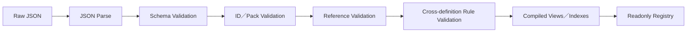

# Data Runtime 與內容契約

> **技術元件：** `data-runtime`
>
> **依賴：** `contracts/core` 與各模組公開的 Definition Schema contribution。
>
> **責任：** 載入外部 JSON 內容包、驗證 Schema／引用／規則、建立唯讀索引、編譯窄化 Definition View、註冊 Condition／Effect／Resolver 種類，以及保證內容順序與 RNG 可重播。
>
> **非責任：** 不讀寫 Runtime GameState、不執行玩家 Command、不提供任意腳本環境、不修改資料檔。

---

## 1. 內容包結構

```text
content/
├─ manifest.json
├─ base/
│  ├─ pack.json
│  ├─ rules/
│  ├─ nations/
│  ├─ cultures/
│  ├─ regions/
│  ├─ cities/
│  ├─ maps/
│  ├─ monsters/
│  ├─ items/
│  ├─ equipment/
│  ├─ skills/
│  ├─ recipes/
│  ├─ cuisine/
│  ├─ material-affixes/
│  ├─ quests/
│  ├─ events/
│  ├─ travel-event-pools/
│  ├─ gathering/
│  ├─ social/
│  ├─ mastery/
│  └─ experience-awards/
└─ yunhua/
   ├─ pack.json
   └─ ...
```

高變動內容原則上一筆 Definition 一個 JSON。編譯器可產生索引，不要求作者手動維護巨大總表。

### 1.1 Manifest

```ts
type RawContentManifest = {
  manifestVersion: string;
  packs: ContentPackReference[];
  loadOrder: ContentPackId[];
  localizationBundles: LocalizationBundleReference[];
};

type ContentPackReference = {
  packId: ContentPackId;
  version: string;
  requiredPacks: ContentPackDependency[];
  optional: boolean;
  contentRoot: string;
};
```

- Manifest 必須明確給出 Pack 順序；不得依檔案系統列舉。
- Pack 相依必須是無循環有向圖。
- 相同 Definition ID 不可默默後蓋前。
- 第一版不提供玩家任意 Plugin 執行環境；未來 DLC 仍使用相同資料契約。

---

## 2. Repository 與 Compiler

```ts
interface ContentRepository {
  loadManifest(): Promise<RawContentManifest>;
  loadPack(ref: ContentPackReference): Promise<RawContentPack>;
  loadLocalization(ref: LocalizationBundleReference): Promise<RawLocalizationBundle>;
}

interface DefinitionCompiler {
  compile(input: CompileContentInput): CompileContentResult;
}

type CompileContentResult =
  | { success: true; registry: DefinitionRegistry; report: CompileReport }
  | { success: false; diagnostics: DataDiagnostic[] };
```

`ContentRepository` 是 Platform Port，可由 Vite bundled assets、Electron 檔案或 Steam DLC 實作。`DefinitionCompiler` 必須是純 TypeScript，測試時可直接使用記憶體 Fixture。

---

## 3. 驗證管線



### 3.1 Schema Validation

驗證：

- 必填欄位、型別、列舉。
- 數值上下限與整數要求。
- discriminated union 的 `kind` 與 payload。
- `schemaVersion` 是否有對應 migration／parser。

### 3.2 Reference Validation

所有 ID 引用必須存在且型別相符，例如：

- Map 只能引用 Map Spawn Rule。
- Skill 的武器需求必須存在。
- Quest Reaction 的 Objective／Deadline／Reward Rule 必須存在。
- Shop 的 Book Pool 不得引用錯誤 Item kind。
- Retry Supply Policy 的 Item Tag 必須存在，且候選 Tag 至少能解析到一個 `combatConsumable`；其他 Item kind 不得被當成補品重骰資源。
- Map Gathering Node 只能引用合法 Gathering Rule；其產物 Resolver 只能引用可建立的 Item Definition。

### 3.3 Rule Validation

跨檔硬規則至少包含：

- Boss 必為大型 3×3。
- 一般敵人 1 招；菁英／Boss 2～4 招。
- 每個 Monster 必須引用合法的 Natural Attack Profile 與 Control Resistance Profile；所有傷害技能必須解析到具數值倍率的 Damage Rule，顯示文字不得作為運算輸入。
- Combat Skill 的 `actionKind` 不得為移動；Combat Effect 只能是 `dealDamage`、`heal`、`adjustCtb`、`interruptCasting`、`applyStatus` 或 `removeStatus`，不得註冊換格、推拉、擊退、全局時間或任意腳本 Effect。`interruptCasting` 只可引用 `cast`／`perform` 與合法的中斷延遲 Rule；Status 持續時間必須為正整數的目標行動次數。
- Combat Skill 的 `masteryExperienceMode = fixedSupport` 必須引用有效 `SupportMasteryAwardRule` 且不得引用 Attack Rule；`damage` 技能必須引用有效 `AttackMasteryAwardRule` 且不得引用 Support Rule。每筆 Attack／Support Mastery Rule 與 Defense Routing 結果的分配比率皆須為正且總和恰為 1；Support 固定值必須非負。Equipment 的 `relatedMasteryIds` 只能引用有效 Mastery。
- 每筆 `ExperienceAwardRule` 必須指定有效 `masteryId` 與有限、非負的 `baseExperience`。玩家對話的 Social Conversation Rule、玩家交易的 City Commerce Practice Rule，以及非玩家自由日的 Team Social Practice Rule，所引用的 Experience Rule 必須有效且目標 Mastery 均為交流；不得由 Social、City、Team 或 UI 寫死固定 MXP。
- Combat Sequence Rule 的成功率 Resolver 必須符合固定 Power Input／Probability Output Schema；重骰相對戰力差門檻必須介於 0～1、重骰次數為非負整數、每次補品數量為 1，第一版攻擊權重刻度必須為 6。
- Combat Power Rule 的 Statistics、Feature 與 Resolver 引用必須存在；Feature 係數與 Capability Base Value 必須為有限非負數。Unit／Formation Resolver 必須是無 RNG、Clock、I/O 與 State 的純 Resolver；同一 Rule 下 Character 與 Monster 不得套用互不相容的分數公式。
- Crafting Recipe 的材料總數必須與裝備品級一致：一般／精品／史詩／傳說／神話分別為 1／2／3／4／5；每個 Material Definition 最多一條 Material Affix。裝備成品的繼承詞條數不得超過投入候選素材數。
- Crafting Outcome Resolver 必須回傳 `succeeded | failed` 判別；成功結果才可建立產物與品質，失敗結果不得建立產物，且輸入素材 ID 必須完整且互斥地落入 consumed／returned。兩種結果都引用同一食譜 MXP Rule。
- 消耗品 Crafting Recipe 不得產生品質前綴或 Material Affix；其 Quality Resolver 只能解析有限正整數產量。TradeGood 的品質只能引用出售倍率 Resolver，不得加入戰鬥／料理效果。
- Cuisine Recipe 不得產出 Inventory Item；每個 Food Affix 必須具備 Tier 1～5 的 Effect。Restaurant Menu 只可引用有效 Cuisine Recipe，並永遠使用所有 Food Affix 的 Tier 1 與自製 MXP 的 1/3。
- 每個 Item Definition 都必須有有限非負整數 `unitWeight`；Carry Capacity Rule 必須具備有限非負的基礎值與每點肌力增量。第一版資料不得出現格數、體積、易碎、損壞、真偽、贓物或合法性欄位。
- 第一版 Character、Quest、Effect 與 Event Definition 不得宣告犯罪、通緝、違法或委託失敗犯罪紀錄；委託到期只能驅動任務狀態與內容生命週期。
- 武器、防具、戰鬥／非戰鬥道具、工藝品、材料與料理食譜皆必須有 `originCultureId`。Crafting／Cuisine Recipe 的文化必須與輸出 Item／餐館菜色文化一致；地圖的原生物品、素材與非人類怪物候選池只能引用所在地 `nativeCultureId` 的內容，人類敵人例外，改引用目前控制國文化池。
- Opening CTB 與 Action Delay 的基礎值、最低值必須非負，且所有減免引用合法主屬性。
- Control Resistance 的 CTB 倍率必須介於 0～1，累積上限若存在必須為非負；一般／魔法減傷與格擋吸收 Resolver 必須先將 raw 夾在不低於 0，再套遞減公式。
- Gathering Rule 的地牢互動分鐘必須為正整數；Lv.0～10 都必須能解析有限的非負整數產物。
- NPC 採集啟用時必須有正數 Point Cost 與合法 NPC Dungeon Target Resolver，該 Resolver 必須支援 `gatheringNode` 並引用合法 Outcome Rule；停用時不得編入 NPC Sequence。
- 地圖樓梯上下座標一致。
- 入口、出口、樓梯、固定陷阱為 1×1 功能房間。
- 國家迷宮尺寸與樓層限制正確。
- Map Refresh Offset 為 0～13。
- Escort Offset 為 0～6。
- NPC 地牢內容成本大於 0。
- NPC Decision Policy 的候選意圖只能是 `enterNearbyAdventureMap`、`acceptNearbyQuest`、`travelToCity`，且一定有可用的非自由 fallback Chain。
- 每個 NPC ActionChain Template 都必須以 `complete` 結束；Quest Template 必須含回原公會結案的節點。
- NPC 市場交易每個自由活動循環的上限為非負整數，且交易／買房規則均引用既有價格與設施資料。
- `PlayerConversationRuleDefinition.maxCompletedPerDay` 與 `PlayerCommerceDailyLimitDefinition.maxCommerceInteractionsPerDay` 皆固定為 6；前者由 Social 全域引用，後者與有效 Player Commerce Practice Rule 由每個 City 引用。City 不得再定義對話上限。
- Social System Definition 必須各引用一筆有效的 Player Affinity 與 Player Conversation Rule。Player Affinity Rule 的上下限、初始值、交流變化、玩家求婚接受與家教價格修正 Resolver 必須齊全；玩家求婚 Resolver 必須 deterministic。Social Runtime／Definition 不得出現 NPC→NPC 或任意角色 pair affinity 欄位。
- NPC Marriage Rule 的接受 Resolver 只能以共隊天數、雙方 Combat Power 與戰力接近程度作輸入並消耗 deterministic RNG；`proposeToTeammate` Free Action Rule 必須且只能在該 kind 引用有效 `npcMarriageRuleId`。候選只允許同隊、成年、存活、未婚、異性且非玩家主角的正式成員，Lifecycle 以穩定 RNG 固定其中一人，不另設候選權重公式。
- Character 建立資料必須能解析不可變 `sex: male | female`；active Partner FamilyLink 必須恰有兩名成年、存活、異性且各自未與他人保持 active partner 關係的角色。
- 每筆 Population Supply Rule 必須引用有效 World Adventurer Generation Rule；其原型清單不可為空，原型／性別／起始年齡／天賦 Resolver 必須存在，且輸出角色在生成日已達該原型的成年門檻。
- `NonPlayerMemberDailySocialPracticeRuleDefinition` 的聊天與購物 Experience Rule 必須都存在，且目標 Mastery 均為交流；不得以市場交易規則或玩家每日上限取代。它只適用非玩家主角正式隊員。
- Recruitment Rule 的成功率與重試資格 Resolver 必須存在；成功率 Resolver 必須接收 Progression 提供的 `inviteSuccessBonus`，Retention 離隊 Resolver 必須接收隊長的 `memberDepartureResistance`。Team Formation 的預設配置 Resolver 必須對 1～9 名正式成員產生每人恰好一格且不重疊的 3×3 配置，禁止產生候補。
- NPC 生計規則的收入視窗、檢查週期與連續不足日數皆為正整數，且離隊條件不可選中隊長。
- Mastery Lv.0～10，主屬最終上限 100。
- 書店基礎池不含高級／極品書。
- Quest Actual End 不早於 Accept Deadline。
- Asset Distribution 的來源、Controller、Item Policy 必須匹配；玩家內部競拍固定以原價值為最低出價、流標直售倍率固定為 0.8。
- 玩家旅行模式必須恰為 3／6／9 日，且三段分別為 1／1／1、2／2／2、3／3／3；NPC Travel Rule 必須恰為 6 日、×1 與 `eventPolicy=none`。
- 每條 Route 必須引用有效的 Player Travel Event Pool；NPC Decision／ActionChain／Travel Rule 不得引用該 Pool、玩家旅行模式、事件 Definition 或事件權重 Profile。
- Player Travel Event Pool 的 `noEventWeight` 必須為有限正數，Entry／Profile 權重必須為有限非負數；Entry 只能引用 `context=playerTravel` 的事件，玩家事件不得定義 `autoResolutionRuleId`。
- Player Travel Event 的條件、Binding 與 Effect target 必須符合 Context。事件 Actor 固定為玩家主角；`allFormalTeamMembers` 只在該 Effect 明確選用時成立。`startDetailedCombat` 每個選項最多一筆且必須是最後一個 Effect。
- Condition 引用圖必須無循環；每筆 Player Travel Event 的 Option ID 必須唯一，且至少有一個沒有 visibility／eligibility 條件的 fallback Option，避免合法事件產生無法關閉的 Pending。

任一 Error 都不得啟動新遊戲或載入需要該內容的存檔。

---

## 4. Diagnostics

```ts
type DataDiagnostic = {
  severity: 'error' | 'warning';
  code: DataDiagnosticCode;
  packId: ContentPackId;
  filePath: string;
  definitionId?: DefinitionId;
  fieldPath?: string;
  messageKey: string;
  details?: Record<string, JsonValue>;
};
```

錯誤必須能定位到 Pack、檔案、Definition 與欄位。不得只回傳「資料載入失敗」。

Warning 可用於：

- `enabled: false` 的未完成內容。
- 目前沒有任何生成池引用的 Definition。
- 可選 Pack 缺少。

Warning 不可掩蓋破壞 Runtime 不變量的資料。

---

## 5. Definition Registry

```ts
interface DefinitionRegistry {
  get<TView>(readerId: DefinitionReaderId, definitionId: DefinitionId): TView;
  has(definitionId: DefinitionId): boolean;
  list<TView>(readerId: DefinitionReaderId, query?: DefinitionQuery): readonly TView[];
  getManifestIdentity(): ContentManifestIdentity;
}
```

完整 Registry 只存在 Data Runtime／Composition。領域模組只能收到窄化 Reader：

```text
DefinitionRegistry
├─ WorldDefinitionReader
├─ MapDefinitionReader
├─ TeamDefinitionReader
├─ AdventurerLifecycleDefinitionReader
├─ PlayerTravelEventDefinitionReader
├─ DungeonDefinitionReader
├─ CharacterDefinitionReader
├─ ItemDefinitionReader
├─ ProgressionDefinitionReader
├─ CityDefinitionReader
├─ SocialDefinitionReader
├─ EconomyDefinitionReader
├─ QuestDefinitionReader
├─ CombatDefinitionReader
├─ CombatSequenceDefinitionReader
├─ CombatPowerDefinitionReader
├─ GatheringDefinitionReader
├─ CraftingDefinitionReader
├─ AssetDistributionDefinitionReader
└─ StatisticsDefinitionReader
```

- Reader 回傳 readonly View。
- 模組不能使用泛型 `getAnyDefinition()`。
- 相同原始 Definition 可被編譯為不同窄化 View，例如 Skill 的 Progression／Combat View，以及 Gathering Rule 的 Map NPC／Dungeon Interaction／Gathering Resolver View。
- View 必須共享同一 Definition ID 與版本來源，不複製成兩份作者資料。

---

## 6. Condition 與 Effect DSL

資料只能選擇已註冊的有限種類：

```ts
type ContentEventDefinition = DefinitionHeader &
  (
    | {
        context: 'playerTravel';
        triggerConditionIds: ConditionDefinitionId[];
        bindingRuleId?: PlayerTravelEventBindingRuleId;
        options: ContentEventOptionDefinition[];
      }
    | {
        context: 'dungeon' | 'city';
        triggerConditionIds: ConditionDefinitionId[];
        options: ContentEventOptionDefinition[];
        autoResolutionRuleId?: ResolverId;
      }
  );

type PlayerTravelEventPoolDefinition = DefinitionHeader & {
  entries: PlayerTravelEventPoolEntryDefinition[];
  noEventWeight: number;
};

type PlayerTravelEventPoolEntryDefinition = {
  eventDefinitionId: PlayerTravelEventDefinitionId;
  baseWeight: number;
  valence: 'positive' | 'neutral' | 'negative';
  availabilityConditionIds: ConditionDefinitionId[];
};

type PlayerTravelEventWeightProfileDefinition = DefinitionHeader & {
  valenceMultipliers: Record<'positive' | 'neutral' | 'negative', number>;
};

type PlayerTravelEventBindingRuleDefinition = DefinitionHeader & {
  kind: 'incompleteEscortQuest';
  selectorResolverId: ResolverId;
};

interface PlayerTravelEventDefinitionReader {
  getPool(id: PlayerTravelEventPoolId): Readonly<PlayerTravelEventPoolDefinition>;
  getWeightProfile(id: PlayerTravelEventWeightProfileId): Readonly<PlayerTravelEventWeightProfileDefinition>;
  getEvent(id: PlayerTravelEventDefinitionId): Readonly<ContentEventDefinition & { context: 'playerTravel' }>;
  getBindingRule(id: PlayerTravelEventBindingRuleId): Readonly<PlayerTravelEventBindingRuleDefinition>;
  getCondition(id: ConditionDefinitionId): Readonly<ConditionDefinition>;
  getEffect(id: EffectDefinitionId): Readonly<EffectDefinition>;
}

type ContentEventOptionDefinition = {
  optionId: DefinitionId;
  visibilityConditionIds: ConditionDefinitionId[];
  eligibilityConditionIds: ConditionDefinitionId[];
  effectIds: EffectDefinitionId[];
};

type ContentEventInstance = {
  instanceId: ContentEventInstanceId;
  definitionId: ContentEventDefinitionId;
  definitionRevision: Revision;
  sourceId: GameId;
  context: ContentEventContext;
  actorCharacterId?: CharacterId;
  rolledOnDay: WorldDay;
  visibleOptionIds: DefinitionId[];
  eligibleOptionIds: DefinitionId[];
  resolverSnapshot: JsonValue;
  rngStreamId: RngStreamId;
};
```

Instance 是 Resolver 已選定結果的可序列化快照，由 Team／Dungeon／City 等情境擁有者存檔；Data Runtime 不保存全域事件佇列。`playerTravel` 的 `actorCharacterId` 固定是目前玩家主角，並由 Team 另存 Route、段落及已綁定的護衛 Quest ID。NPC 旅行既不建立 Instance，也不呼叫事件 Resolver。

```ts
type ConditionDefinition =
  | { kind: 'actorHasItem'; itemDefinitionId: ItemDefinitionId; amount: number }
  | { kind: 'actorHasCurrency'; amount: number }
  | { kind: 'actorMasteryAtLeast'; masteryId: MasteryId; level: number }
  | { kind: 'playerTeamHasIncompleteQuest'; questKind: QuestKind }
  | { kind: 'worldFact'; factId: WorldFactId; expected: JsonScalar }
  | { kind: 'all'; conditionIds: ConditionDefinitionId[] }
  | { kind: 'any'; conditionIds: ConditionDefinitionId[] }
  | { kind: 'not'; conditionId: ConditionDefinitionId };

type EffectDefinition =
  | { kind: 'grantItem'; target: EffectTarget; itemDefinitionId: ItemDefinitionId; amount: number }
  | { kind: 'consumeActorItem'; itemDefinitionId: ItemDefinitionId; amount: number }
  | { kind: 'removeActorCurrency'; amount: number }
  | { kind: 'applyStatus'; target: EffectTarget; statusId: StatusId; duration: number }
  | { kind: 'grantMasteryExperience'; target: EffectTarget; experienceAwardRuleId: ExperienceAwardRuleId; multiplier?: number }
  | { kind: 'startDetailedCombat'; encounterPoolId: EncounterPoolId }
  | { kind: 'setWorldFact'; factId: WorldFactId; value: JsonScalar }
  | { kind: 'changeCityMetric'; cityId: CityId; metric: 'prosperity' | 'safety'; amount: number };

type PlayerTravelConditionContext = {
  actorCharacterId: CharacterId;
  playerTeamId: TeamId;
  routeId: RouteId;
  fromCityId: CityId;
  toCityId: CityId;
  segmentIndex: 0 | 1 | 2;
  worldDay: WorldDay;
  actorItemCounts: Readonly<Record<ItemDefinitionId, number>>;
  actorCurrency: number;
  actorMasteryLevels: Readonly<Record<MasteryId, number>>;
  playerEscortQuests: readonly PlayerTravelEscortQuestRef[];
  worldFactValues: Readonly<Record<WorldFactId, JsonScalar>>;
};

type EffectPlan = {
  sourceEventInstanceId: ContentEventInstanceId;
  optionId: DefinitionId;
  steps: readonly {
    effectId: EffectDefinitionId;
    targetCharacterIds: readonly CharacterId[];
  }[];
  continuation: 'completeImmediately' | 'awaitDetailedCombat';
};
```

Condition Resolver 只讀 Workflow 由各窄化 Query 組成的 immutable Context Snapshot；它不能取得完整 GameState 或直接呼叫模組。`playerTeamHasIncompleteQuest` 的 Snapshot 來源是 Quest 的窄化 Query，只決定事件 Entry 是否合格，不會修改事件池。若 Entry 另有 `incompleteEscortQuest` Binding，選中事件時才以 deterministic Resolver 固定一筆 Quest，並把 Quest ID 寫入 Instance。

Effect Resolver 只產生 `EffectPlan`，不直接改 State。Application Workflow 依每個 Effect kind 的註冊表轉成目標模組的 Internal Command；必要步驟被拒絕時遵守同一 EngineTransaction 回滾規則。`consumeActorItem` 依穩定 ItemInstanceId 順序選取合法實體，`removeActorCurrency` 只可轉入 system sink。`startDetailedCombat` 會把旅行互動轉為 `awaitingCombatResult`；同源 Encounter 正式結算後，Workflow 才能完成事件與繼續旅行。如此資料可以組合內容，但不會成為繞過模組所有權的第二條寫入通道。

`EffectPlan.steps.targetCharacterIds` 是 Target Resolver 的固定結果；世界、城市與戰鬥類 Effect 使用空陣列。Instance 建立後不得因隊伍改組或重新開啟 UI 而重選目標。

| DSL kind | 唯讀條件來源／唯一寫入者 |
|---|---|
| `actorHasItem`／`grantItem`／`consumeActorItem` | Inventory Query／Inventory Internal Command。 |
| `actorHasCurrency`／`removeActorCurrency` | Economy Query／Economy Internal Command。 |
| `actorMasteryAtLeast`／`grantMasteryExperience` | Progression Query／`GrantContentEventMasteryExperience`。 |
| `playerTeamHasIncompleteQuest`／護衛 Binding | Quest 的玩家旅行窄化 Query；沒有寫入效果。 |
| `applyStatus` | Character `ApplyContentEventStatus`。 |
| `startDetailedCombat` | Combat `StartCombatEncounter`；結果由同源 Event 續接。 |
| `worldFact`／`setWorldFact` | World Query／World Internal Command。 |
| `changeCityMetric` | City Internal Command。 |

Player Travel Event Workflow 只做編排，不持有上述任何資料，也不直接寫入任一模組 Slice。

第一版玩家旅行事件的解析順序固定為：

```text
TravelSegmentReached
  → 讀 Route.playerTravelEventPoolId
  → 以玩家主角、玩家隊伍、Route、World Fact／Modifier 建立唯讀 Condition Context
  → 排除不合格 Entry，套用旅行模式的 valence multiplier
  → 在「合法 Entry + noEventWeight」中擲定一次
  → noEvent：直接完成本段
  → event：解析 Binding、選項資格並保存 ContentEventInstance
  → 玩家選項產生 EffectPlan
  → 即時效果全數提交，或等待同源 detailed Combat 結果
  → 完成事件後才安排下一段／抵達
```

護衛刺殺是事件池中的普通靜態 Entry：它使用 `playerTeamHasIncompleteQuest(escort)` 作可用條件，使用 `incompleteEscortQuest` Binding 固定敘事對象，並以 `startDetailedCombat` 開戰。非玩家隊伍沒有事件池，因此不需要 NPC 事件選項、AI 自動選項或背景事件結算規則。

新增一筆既有 `kind` 內容只需 JSON；新增 `kind` 才需要：

1. 新增公開型別。
2. 新增 Schema。
3. 指定擁有／執行模組。
4. 新增 Validator 與 Resolver。
5. 新增 Fixture、測試與存檔影響說明。

禁止：

- `eval`、函式本文或 JavaScript 字串。
- 從資料指定任意 import path。
- 以反射呼叫未註冊方法。
- 資料直接呼叫 Electron／Steam／檔案 API。

---

## 7. Resolver Registry

某些規則需要程式實作，但資料只能引用穩定 Resolver ID。

```ts
type ResolverRegistration<TInput, TResult> = {
  resolverId: ResolverId;
  ownerModule: ModuleId;
  inputSchemaId: SchemaId;
  resultSchemaId: SchemaId;
  resolve(input: Readonly<TInput>, context: ResolverContext): TResult;
};
```

Resolver 必須：

- deterministic、同步、無平台 I/O。
- 只讀取注入的 Definition View 與 Query Port。
- RNG 只能使用注入的 scoped stream。
- 回傳 JSON 可表示結果。
- 不直接修改 GameState。

資料編譯時必須驗證所有 Resolver ID 已註冊，且 owner／input schema 相符。

---

## 8. Schema Contribution

每個模組自行輸出：

```ts
type ModuleDataContribution = {
  moduleId: ModuleId;
  definitionSchemas: SchemaRegistration[];
  referenceRules: ReferenceRuleRegistration[];
  validationRules: ValidationRuleRegistration[];
  readerFactories: DefinitionReaderFactory[];
  resolverRegistrations: ResolverRegistration<unknown, unknown>[];
};
```

Data Runtime 聚合 contribution，不 import 模組內部 reducer 或 State。新增 City 商品、Monster 或 Quest 內容不應修改 Data Runtime 主程式。

---

## 9. 內容版本與存檔

```ts
type ContentManifestIdentity = {
  manifestVersion: string;
  manifestHash: string;
  packs: { packId: ContentPackId; version: string; hash: string }[];
};
```

載入存檔時：

1. 先載入並編譯目前內容。
2. 比對 SaveMeta 的 Manifest Identity。
3. 驗證所有 Runtime Definition ID 仍存在。
4. 套用明確的 Definition alias／migration。
5. 缺少必要 Pack 或 Definition 時停止，列出受影響 ID。

不得以「找不到就換成第一筆」或「靜默刪除 Runtime Entity」載入存檔。

---

## 10. 開發期重新載入

Vite 開發環境可監看 JSON 並重新編譯，但：

- Hot Reload 只替換 readonly Registry。
- 已開啟遊戲的 Runtime State 必須重新跑引用與規則驗證。
- Definition 破壞性變更需要重開 Session 或執行明確 migration。
- Production／Steam Build 不允許繞過編譯驗證載入任意本機腳本。

---

## 11. 最小驗收測試

1. Pack 順序與檔案列舉順序改變時，編譯索引仍 deterministic。
2. 重複 Definition ID、缺少引用、錯誤 kind 與循環 Pack 相依均失敗。
3. Boss 體型、怪物技能數、地圖樓梯、採集點房間互斥、Gathering Rule、書籍層級與 Asset Distribution Policy 等規則驗證。
4. 同一 Skill 可建立 Progression／Combat 窄化 View，且來源版本一致。
5. 未註冊 Resolver 無法啟動。
6. Resolver 使用相同 input／seed 得到相同結果。
7. 舊存檔缺少必要 Definition 時回報完整 diagnostics。
8. 領域模組測試可用最小記憶體 Reader，不需要真實檔案。

---

## 12. Data Runtime 交接清單

- [ ] Manifest、Pack、Definition Header 與 Localization Schema。
- [ ] Parse／Schema／Reference／Rule／Compile 管線。
- [ ] Diagnostic 格式與 UI 可讀報告。
- [ ] Module Data Contribution 與窄化 Reader Factory。
- [ ] Condition／Effect／Resolver Registry。
- [ ] Manifest Hash、Definition alias 與存檔相容驗證。
- [ ] Vite Dev Reload 與 Production 安全邊界。
