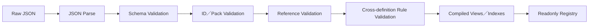

# Data Runtime 與內容契約

> **技術元件：** `data-runtime`
>
> **依賴：** `contracts/core` 與各模組公開的 Definition Schema contribution。
>
> **責任：** 載入外部 JSON 內容包、驗證 Schema／引用／規則、建立唯讀索引、編譯窄化 Definition View、註冊 Condition／Effect／Resolver 種類，以及保證內容順序與 RNG 可重播。
>
> **非責任：** 不讀寫 Runtime GameState、不執行玩家 Command、不提供任意腳本環境、不修改資料檔。

---

## 1. 內容包結構

```text
content/
├─ manifest.json
├─ base/
│  ├─ pack.json
│  ├─ rules/
│  ├─ nations/
│  ├─ cultures/
│  ├─ regions/
│  ├─ cities/
│  ├─ maps/
│  ├─ monsters/
│  ├─ items/
│  ├─ equipment/
│  ├─ skills/
│  ├─ recipes/
│  ├─ cuisine/
│  ├─ material-affixes/
│  ├─ quests/
│  ├─ gathering/
│  └─ mastery/
└─ yunhua/
   ├─ pack.json
   └─ ...
```

高變動內容原則上一筆 Definition 一個 JSON。編譯器可產生索引，不要求作者手動維護巨大總表。

### 1.1 Manifest

```ts
type RawContentManifest = {
  manifestVersion: string;
  packs: ContentPackReference[];
  loadOrder: ContentPackId[];
  localizationBundles: LocalizationBundleReference[];
};

type ContentPackReference = {
  packId: ContentPackId;
  version: string;
  requiredPacks: ContentPackDependency[];
  optional: boolean;
  contentRoot: string;
};
```

- Manifest 必須明確給出 Pack 順序；不得依檔案系統列舉。
- Pack 相依必須是無循環有向圖。
- 相同 Definition ID 不可默默後蓋前。
- 第一版不提供玩家任意 Plugin 執行環境；未來 DLC 仍使用相同資料契約。

---

## 2. Repository 與 Compiler

```ts
interface ContentRepository {
  loadManifest(): Promise<RawContentManifest>;
  loadPack(ref: ContentPackReference): Promise<RawContentPack>;
  loadLocalization(ref: LocalizationBundleReference): Promise<RawLocalizationBundle>;
}

interface DefinitionCompiler {
  compile(input: CompileContentInput): CompileContentResult;
}

type CompileContentResult =
  | { success: true; registry: DefinitionRegistry; report: CompileReport }
  | { success: false; diagnostics: DataDiagnostic[] };
```

`ContentRepository` 是 Platform Port，可由 Vite bundled assets、Electron 檔案或 Steam DLC 實作。`DefinitionCompiler` 必須是純 TypeScript，測試時可直接使用記憶體 Fixture。

---

## 3. 驗證管線



### 3.1 Schema Validation

驗證：

- 必填欄位、型別、列舉。
- 數值上下限與整數要求。
- discriminated union 的 `kind` 與 payload。
- `schemaVersion` 是否有對應 migration／parser。

### 3.2 Reference Validation

所有 ID 引用必須存在且型別相符，例如：

- Map 只能引用 Map Spawn Rule。
- Skill 的武器需求必須存在。
- Quest Reaction 的 Objective／Deadline／Reward Rule 必須存在。
- Shop 的 Book Pool 不得引用錯誤 Item kind。
- Map Gathering Node 只能引用合法 Gathering Rule；其產物 Resolver 只能引用可建立的 Item Definition。

### 3.3 Rule Validation

跨檔硬規則至少包含：

- Boss 必為大型 3×3。
- 一般敵人 1 招；菁英／Boss 2～4 招。
- Combat Skill 的 `actionKind` 不得為移動，Combat Effect Registry 不得註冊換格、推拉或擊退 Effect。
- Combat Skill 的 `masteryExperienceMode = fixedSupport` 必須引用有效 `SupportMasteryAwardRule`；`damage` 技能不得引用該 Rule。每筆 Support Mastery Rule 的固定值必須非負、分配比率皆為正，且總和恰為 1。
- Crafting Recipe 的材料總數必須與裝備品級一致：一般／精品／史詩／傳說／神話分別為 1／2／3／4／5；每個 Material Definition 最多一條 Material Affix。裝備成品的繼承詞條數不得超過投入候選素材數。
- 消耗品 Crafting Recipe 不得產生品質前綴或 Material Affix；其 Quality Resolver 只能解析有限正整數產量。TradeGood 的品質只能引用出售倍率 Resolver，不得加入戰鬥／料理效果。
- Cuisine Recipe 不得產出 Inventory Item；每個 Food Affix 必須具備 Tier 1～5 的 Effect。Restaurant Menu 只可引用有效 Cuisine Recipe，並永遠使用所有 Food Affix 的 Tier 1 與自製 MXP 的 1/3。
- 武器、防具、戰鬥／非戰鬥道具、工藝品、材料與料理食譜皆必須有 `originCultureId`。Crafting／Cuisine Recipe 的文化必須與輸出 Item／餐館菜色文化一致；地圖的原生物品、素材與非人類怪物候選池只能引用所在地 `nativeCultureId` 的內容，人類敵人例外，改引用目前控制國文化池。
- Opening CTB 與 Action Delay 的基礎值、最低值必須非負，且所有減免引用合法主屬性。
- Gathering Rule 的地牢互動分鐘必須為正整數；Lv.0～10 都必須能解析有限的非負整數產物。
- NPC 採集啟用時必須有正數 Point Cost 與合法 NPC Dungeon Target Resolver，該 Resolver 必須支援 `gatheringNode` 並引用合法 Outcome Rule；停用時不得編入 NPC Sequence。
- 地圖樓梯上下座標一致。
- 入口、出口、樓梯、固定陷阱為 1×1 功能房間。
- 國家迷宮尺寸與樓層限制正確。
- Map Refresh Offset 為 0～13。
- Escort Offset 為 0～6。
- NPC 地牢內容成本大於 0。
- NPC Decision Policy 的候選意圖只能是 `enterNearbyAdventureMap`、`acceptNearbyQuest`、`travelToCity`，且一定有可用的非自由 fallback Chain。
- 每個 NPC ActionChain Template 都必須以 `complete` 結束；Quest Template 必須含回原公會結案的節點。
- NPC 市場交易每個自由活動循環的上限為非負整數，且交易／買房規則均引用既有價格與設施資料。
- `PlayerSocialDailyLimitDefinition` 的聊天與交易上限皆固定為 6；每個 City 都必須引用一筆有效的限制資料。
- `NonPlayerMemberDailySocialPracticeRuleDefinition` 的聊天與購物 Experience Rule 必須都存在，且目標 Mastery 均為交流；不得以市場交易規則或玩家每日上限取代。它只適用非玩家主角正式隊員。
- NPC 生計規則的收入視窗、檢查週期與連續不足日數皆為正整數，且離隊條件不可選中隊長。
- Mastery Lv.0～10，主屬最終上限 100。
- 書店基礎池不含高級／極品書。
- Quest Actual End 不早於 Accept Deadline。
- Asset Distribution 的來源、Controller、Item Policy 必須匹配；玩家內部競拍固定以原價值為最低出價、流標直售倍率固定為 0.8。

任一 Error 都不得啟動新遊戲或載入需要該內容的存檔。

---

## 4. Diagnostics

```ts
type DataDiagnostic = {
  severity: 'error' | 'warning';
  code: DataDiagnosticCode;
  packId: ContentPackId;
  filePath: string;
  definitionId?: DefinitionId;
  fieldPath?: string;
  messageKey: string;
  details?: Record<string, JsonValue>;
};
```

錯誤必須能定位到 Pack、檔案、Definition 與欄位。不得只回傳「資料載入失敗」。

Warning 可用於：

- `enabled: false` 的未完成內容。
- 目前沒有任何生成池引用的 Definition。
- 可選 Pack 缺少。

Warning 不可掩蓋破壞 Runtime 不變量的資料。

---

## 5. Definition Registry

```ts
interface DefinitionRegistry {
  get<TView>(readerId: DefinitionReaderId, definitionId: DefinitionId): TView;
  has(definitionId: DefinitionId): boolean;
  list<TView>(readerId: DefinitionReaderId, query?: DefinitionQuery): readonly TView[];
  getManifestIdentity(): ContentManifestIdentity;
}
```

完整 Registry 只存在 Data Runtime／Composition。領域模組只能收到窄化 Reader：

```text
DefinitionRegistry
├─ WorldDefinitionReader
├─ MapDefinitionReader
├─ TeamDefinitionReader
├─ DungeonDefinitionReader
├─ CharacterDefinitionReader
├─ InventoryDefinitionReader
├─ ProgressionDefinitionReader
├─ CityDefinitionReader
├─ EconomyDefinitionReader
├─ QuestDefinitionReader
├─ CombatDefinitionReader
├─ GatheringDefinitionReader
├─ AssetDistributionDefinitionReader
└─ StatisticsDefinitionReader
```

- Reader 回傳 readonly View。
- 模組不能使用泛型 `getAnyDefinition()`。
- 相同原始 Definition 可被編譯為不同窄化 View，例如 Skill 的 Progression／Combat View，以及 Gathering Rule 的 Map NPC／Dungeon Interaction／Gathering Resolver View。
- View 必須共享同一 Definition ID 與版本來源，不複製成兩份作者資料。

---

## 6. Condition 與 Effect DSL

資料只能選擇已註冊的有限種類：

```ts
type ContentEventDefinition = DefinitionHeader & {
  allowedContexts: ('travel' | 'dungeon' | 'city')[];
  triggerConditionIds: ConditionDefinitionId[];
  options: ContentEventOptionDefinition[];
  autoResolutionRuleId?: ResolverId;
};

type ContentEventOptionDefinition = {
  optionId: DefinitionId;
  visibilityConditionIds: ConditionDefinitionId[];
  eligibilityConditionIds: ConditionDefinitionId[];
  effectIds: EffectDefinitionId[];
};

type ContentEventInstance = {
  definitionId: ContentEventDefinitionId;
  sourceId: GameId;
  context: 'travel' | 'dungeon' | 'city';
  rolledOnDay: WorldDay;
  allowedChoiceIds: DefinitionId[];
  resolverSnapshot: JsonValue;
};
```

Instance 是 Resolver 已選定結果的可序列化快照，由 Team／Dungeon／City 等情境擁有者存檔；Data Runtime 不保存全域事件佇列。

```ts
type ConditionDefinition =
  | { kind: 'hasItem'; itemDefinitionId: ItemDefinitionId; amount: number }
  | { kind: 'masteryAtLeast'; masteryId: MasteryId; level: number }
  | { kind: 'worldFact'; factId: WorldFactId; expected: JsonScalar }
  | { kind: 'all'; conditions: ConditionDefinition[] }
  | { kind: 'any'; conditions: ConditionDefinition[] };

type EffectDefinition =
  | { kind: 'grantItem'; itemDefinitionId: ItemDefinitionId; amount: number }
  | { kind: 'applyStatus'; statusId: StatusId; duration: number }
  | { kind: 'adjustCurrentCtb'; amount: number }
  | { kind: 'grantMasteryExperience'; masteryId: MasteryId; amount: number }
  | { kind: 'setWorldFact'; factId: WorldFactId; value: JsonScalar }
  | { kind: 'changeCityMetric'; cityId: CityId; metric: 'prosperity' | 'safety'; amount: number };
```

Effect Resolver 只產生 `EffectPlan`，不直接改 State。Application Workflow 依每個 Effect kind 的註冊表轉成目標模組的 Internal Command；必要步驟被拒絕時遵守同一 EngineTransaction 回滾規則。如此資料可以組合內容，但不會成為繞過模組所有權的第二條寫入通道。

新增一筆既有 `kind` 內容只需 JSON；新增 `kind` 才需要：

1. 新增公開型別。
2. 新增 Schema。
3. 指定擁有／執行模組。
4. 新增 Validator 與 Resolver。
5. 新增 Fixture、測試與存檔影響說明。

禁止：

- `eval`、函式本文或 JavaScript 字串。
- 從資料指定任意 import path。
- 以反射呼叫未註冊方法。
- 資料直接呼叫 Electron／Steam／檔案 API。

---

## 7. Resolver Registry

某些規則需要程式實作，但資料只能引用穩定 Resolver ID。

```ts
type ResolverRegistration<TInput, TResult> = {
  resolverId: ResolverId;
  ownerModule: ModuleId;
  inputSchemaId: SchemaId;
  resultSchemaId: SchemaId;
  resolve(input: Readonly<TInput>, context: ResolverContext): TResult;
};
```

Resolver 必須：

- deterministic、同步、無平台 I/O。
- 只讀取注入的 Definition View 與 Query Port。
- RNG 只能使用注入的 scoped stream。
- 回傳 JSON 可表示結果。
- 不直接修改 GameState。

資料編譯時必須驗證所有 Resolver ID 已註冊，且 owner／input schema 相符。

---

## 8. Schema Contribution

每個模組自行輸出：

```ts
type ModuleDataContribution = {
  moduleId: ModuleId;
  definitionSchemas: SchemaRegistration[];
  referenceRules: ReferenceRuleRegistration[];
  validationRules: ValidationRuleRegistration[];
  readerFactories: DefinitionReaderFactory[];
  resolverRegistrations: ResolverRegistration<unknown, unknown>[];
};
```

Data Runtime 聚合 contribution，不 import 模組內部 reducer 或 State。新增 City 商品、Monster 或 Quest 內容不應修改 Data Runtime 主程式。

---

## 9. 內容版本與存檔

```ts
type ContentManifestIdentity = {
  manifestVersion: string;
  manifestHash: string;
  packs: { packId: ContentPackId; version: string; hash: string }[];
};
```

載入存檔時：

1. 先載入並編譯目前內容。
2. 比對 SaveMeta 的 Manifest Identity。
3. 驗證所有 Runtime Definition ID 仍存在。
4. 套用明確的 Definition alias／migration。
5. 缺少必要 Pack 或 Definition 時停止，列出受影響 ID。

不得以「找不到就換成第一筆」或「靜默刪除 Runtime Entity」載入存檔。

---

## 10. 開發期重新載入

Vite 開發環境可監看 JSON 並重新編譯，但：

- Hot Reload 只替換 readonly Registry。
- 已開啟遊戲的 Runtime State 必須重新跑引用與規則驗證。
- Definition 破壞性變更需要重開 Session 或執行明確 migration。
- Production／Steam Build 不允許繞過編譯驗證載入任意本機腳本。

---

## 11. 最小驗收測試

1. Pack 順序與檔案列舉順序改變時，編譯索引仍 deterministic。
2. 重複 Definition ID、缺少引用、錯誤 kind 與循環 Pack 相依均失敗。
3. Boss 體型、怪物技能數、地圖樓梯、採集點房間互斥、Gathering Rule、書籍層級與 Asset Distribution Policy 等規則驗證。
4. 同一 Skill 可建立 Progression／Combat 窄化 View，且來源版本一致。
5. 未註冊 Resolver 無法啟動。
6. Resolver 使用相同 input／seed 得到相同結果。
7. 舊存檔缺少必要 Definition 時回報完整 diagnostics。
8. 領域模組測試可用最小記憶體 Reader，不需要真實檔案。

---

## 12. Data Runtime 交接清單

- [ ] Manifest、Pack、Definition Header 與 Localization Schema。
- [ ] Parse／Schema／Reference／Rule／Compile 管線。
- [ ] Diagnostic 格式與 UI 可讀報告。
- [ ] Module Data Contribution 與窄化 Reader Factory。
- [ ] Condition／Effect／Resolver Registry。
- [ ] Manifest Hash、Definition alias 與存檔相容驗證。
- [ ] Vite Dev Reload 與 Production 安全邊界。
