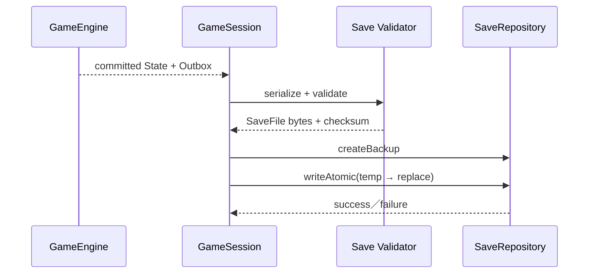

# Save、Electron 與 Steam 平台契約

> **技術元件：** `app/save`、`platform/electron`、`platform/save`、`platform/steam`
>
> **依賴：** Engine 的 committed GameState／Outbox，以及 Data Runtime 的 Content Manifest Identity。
>
> **責任：** 定義存檔格式、原子寫入、備份、Migration、內容相容驗證、Electron IPC、Steam Cloud／Achievement Port 與平台失敗處理。
>
> **非責任：** 不判斷委託、戰鬥、物品、時間或成就的玩法條件。

---

## 1. SaveFile

```ts
type SaveSlotId = Brand<string, 'platform:save-slot'>;
type BackupId = Brand<string, 'platform:backup'>;
type RemoteSaveId = Brand<string, 'platform:remote-save'>;
type PlatformAchievementId = Brand<string, 'platform:achievement'>;
type PlaySessionId = Brand<string, 'platform:play-session'>;

type ContentPackFingerprint = Readonly<{
  packId: ContentPackId;
  version: string;
  hash: string;
}>;

type SaveFileMetadata = Readonly<{
  saveSchemaVersion: number;
  moduleVersions: Readonly<Record<ModuleId, number>>;
  contentManifestVersion: string;
  contentManifestHash: string;
  contentPacks: readonly ContentPackFingerprint[];
  appBuildVersion: string;
}>;

type SaveFile = Readonly<{
  meta: SaveFileMetadata;   // 存檔中繼資料只存在此外層；GameState 不再保存 meta
  state: GameState;
  createdAtIso: string;
  savedAtIso: string;
  playSessionId: PlaySessionId;
  checksum: string;
}>;
```

ISO 時間只供檔案排序與 UI 顯示；遊戲規則永遠使用 `WorldDay`。

存檔時由 Save Service 依 Module Registry、當前 Content Manifest 與 App Build 建立唯一 `SaveFileMetadata`，**不從 `GameState` 複製**；讀檔時先解析 `SaveFile.meta` 供 Schema／Module Migration 與內容相容驗證，再解析 `GameState`。Schema、Content Pack 與 App Build 屬存檔解析／遷移／相容性資訊，不是遊戲世界狀態。

### 1.1 必須存檔的 Runtime

- 全部領域 State Slice。
- Scheduler 與 Job revision。
- Active Combat Encounter。
- Player Dungeon Session 與 NPC Dungeon Run。
- Social 的玩家中心好感（一名非玩家真實冒險者至多一筆）與當日對話用量；禁止序列化 NPC×NPC 關係矩陣或對話全文。
- Pending Interaction。
- Quest 兩期限與四狀態。
- RNG stream ID、Runtime ID sequence。

### 1.2 不存檔

- React component state。
- ViewModel／Projection cache。
- Definition 完整副本。
- 進行中的 EngineTransaction。
- Promise、callback、DOM、Electron handle。

---

## 2. SaveRepository Port

```ts
interface SaveRepository {
  listSlots(): Promise<SaveSlotSummary[]>;
  read(slotId: SaveSlotId): Promise<Uint8Array>;
  writeAtomic(slotId: SaveSlotId, data: Uint8Array): Promise<SaveWriteResult>;
  createBackup(slotId: SaveSlotId): Promise<BackupId>;
  restoreBackup(slotId: SaveSlotId, backupId: BackupId): Promise<void>;
  delete(slotId: SaveSlotId): Promise<void>;
}
```

Engine／領域模組只知道「產生 committed State」，不 import `SaveRepository`。

---

## 3. 存檔流程



規則：

1. 只有 committed State 可進入序列化。
2. 儲存前執行 JSON 可表示與核心不變量檢查。
3. 平台先寫同目錄暫存檔，完成後原子取代正式檔。
4. 覆蓋前保留有限份輪替備份。
5. 寫入失敗不破壞上一份有效存檔。
6. 存檔失敗只通知 Application；不能回滾已提交的遊戲交易。

---

## 4. 讀檔與 Migration

```text
讀取 bytes
→ checksum／JSON 結構驗證
→ Save Schema Migration
→ 各 Module Slice Migration
→ 載入目前 Content Manifest
→ Definition ID／Pack 相容驗證
→ Scheduler 重建與比對
→ 全域不變量驗證
→ 建立 GameSession
```

### 4.1 Module Migration

```ts
type ModuleMigration = {
  moduleId: ModuleId;
  fromVersion: number;
  toVersion: number;
  migrate(rawSlice: JsonValue): JsonValue;
};
```

- 每次只升一個版本，依序套用。
- Migration 必須 deterministic，不能使用 RNG、系統時間或平台網路。
- Migration **不接收 Definition**：它只轉換舊存檔 JSON 結構，不依當前內容資料重算結果；內容 ID alias／相容性修正屬 Manifest 載入後的獨立階段（見 §4.2）。因此不保留 `MigrationContext`。
- 模組只 Migration 自己的 Slice。
- 跨 Slice Migration 由架構管理的 Save Migration 明確編排，不能由某領域偷偷改另一 Slice。
- 每個 Migration 必須有舊版 Fixture。

### 4.2 內容相容

- Manifest Hash 相同：直接驗證引用。
- Hash 不同但 Pack 宣告相容／alias：套用內容引用 Migration。
- 缺少必要 Pack、Definition 或 Resolver：拒絕載入並列出詳細清單。
- 不可靜默刪除怪物、Item、Quest 或 Character 來讓存檔勉強開啟。

---

## 5. Auto-save Policy

Auto-save 時機屬 Application 設定，不屬玩法規則。建議安全切點：

- 玩家 Command 交易提交後。
- 世界快轉安全區段提交後。
- 進入／離開城市或冒險地後。
- Combat Encounter 建立、每個玩家 Action 提交、Encounter 結束後。
- Pending Interaction 建立或解決後。

不可在 EngineTransaction 中途存檔。連續高頻 Action 可由 Application debounce，但退出程式前必須 flush。

---

## 6. Electron 邊界

```text
Electron Main
  ├─ File System
  ├─ Atomic Save／Backup
  ├─ Steam SDK
  └─ Window Lifecycle

Preload
  └─ typed IPC bridge

Renderer
  ├─ React
  ├─ GameSession
  └─ Pure TypeScript Engine
```

### 6.1 IPC Port

```ts
interface DesktopBridge {
  saves: {
    list(): Promise<SaveSlotSummary[]>;
    read(slotId: SaveSlotId): Promise<ArrayBuffer>;
    write(slotId: SaveSlotId, data: ArrayBuffer): Promise<SaveWriteResult>;
  };
  steam: {
    status(): Promise<SteamStatus>;
    unlockAchievement(id: PlatformAchievementId): Promise<void>;
  };
}
```

- Renderer 不開啟 Node Integration。
- Preload 只暴露白名單方法與 JSON／ArrayBuffer DTO。
- IPC 兩端都驗證 payload。
- Renderer 不可傳任意檔案路徑、shell command 或 Steam API 名稱。

---

## 7. Steam Port

```ts
interface AchievementGateway {
  unlock(candidate: AchievementCandidate): Promise<AchievementDeliveryResult>;
}

interface CloudSaveGateway {
  upload(slot: CloudSaveUpload): Promise<CloudSaveResult>;
  listRemote(): Promise<RemoteSaveSummary[]>;
  download(remoteId: RemoteSaveId): Promise<Uint8Array>;
}
```

平台效果候選型別（由 Application 依 committed Outbox 的 events／notifications 投影產生；純引擎不持有這些型別）：

```ts
type AudioCandidate = {
  sourceEventId: EventId;
  cueId: AudioCueId;
  dedupeKey?: string;
  priority?: number;
};

type AchievementCandidate = {
  sourceEventId: EventId;
  achievementId: AchievementDefinitionId;   // 遊戲內 Definition ID，非 Steam ID；對照表只存在 Platform Adapter
};

type AchievementDeliveryResult =
  | { status: 'delivered' | 'already-delivered' }
  | { status: 'retryable-failure' | 'permanent-failure'; errorCode?: string };

type AutoSaveRequest = {
  sourceEventId: EventId;
  reason: string;
};

type PlatformEffectCandidate =
  | AudioCandidate
  | AchievementCandidate
  | AutoSaveRequest;
```

平台送達失敗（含 `AchievementDeliveryResult` 的 failure）不得回頭改變 `GameState`；以 `sourceEventId` 冪等重試。

### 7.1 Achievement

- 領域模組只發 DomainEvent。
- Application 把 committed Event 投影為 AchievementCandidate。
- Platform Adapter 將 Candidate ID 對應 Steam ID。
- Steam 失敗不改變遊戲 State，以 Event ID 冪等重試。

### 7.2 Steam Cloud

- Cloud 同步的是完整 SaveFile，不在雲端合併兩份 GameState。
- 本機與遠端衝突時顯示日期、世界日、角色與 Manifest 資訊，讓玩家選擇。
- 選擇前保留本機與遠端副本。
- 下載後仍走完整 checksum、Migration、Content 與不變量驗證。

---

## 8. 平台 Delivery Journal

需要跨程式重啟重試的平台副作用使用獨立 Journal：

```ts
type PlatformDeliveryRecord = {
  deliveryId: EventId;
  kind: 'achievement' | 'cloudUpload';
  payload: JsonValue;
  state: 'pending' | 'delivered';
  attempts: number;
};
```

Journal 不是玩法 State，不參與重播；但同一 Event ID 不得重複解鎖或上傳。

---

## 9. 錯誤與恢復

| 錯誤 | 處理 |
|---|---|
| JSON／checksum 損壞 | 提供最近有效備份，不覆蓋壞檔。 |
| Migration 缺失 | 阻止載入並顯示缺少的版本步驟。 |
| Content Pack 缺少 | 顯示 Pack／Definition 清單，不靜默修復。 |
| 寫入磁碟失敗 | 保留舊檔，UI 顯示可重試錯誤。 |
| Steam 未啟動 | 遊戲仍可本機執行，平台功能降級。 |
| Cloud 衝突 | 保留雙方，要求玩家選擇。 |

---

## 10. 最小驗收測試

1. Active Combat、Pending Interaction、NPC Dungeon Run 存讀後一致。
2. 寫入中斷仍可讀取上一份正式檔。
3. 每個 Module Migration 使用舊版 Fixture 成功。
4. 缺 Pack／Definition／Resolver 時提供完整錯誤。
5. Scheduler 重建結果與存檔版本一致。
6. Steam／磁碟失敗不改 GameState。
7. 同一 Achievement Event ID 多次重試只交付一次。
8. Renderer 無法呼叫任意檔案與 shell API。

---

## 11. Save／Platform 交接清單

- [ ] SaveFile、Meta、Checksum 與序列化 Validator。
- [ ] Atomic write、backup、restore。
- [ ] Save／Module／Content Migration Registry。
- [ ] Scheduler 重建與全域不變量驗證。
- [ ] typed Electron IPC 與安全 preload。
- [ ] Steam Achievement／Cloud Adapter 與 Delivery Journal。
- [ ] 損壞、缺內容、平台離線與衝突測試。
