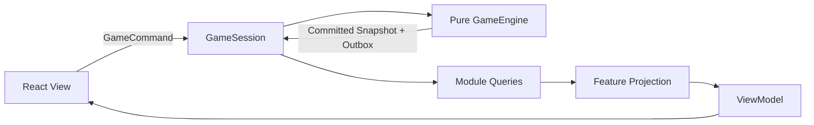

# React Application、ViewModel 與 UI 契約

> **技術元件：** `app/`、`ui/`
>
> **適用環境：** React + TypeScript + Vite；Electron Renderer 使用同一套 Application／UI。
>
> **責任：** 定義 GameSession、Command dispatch、唯讀 Snapshot、跨模組 Projection、Feature ViewModel、Pending Interaction、React Store Adapter 與多 Model 畫面的整合方式。
>
> **非責任：** 不在 View、Hook、Store 或 Router 內實作玩法規則。

---

## 1. 採用的 View／Model 模式

架構採用：

```text
Unidirectional Data Flow
+ Command / Query Separation
+ Selector-based ViewModel
```

外觀接近 MVVM，但不是雙向綁定：



- View 只顯示 ViewModel 與送出 Command。
- ViewModel 只含畫面需要的資料與 UI 狀態。
- Domain State 不包含 React 狀態。
- 不使用雙向 Model binding。
- 不讓 View 直接持有可寫 Entity。

---

## 2. GameSession

```ts
interface GameSession {
  getSnapshot(): GameSessionSnapshot;
  subscribe(listener: () => void): () => void;
  project<TInput, TView>(
    projection: FeatureProjectionToken<TInput, TView>,
    input: TInput,
  ): TView;
  dispatch(command: GameCommand): Promise<GameCommandUiResult>;
  continueWorldAdvance(targetDay: WorldDay): Promise<WorldAdvanceUiResult>;
  save(slotId: SaveSlotId): Promise<SaveUiResult>;
}

type GameSessionSnapshot = {
  revision: number;
  pendingInteraction?: PendingInteractionView;
  lastCommittedOutbox?: CommittedOutboxView;
};

type FeatureProjectionToken<TInput, TView> = {
  projectionId: ProjectionId;
  readonly __input?: TInput;   // compile-time phantom type
  readonly __view?: TView;
};
```

GameSession：

1. 序列化玩家 Command，避免同時執行兩筆交易。
2. 呼叫 Engine。
3. 只接受 committed Result。
4. 私有替換 committed GameState，遞增對外 Revision Snapshot。
5. 發出一次訂閱通知。
6. 交付 Notification、Save、Audio、Achievement candidate。

GameSession 不檢查角色能否攻擊、任務是否完成或商品是否買得起。完整 GameState 只存在 GameSession／Engine 邊界，不直接交給 React。

---

## 3. React Store Adapter

```ts
function useGameSelector<TInput, TView>(
  projection: FeatureProjectionToken<TInput, TView>,
  input: TInput,
  equality?: (a: TView, b: TView) => boolean,
): TView;
```

可使用 React `useSyncExternalStore` 或等價 Adapter。是否採 Zustand／Redux 不影響領域契約，但 Store 必須遵守：

- 唯一資料來源是 GameSession 私有的 committed State 與公開 Projection。
- Reducer／action 不得另改 GameState。
- 不鏡像整份 Entity 到 component local state。
- local state 只保存游標、分頁、展開狀態、未送出的表單與動畫。
- Projection／Selector 實作必須是 pure function並註冊於 `app/read-models`；Feature 只拿 typed Token，不可取得實作、Query Facade 或原始 GameState。

---

## 4. Query 與 Projection

### 4.1 單模組 Query

```text
modules/city → CityQuery
modules/quest → QuestQuery
modules/inventory → InventoryQuery
```

Query 回傳 readonly DTO，不回傳內部 Entity reference。

### 4.2 多模組 Projection

同一 View 需要多個 Model 時，在 `app/read-models/` 組合：

```ts
type CityScreenViewModel = {
  city: CityHeaderViewModel;
  facilities: FacilityCardViewModel[];
  shops: ShopPanelViewModel[];
  guild: GuildPanelViewModel;
  party: PartySummaryViewModel;
  notifications: UiNoticeViewModel[];
};

function selectCityScreenModel(
  queries: {
    world: WorldQuery;
    city: CityQuery;
    team: TeamQuery;
    character: CharacterQuery;
    inventory: InventoryQuery;
    economy: EconomyQuery;
    quest: QuestQuery;
    progression: ProgressionQuery;
    distribution: AssetDistributionQuery;
  },
  input: CityScreenProjectionInput,
): CityScreenViewModel;
```

Composition 將此函式註冊為 `cityScreenProjection`；UI 只 import 對應 `FeatureProjectionToken`。如此 Projection 可留在 Engine／Worker 同側，Renderer 不需要傳送函式或完整 GameState。

Projection 可以：

- 組合多個 Query。
- 格式化顯示值。
- 計算 UI enable／disable，但必須顯示來自核心的 Eligibility／Reason DTO。
- 將實際 `currentCtb` 轉成行動條顯示比例。

Projection 不可以：

- 判斷委託完成。
- 重算傷害、價格、MXP 或刷新。
- 修改 State。
- 送出 Command 或 Job。

---

## 5. Feature 目錄

```text
ui/
├─ app-shell/
├─ features/
│  ├─ title/
│  ├─ city/
│  ├─ tavern/
│  ├─ guild/
│  ├─ shop/
│  ├─ home/
│  ├─ travel/
│  ├─ dungeon/
│  ├─ combat/
│  ├─ character/
│  ├─ inventory/
│  ├─ loot-distribution/
│  ├─ progression/
│  └─ save-load/
├─ components/
└─ design-system/

app/
├─ composition/
├─ workflows/
├─ read-models/
├─ gameSession.ts
├─ notifications/
└─ save/
```

Feature 可以依賴 Design System、自己的 ViewModel 與 Command DTO；不可 import 模組的 `state.ts`、reducer 或 repository。

---

## 6. Command UI 狀態

```ts
type GameCommandUiResult =
  | { accepted: true; notifications: UiNotice[] }
  | { accepted: false; rejection: UiCommandRejection };

type UiCommandRejection = {
  code: string;
  messageKey: LocalizationKey;
  details?: Record<string, JsonValue>;
};
```

- Button 可依 Query Eligibility 預先 disabled，提升體驗。
- 即使 Button enabled，核心仍重新驗證。
- Rejection 不以例外表示一般玩法失敗。
- View 不做 optimistic GameState update。
- Command 執行中可鎖定重複輸入，但不能假裝已成功。

---

## 7. Pending Interaction

旅行、地圖事件、隊內戰利品競拍或其他需要玩家選擇的內容必須存在擁有模組 State：

```ts
type PendingInteractionView = {
  interactionId: InteractionId;
  kind: PendingInteractionKind;
  titleKey: LocalizationKey;
  bodyKey: LocalizationKey;
  optionViews: {
    optionId: DefinitionId;
    labelKey: LocalizationKey;
    resolutionCommand: GameCommand;
  }[];
  sourceId: GameId;
};
```

UI：

1. 從 committed Revision Snapshot／Projection 看到 Pending Interaction。
2. 顯示 Modal／Screen。
3. 玩家選擇後原樣送出 ViewModel 提供的模組專用 Game Command，例如 `resolveTravelInteraction`、`submitLootBid` 或 `passLootItem`。
4. 核心驗證 Interaction ID 與選項。
5. 提交後 View 自然消失。

關閉視窗、切換頁面或存讀檔都不會遺失選擇狀態。React Modal 不是互動的真相來源。

`resolutionCommand` 是 Projection 由 committed Pending Interaction 組出的公開 DTO，不含任意 callback。共用 Modal 不需要知道哪個領域擁有互動，也不能自行拼接命令 payload。

---

## 8. 城市、地牢與戰鬥畫面

### 8.1 城市

City Screen Projection 同時讀 World、City、Team、Inventory、Economy、Quest、Progression。多 Model 只在 Projection 相遇，不讓 City 模組 import Quest／Economy State。

- 隊伍財務摘要必須逐角色顯示，不得捏造 `partyGold` 或共用背包。
- Tavern Projection 組合 City 營業狀態、Team 酒館訪客、Character 摘要與近期真實行動。
- 聊天只是零時間 Read Interaction；招募與解雇則送 Team Game Command。
- Quest Cargo 顯示為獨立的鎖定區，物品卡必須禁用使用、裝備、出售與一般轉移，只提供任務目的與期限資訊。

### 8.2 地牢

- ViewModel 顯示房間節點、實際形狀、通道／紅門、樓梯、固定採集點與偏好標記。
- 小地圖以 Dungeon 的 `PlayerMapKnowledge` 決定可見範圍：未揭露房間的所有小格畫成黑格；揭露多格房間時一次顯示整個房間形狀。
- 已揭露範圍永久保留；Map 刷新後，Projection 以相同知識組合 Map 當前版本狀態，讓已知紅門顯示為重新關閉、已知陷阱顯示為重新啟用。
- 採集點所在房間揭露後永久顯示其固定位置；圖示的 available／harvested 狀態來自 Map 當前版本，刷新後可重新顯示 available。
- 永久小地圖不等於永久看見動態內容；刷新後的新怪物、寶箱與事件只依目前 Session 視野顯示。
- 完整 `DungeonMinimapView` 由 `app/read-models/` 組合 Dungeon Knowledge 與 Map Template／Spatial Runtime；Dungeon 與 Map 都不單獨宣稱擁有完整小地圖 ViewModel。
- 玩家只選擇相鄰可達房間或互動。
- 移動分鐘、跨日、內容合法性由 Dungeon／Map Query 提供。
- 採集按鈕只送 `gatherDungeonNode`；可否採集、實際分鐘、最高採集者、產物 RNG 與 MXP 都不得在 View 預算或寫死。
- 不在 Canvas／DOM 自行判斷可通行。
- 玩家使用出口後若有共同成果，畫面轉入 Asset Distribution Pending Interaction；競拍與均分完成前不顯示已返城。

### 8.3 資產分配

- 每回合顯示物品、原價值、最低出價、各角色目前出價與個人可用餘額。
- 玩家只提交自己可控制角色的 Bid／Pass；同伴出價由核心 Resolver 提供，不由 UI 模擬。
- 流標時明確顯示「按原價值 80% 直售」，不可套用當地商店價格或市場修正。
- 完成頁逐角色顯示取得物品與貨幣；貨幣池是競拍款、直售款與地牢金幣的總和。
- NPC RNG 分配沒有玩家 Pending View，只能在結果／酒館近期行動中看到摘要。

### 8.4 戰鬥

- 雙方各顯示 3×3 Grid。
- 戰鬥外的 Team Formation ViewModel 提供可配置正式成員、3×3 格位與 `configureCombatFormation` Command DTO；View 只編輯下一場 Encounter 的持久配置。
- Combat ViewModel 提供 footprint、合法目標、可用技能、`currentCtb` 與核心已決定的 CTB 順序。
- 行動條顯示 `min(currentCtb / 100, 1)`；Tooltip 可顯示實際 CTB。
- UI 不把超過 100 的 State 截斷。
- 沒有普通攻擊按鈕。
- 沒有換格、前進、後退或位移技能入口；自動補位只播放 committed Combat State 的視覺變化，動畫不控制補位時機。
- 同值時 UI 必須呈現核心保存的 readyQueue，不能自行用角色 ID 或 React render 順序重排。
- 反擊架勢、施法、格擋、硬直與昏迷顏色來自 Combat ViewModel。

---

## 9. Notification 與效果

```ts
interface NotificationProjector {
  project(event: GameDomainEvent): UiNotice[];
}

interface AudioCandidateProjector {
  project(event: GameDomainEvent): AudioCandidate[];
}
```

只處理 committed Event。Notification／Audio：

- 不修改 State。
- 不觸發新的玩法 Command。
- 可被玩家關閉或略過，不影響結果。
- 使用 Localization Key，不把核心中文句子當契約。

---

## 10. Localization

Definition、Event、Rejection 與 ViewModel 使用：

```ts
type LocalizedTextRef = {
  key: LocalizationKey;
  params?: Record<string, JsonScalar>;
};
```

核心 State 不保存已翻譯文字。名稱、描述、錯誤與通知在 UI 邊界依目前語系解析。

---

## 11. 效能與一致性

- GameState 正規化；Projection 以 ID 查詢。
- Snapshot Revision 未改變時可安全 memoize。
- Query 不遍歷無關的整個世界；各模組提供索引。
- 長時間快轉可顯示非玩法性的計算進度，但只有安全切點能替換 Snapshot。
- Web Worker 可作為未來 GameEngine Adapter；訊息仍使用相同 JSON 契約。
- UI 動畫完成與否不得控制世界交易提交。

---

## 12. UI 測試

1. View 使用固定 ViewModel 可獨立 Story／Snapshot 測試。
2. Selector／Projection 使用多 Query Fixture 測試，不啟動 React。
3. Command rejection 顯示正確 message key，State 不 optimistic 更新。
4. Pending Interaction 存讀檔後重新顯示。
5. 城市畫面正確組合 Offer、Quote、Quest、隊伍與設施。
6. Combat `currentCtb = 150` 顯示滿條但 Tooltip／State 保留 150。
7. 無普通攻擊入口。
8. Feature 不 import 任一 `modules/*/state.ts`。
9. Electron bridge 缺失時，Web／測試 Adapter 仍可執行核心 UI。
10. 酒館聊天只顯示真實近期行動，招募／解雇後個人金錢與物品顯示完全不變。
11. Quest Cargo 物品所有一般資產操作皆 disabled，expired 後才出現在 Asset Distribution。
12. 地牢離場競拍存讀檔後回到同一 Item／出價狀態，完成後才顯示返城。
13. 同值 CTB 依核心 readyQueue 顯示我方優先；重繪不改變同側隨機順序。
14. 前排補位只反映 committed Combat Snapshot；關閉動畫或跳過動畫不影響格位，且畫面沒有戰鬥移動控制。
15. Team Formation 編輯只更新下一場配置；active Encounter 的格位與配置 revision 不被 UI 直接改寫。
16. 已揭露採集點跨刷新保留位置、狀態恢復 available；重複點擊與競爭失敗不由 UI 假裝扣時或發放產物的測試。

---

## 13. UI／Application 交接清單

- [ ] GameSession、Command Queue 與 committed Snapshot。
- [ ] React Store Adapter／`useGameSelector`。
- [ ] Module Query Facade 與 Feature Projection。
- [ ] City、Tavern、Dungeon、Asset Distribution、Combat、Character 等 ViewModel。
- [ ] Pending Interaction 與可中斷快轉。
- [ ] Notification／Audio／Localization Projector。
- [ ] Feature import boundary 與 UI 契約測試。
