# Greeting Adventurer｜技術架構藍圖

> **文件定位：** 本文件是 React／TypeScript 版本的架構契約與交接藍圖，不是遊戲實作，也不是數值或內容規格。後續實作者應在本文件劃定的邊界內填入規則、資料與 View；若必須改動契約，必須先更新本文件與共用型別。
>
> **適用環境：** Vite + React + TypeScript + Electron；未來可包裝為 Steam 桌面版。遊戲目前是單機、以本機存檔為主；Steam Cloud、成就與 DLC 都屬平台介接，不得滲入遊戲規則核心。

---

## 1. 架構目標

### 1.1 必須達成

1. **領域解耦：** 世界、角色、地圖、隊伍、地牢、城市、經濟、委託、背包、成長與戰鬥可各自開發、測試與替換。
2. **資料驅動：** 遊戲內容與數值一律由外部資料檔定義；邏輯程式不可寫死某把武器、某隻怪、某張地圖或某個城市的實際內容。
3. **可重播且可測試：** 同一份初始狀態、資料版本、指令序列與 RNG seed，必須產生相同結果。
4. **UI 無規則：** React View 只負責輸入與顯示；所有世界狀態變更都由純 TypeScript 核心完成。
5. **可存檔與升版：** Runtime State 必須可序列化為 JSON，並能依資料與存檔版本執行 migration。
6. **可平行開發：** 日常工作只會觸及各自模組目錄；共用契約、組裝根與存檔升版才是少數需協調的共享點。

### 1.2 刻意不做

- 不使用 ECS。
- 不使用可任意執行腳本的資料檔、`eval` 或模組間 callback。
- 不以 React Store、Electron IPC 或 Steam API 作為遊戲規則的來源。
- 不做「所有角色逐格、即時同步」的背景模擬；非玩家冒險者採日結算的抽象模型。
- 不在第一版建立泛用 Plugin 生態或網路多人架構。

---

## 2. 名詞與責任區分

| 名詞 | 定義 | 是否存檔 |
|---|---|---|
| **Definition** | 唯讀內容定義，例如地圖模板、怪物資料、道具資料、規則與生成表。來源是資料檔。 | 否；以版本／雜湊識別。 |
| **Runtime State** | 本局世界的可變狀態，例如某張圖的版本、某件道具歸屬、NPC 地牢進度。 | 是。 |
| **GameCommand** | 玩家或應用層提出的意圖，例如接任務、購買、開始旅行、休息。 | 否；可記入操作紀錄。 |
| **InternalCommand** | 一個模組對另一個模組提出的定向要求；只有一個 Handler，可拒絕。 | 否；交易中暫存。 |
| **ScheduledJob** | 到指定世界日需要處理的排程工作，例如委託期限、地圖刷新、NPC 地牢日。 | 是；可由 State 重建。 |
| **DomainEvent** | 核心處理後發出的已發生結果，例如地圖內容生成、NPC 地牢結算、委託到期。 | 視需要寫入歷史紀錄。 |
| **ContentEvent** | 一筆可由資料定義的遊戲內容，如旅行遭遇或地圖事件；不是核心排程類型。 | 其實例狀態會存檔。 |
| **Projection／ViewModel** | 多個領域 Query 組合後的唯讀衍生模型；不擁有來源資料。 | 否。 |
| **EngineTransaction** | 一個 Command 或 Job 引發的原子狀態變更與訊息鏈。 | 否；只提交完成結果。 |

**最重要的分界：**

```text
資料檔定義「是什麼、數值多少、引用誰、何時可觸發」
程式邏輯定義「合法條件／效果種類要如何執行」
Runtime State 記錄「本局的它在哪裡、是否已處理、誰正在使用」
```

---

## 3. 分層與依賴方向

```mermaid
flowchart BT
  CONTENT["content/ JSON 內容包"] --> DATA["data-runtime\n載入、驗證、唯讀 Registry"]
  CONTRACTS["contracts/\n共用契約"]
  KERNEL["kernel/\n時間、RNG、排程、路由"] --> CONTRACTS
  DATA --> CONTRACTS
  MAP["modules/map"] --> CONTRACTS
  CHARACTER["modules/character"] --> CONTRACTS
  TEAM["modules/team"] --> CONTRACTS
  LIFECYCLE["modules/adventurer-lifecycle"] --> CONTRACTS
  DUNGEON["modules/dungeon"] --> CONTRACTS
  CITY["modules/city"] --> CONTRACTS
  QUEST["modules/quest"] --> CONTRACTS
  INVENTORY["modules/inventory"] --> CONTRACTS
  PROGRESSION["modules/progression"] --> CONTRACTS
  COMBAT["modules/combat"] --> CONTRACTS
  COMBAT_SEQUENCE["modules/combat-sequence"] --> CONTRACTS
  WORLD["modules/world"] --> CONTRACTS
  ECONOMY["modules/economy"] --> CONTRACTS
  DISTRIBUTION["modules/distribution"] --> CONTRACTS
  CRAFTING["modules/crafting"] --> CONTRACTS
  SOCIAL["modules/social"] --> CONTRACTS
  STATS["domain-services/statistics\n無 State 純計算"] --> CONTRACTS
  POWER["domain-services/combat-power\n無 State 純計算"] --> CONTRACTS
  GATHERING["domain-services/gathering\n無 State 純計算"] --> CONTRACTS
  MAP --> KERNEL
  CHARACTER --> KERNEL
  TEAM --> KERNEL
  LIFECYCLE --> KERNEL
  DUNGEON --> KERNEL
  CITY --> KERNEL
  QUEST --> KERNEL
  INVENTORY --> KERNEL
  PROGRESSION --> KERNEL
  COMBAT --> KERNEL
  COMBAT_SEQUENCE --> KERNEL
  WORLD --> KERNEL
  ECONOMY --> KERNEL
  DISTRIBUTION --> KERNEL
  CRAFTING --> KERNEL
  SOCIAL --> KERNEL
  COMPOSE["app/composition\n組合型別與模組註冊"] --> DATA
  WORKFLOW["app/workflows\n跨模組交易編排"] --> CONTRACTS
  READMODEL["app/read-models\n跨模組唯讀 Projection"] --> CONTRACTS
  COMPOSE --> MAP
  COMPOSE --> CHARACTER
  COMPOSE --> TEAM
  COMPOSE --> LIFECYCLE
  COMPOSE --> DUNGEON
  COMPOSE --> CITY
  COMPOSE --> QUEST
  COMPOSE --> INVENTORY
  COMPOSE --> PROGRESSION
  COMPOSE --> COMBAT
  COMPOSE --> COMBAT_SEQUENCE
  COMPOSE --> WORLD
  COMPOSE --> ECONOMY
  COMPOSE --> DISTRIBUTION
  COMPOSE --> CRAFTING
  COMPOSE --> SOCIAL
  COMPOSE --> STATS
  COMPOSE --> POWER
  COMPOSE --> GATHERING
  COMPOSE --> WORKFLOW
  COMPOSE --> READMODEL
  UI["ui/ React Features"] --> READMODEL
  UI --> COMPOSE
  PLATFORM["platform/ Electron、Save、Steam"] --> COMPOSE
```



### 3.1 硬性依賴規則

1. `contracts/` 不可 import 任何遊戲模組、React、Electron 或平台程式。
2. `kernel/` 只可依賴 `contracts/` 與基礎工具；不得知道雲華、怪物、委託等內容。
3. 任一 `modules/<name>/` 不可 import 另一模組的實作或 State；跨模組只能依賴 `contracts/<target>/` 的 Command、Event、Query Port 與 DTO。
4. 只有 `app/composition/` 可以同時 import 多個模組並註冊它們。
5. `app/workflows/` 可以編排多個公開 Internal Command，但不可擁有領域 State、數值公式或把失敗藏成成功。
6. `app/read-models/` 可以組合多個公開 Query，但不可寫入 State 或執行 Command。
7. `ui/` 不可直接修改 `GameState`；只能取得 ViewModel、送出 `GameCommand`。
8. `platform/` 不可實作遊戲規則；它只提供檔案、IPC、Steam、音效等外部能力。

### 3.2 邊界必須由工具強制

文件約定之外，專案在 CI 必須執行：

1. `no-restricted-imports`／dependency graph 檢查：禁止 `modules/a` deep-import `modules/b`，只允許 `contracts/b`。
2. 循環依賴檢查：contracts、modules、workflows、read-models 與 UI Feature 的依賴圖不得成環。
3. 每個模組以自己的 contract、fixture 與記憶體 Reader 單獨 typecheck／test，不要求啟動完整遊戲。
4. `public.ts` Export Snapshot 測試：未經契約變更不得意外擴張或刪除公開 API。
5. UI import 規則：`ui/features/*` 只能引用公開 ViewModel／GameCommand／Design System，不可引用 State、Handler 或 Resolver。

因此多人同時開發時，真正需要共同協調的只剩 `contracts/core`、Composition Registry、跨模組 Workflow／Projection，以及同一張多 Model View；領域內部檔案不應互相造成編譯衝突。

---

## 4. 建議目錄與檔案所有權

```text
content/                              # 實際遊戲內容；不可寫 TypeScript 邏輯
├─ manifest.json
├─ base/
│  ├─ rules/
│  ├─ items/
│  ├─ monsters/
│  ├─ skills/
│  ├─ maps/
│  ├─ cities/
│  ├─ quests/
│  ├─ gathering/
│  ├─ mastery/
│  ├─ nations/
│  ├─ cultures/
│  ├─ routes/
│  ├─ economy/
│  └─ content-events/
└─ yunhua/
   ├─ maps/
   ├─ monster-groups/
   ├─ items/
   └─ cities/

src/
├─ contracts/
│  ├─ core/                           # ID、信封、交易與共用資料形狀
│  ├─ map/                            # Map 自己擁有的公開契約
│  ├─ team/
│  ├─ dungeon/
│  ├─ combat-sequence/
│  └─ ...                             # 各模組維護自己的公開契約
├─ kernel/                            # 架構管理者維護
├─ data-runtime/                      # 資料契約與 Registry 維護者負責
├─ domain-services/
│  ├─ statistics/                     # 跨模組能力公式；純計算、無 State
│  ├─ combat-power/                   # 角色／隊伍／Encounter 共用戰力；純計算、無 State
│  └─ gathering/                      # 採集者與產物解析；純計算、無 State
├─ modules/
│  └─ <module>/
│     ├─ public.ts                    # 唯一對外入口
│     ├─ state.ts                     # 唯一可寫的 Slice
│     ├─ definitions.ts               # 本模組所需的 Definition 型別
│     ├─ gameCommands.ts
│     ├─ internalCommands.ts
│     ├─ jobs.ts
│     ├─ events.ts
│     ├─ queries.ts
│     ├─ system.ts
│     ├─ fixtures.ts
│     └─ *.test.ts
├─ app/
│  ├─ composition/                    # 完整 State／訊息聯集與 Registry
│  ├─ workflows/                      # 跨模組原子流程；含 combat-sequence-supply、single-battle-sweep
│  ├─ read-models/                    # 多 Query Projection
│  ├─ gameSession.ts
│  └─ save/
├─ ui/
│  ├─ features/
│  ├─ components/
│  └─ design-system/
└─ platform/
   ├─ electron/
   ├─ save/
   └─ steam/
```

高變動內容原則上採「一筆 Definition 一個檔案」，例如 `content/yunhua/maps/old-canal.json`。這可避免多人改同一張大表而衝突；索引與 Manifest 由內容編譯器產生或集中註冊。

---

## 5. 共用核心契約

本章只描述邏輯資料形狀；以下 pseudo-TypeScript 是契約說明，不是指定實作。

### 5.1 ID、時間與 RNG

```ts
type WorldDay = number;        // 整數世界日，不使用 Date
type DungeonMinute = number;   // 迷宮內時間，可跨午夜
type Seed = string;

type GameId = string;          // 實作時以 branded ID 區分 ItemId、MapId、TeamId…

type RngContext = {
  worldSeed: Seed;
  streamId: string;
};
```

- 所有世界排程使用 `WorldDay`。
- 地牢內的玩家移動使用分鐘；跨越午夜時才要求世界核心推進到下一日。
- 每個會抽 RNG 的 Job、地牢 Run 或內容實例都要有可重播的 seed／stream ID。

### 5.2 根狀態與 Slice

```ts
type GameState = {
  meta: SaveMeta;
  core: CoreState;
  character: CharacterState;
  map: MapState;
  team: TeamState;
  adventurerLifecycle: AdventurerLifecycleState;
  dungeon: DungeonState;
  city: CityState;
  inventory: InventoryState;
  quest: QuestState;
  progression: ProgressionState;
  combat: CombatState;
  combatSequence: CombatSequenceState;
  world: WorldState;
  economy: EconomyState;
  distribution: AssetDistributionState;
  crafting: CraftingState;
  social: SocialState;
};
```

- 此完整 `GameState` 定義屬 `app/composition`；`contracts/core` 不 import 任一領域 Slice。
- 每個領域模組只公開自己的 State contribution，並且不接收完整 `GameState`。
- 每個模組只可寫自己的 Slice。
- 跨 Slice 關聯一律存 ID，不巢狀複製對方資料。
- 任一實體皆以 `Record<Id, Entity>` 正規化存放，避免同一事實在多處失去同步。
- `GameState` 不含 Definition 的完整副本；只保存 `definitionId`、資料版本與本局變化。

### 5.3 核心入口

```ts
executePlayerCommand(state, definitions, command, rng): EngineResult
advanceWorldToDay(state, definitions, targetDay, rng): EngineResult
```

```ts
type EngineResult = {
  state: GameState;
  committedEvents: GameDomainEvent[];
  notifications: Notification[];
};
```

React、Electron、測試與未來 Web Worker 都只能經由這兩類入口驅動遊戲。

每次入口呼叫都建立一筆 `EngineTransaction`。交易中的 Internal Command、DomainEvent、Job Draft 與 Slice 變更全部成功後才提交；必要步驟拒絕時，State 與外部副作用一律不變。

### 5.4 排程工作

每個模組擁有自己的 Job 型別，`app/composition` 再組成 `GameScheduledJob`。Kernel 只認得共通信封、排序欄位與 Module Registry，不必為新增玩法 Job 修改 Kernel。

| Job 類型 | 擁有／處理模組 | 用途 |
|---|---|---|
| `questDeadline` | quest | 接受期限或實際結束期限。 |
| `mapRefreshCheck` | map | 固定 14 日刷新，或 Pending 的次日檢查。 |
| `shopRefresh` | city | 月刷新與貨架清理。 |
| `escortGeneration` | city | 城市每週護衛候選批次；Quest 依完成事件建立委託。 |
| `teamPlanDue` | team | 玩家旅行段落、NPC 固定第 6 日抵達、進出冒險地等大動作。 |
| `nonPlayerMemberCityFreeDayTick` | team | 任一隊伍處於城市自由期時，每位非玩家主角正式成員固定得到一次聊天與一次購物交流練習。 |
| `npcDungeonDay` | dungeon | 地牢內 NPC 隊伍取得當日 10 點。 |
| `freeActionDue` | team | 城鎮自由活動中的個人任務完成；後續成長由事件與 Workflow 處理。 |
| `npcDecisionDue`／`npcChainAdvance` | adventurer-lifecycle | 非玩家隊伍抽選下一個意圖，或在次日推進既有動作串。 |
| `worldConflictCheck`／`worldConflictResolve` | world | 只在對應世界規則啟用時檢查與完成衝突。 |
| `marketPressureExpire`／`eventWeightModifierExpire` | world | 結束有期限的世界市場或事件權重修正。 |
| `characterLifecycleDue` | character | 成年、退休或自然死亡的明確日期檢查；不每日掃描角色。 |
| `foodStatusExpiry` | crafting | 移除到期 FoodStatus 與其暫時效果。 |
| `npcCuisineDecisionDue` | crafting | 無 FoodStatus 的非玩家角色獨立骰自製料理或餐館；不進 FreeAction。 |

### 5.5 內部命令與領域事件

跨模組要求使用 `InternalCommand`，只有一個處理者且可以拒絕；`DomainEvent` 只表示已經完成的結果，可以有多個訂閱者且不能以業務理由拒絕。

```text
錯誤：BookLearningRequested DomainEvent
正確：ConsumeBookForLearning InternalCommand
      → BookUseCommittedForLearning DomainEvent
```

代表性 Internal Command：

```text
CreateItemInstance
TransferItem
ApplyNpcDungeonSettlement
ResolvePlayerMapContent
StartReturnFromDungeon
StartCombatSequence
ResolveNextCombatSequenceChallenge
CommitCombatSequenceSourceResults
ConsumeBookForLearning
CommitCombatItemUse
```

代表性 Domain Event：

```text
MapRefreshed
MapContentGenerated
MapContentResolved
QuestStateChanged
TeamPlanChanged
TeamLocationChanged
NpcDungeonSettlementApplied
CombatSequenceSettled
InventoryTransferred
BookUseCommittedForLearning
MasteryExperienceGranted
```

一筆 Job 的交易完成後才處理同日下一筆 Job。交易內的訊息順序固定並保存 `transactionId / correlationId / causationId`；同一輸入永遠得到相同結果。

---

## 6. 資料檔、載入與驗證契約

### 6.1 資料檔原則

- 出貨內容使用 JSON；不以 `.ts` 檔直接放遊戲內容。
- 所有 Definition 必須有穩定 `id`、`schemaVersion`、所屬 `packId`。
- Runtime State 只引用 Definition ID。
- 新增實際內容只需新增資料檔與 Manifest 登錄；不應為加入一把武器或一張地圖修改核心邏輯。
- 資料可使用**既有**的 `conditionId`、`effectId`、`resolverId`；新增效果語法才需要程式與契約變更。

### 6.2 內容載入介面

```ts
interface ContentRepository {
  loadManifest(): RawContentManifest;
  loadPack(packId: ContentPackId): RawContentPack;
}

interface DefinitionCompiler {
  compile(
    manifest: RawContentManifest,
    packs: RawContentPack[],
  ): DefinitionRegistry | DataDiagnostics;
}
```

- `ContentRepository` 由 Vite／Electron／Steam DLC 的平台層實作。
- `DefinitionCompiler` 在 `data-runtime/`；它只做解析、驗證、索引與只讀 Registry 建立。
- `domain/` 永遠不讀檔，也不知道資料來自 bundled JSON、DLC 或測試 Fixture。

### 6.3 三層驗證

1. **Schema 驗證：** 欄位、列舉、型別、必填值與數值範圍。
2. **Reference 驗證：** 所有 `itemId`、`mapId`、`monsterGroupId`、`effectId` 等引用都必須存在。
3. **規則驗證：** 例如 Boss 必為大型怪、地圖刷新偏移限定 0～13、NPC 探索點成本大於 0、樓梯上下座標一致。

任一層失敗不得啟動新遊戲，並必須回報檔案路徑、Definition ID、欄位路徑與錯誤原因。

### 6.4 窄化 Definition Reader

模組不可拿到無限制的全域資料庫。組裝層提供窄化 Reader：

```ts
interface MapDefinitionReader {
  getMapTemplate(id: MapTemplateId): MapTemplateDefinition;
  getMapSpawnRule(id: MapSpawnRuleId): MapSpawnRuleDefinition;
}

interface NpcDungeonDefinitionReader {
  getNpcExplorationRule(id: RuleId): NpcExplorationRuleDefinition;
  getNpcResolver(id: ResolverId): NpcResolverDefinition;
}

interface QuestDefinitionReader {
  getQuestRule(id: QuestRuleId): QuestRuleDefinition;
}
```

這讓 `map`、`dungeon`、`quest` 在型別層面也看不到不屬於它們的內容。

### 6.5 靜態 Definition 與 Runtime Instance 對照

| 靜態 Definition | Runtime Instance |
|---|---|
| `ItemDefinition` | `ItemInstance`：實體 ID、擁有者／位置、重量快照與製作詞綴等。 |
| `MapTemplateDefinition` | `MapInstance`：版本、刷新狀態、鎖定、內容實例。 |
| `MonsterGroupDefinition` | `EncounterInstance`：所在房間、存活／已清除狀態。 |
| `QuestRuleDefinition` | `QuestInstance`：兩期限、目標實體、四狀態、接取者。 |
| `ContentEventDefinition` | `ContentEventInstance`：來源、Actor、已固定的可見／可選選項、Resolver 快照與 RNG Stream。 |

`ContentEvent` 不另設一個可任意寫全世界的 Event 模組。它是資料定義與已選定的內容快照，Runtime Instance 由發生情境的領域保存：

- 玩家旅行事件由 Team 的玩家旅行 Plan／Pending Interaction 保存；NPC 旅行不建立 ContentEvent Instance。
- 地圖事件由 Map Content 與 Dungeon 探索 Session 保存。
- 城內情報由 City 的 Intel Lead 保存。
- 技術上的 `DomainEvent` 仍只是「處理結果已發生」的訊息，不能取代 ContentEvent Instance。

---

## 7. 每日世界結算與時間跳躍

### 7.1 概念模型

世界規則上以「每日世界結算」推進：只有當日到期的地圖、委託、NPC 隊伍與城市批次會被處理；未到期者跳過。

實作上不必逐日掃描。當玩家休息多日，核心直接跳到最近 `ScheduledJob.dueDay`，處理該日，再找下一個到期日；中間沒有任何 Job 的日子可直接略過。結果必須與逐日推進完全一致。

若途中產生必須由玩家選擇的玩家旅行／世界事件，擁有模組先把 Pending Interaction 寫入 State，世界推進在該日提交並停止。UI 解決互動後才繼續原本的目標日；不可把選擇只存在 React Modal 或非存檔 Promise。NPC 旅行固定 6 日直達，不參與事件池或 Pending 流程。

### 7.2 固定處理相位

| Phase | 內容 | 原因 |
|---|---|---|
| A. 完成前段行動 | 到期的旅行、NPC 隊伍行動、自由行動與地牢日結算。 | 先讓前一段已花完的時間結束。 |
| B. 期限關閉 | 委託接受／實際結束期限、刷新鎖到期。 | 防止過期內容在同日後段繼續產生收益。 |
| C. 固定世界週期 | 地圖刷新檢查、商店月刷新、護衛週期。 | 固定日曆行為集中處理。 |
| D. 因果後續 | 新內容生成後的庫存、情報、委託反應。 | 是處理器內的後續，不另建立全域掃描。 |
| E. 排程下一輪 | NPC 選新大動作、重排個人自由行動與下一個 Job。 | 新行為最早自下一日開始，避免同日連鎖。 |

### 7.3 Pending Refresh 的技術定義

1. 固定刷新日遇到地圖內有任一冒險者：`map.pendingRefresh = true`。
2. 最後一名冒險者離開時，**只登記**一筆 `mapRefreshCheck(reason: pending)`，`dueDay = currentDay + 1`。
3. 次日檢查時，地圖仍無冒險者且未被鎮壓／討伐鎖定，才執行刷新。
4. 若次日仍有人在內，Pending 保留並再排下一次檢查；固定 14 日節奏不因此位移，也不累積刷新次數。

玩家的內容完成條件可在玩家指令當下判定；非玩家隊伍的內容完成條件僅於其日結算 Job 處理，不要求即時逐格模擬。

---

## 8. 領域模組規格與資料所有權

| 模組 | 唯一擁有的 Runtime State | 讀取的 Definition | 對外發布的主要結果 |
|---|---|---|---|
| `character` | 角色身分、年齡、當前生命／魔力、生命週期、家族與角色可用性。 | 身分原型、生命週期規則。 | `CharacterCreated`、`CharacterAvailabilityChanged`、`CharacterDied`。 |
| `map` | 地圖版本、Pending、刷新鎖、固定採集點狀態、地圖內容實例與 NPC 序列。 | 地圖模板、生成表、文化池。 | `MapRefreshed`、`MapContentGenerated`、`MapContentResolved`、`MapGatheringNodeHarvested`。 |
| `team` | 玩家／NPC 隊伍、1～9 名正式成員、全員九宮格配置、位置、大動作、可跨多段自由期累積的成員自由行動與近期行動紀錄；不擁有共用金錢或一般物品。 | 行動、旅行、招募、留隊與近期紀錄規則。 | `TeamPlanChanged`、`TeamLocationChanged`、`TeamMemberJoined`。 |
| `adventurer-lifecycle` | NPC Team 的 Controller、下一個意圖、動作串與市場交易意圖；另為所有非玩家主角正式成員選擇個人自由行動；不執行或擁有隊伍／任務／婚姻／資產。 | 決策、動作串、個人自由行動、NPC 求婚候選與市場偏好規則。 | `NpcIntentSelected`、`NpcActionChainChanged`、`NpcMarketIntentCreated`。 |
| `dungeon` | 玩家探索暫態、`NpcDungeonRun`、非戰鬥內容暫存結果與 Combat Sequence reference。 | NPC 探索點規則、非戰鬥內容 Resolver。 | `NpcDungeonRunProgressed`；要求 Map 與 Combat Sequence 結算。 |
| `city` | 建築狀態、商店刷新政策、貨架 Offer、護衛候選，以及玩家主角每日交易上限。 | 城市與設施定義、商店規則、玩家主角每日交易限制。 | `ShopRefreshed`、`EscortCandidatesGenerated`、`CommerceInteractionCompleted`。 |
| `inventory` | 所有 Item Instance 的所有權、唯一位置、保留、移轉紀錄與玩家隊超載 Resolution。 | 道具定義。 | `InventoryTransferred`、`ItemConsumed`、`EncumbranceResolutionOpened／Closed`。 |
| `quest` | Quest Instance、兩期限、四狀態、接取與結案；護衛角色只與 Quest 關聯，不加入 Team，所屬隊伍任一戰敗會終止全部進行中護衛。 | 委託規則、反應規則。 | `QuestCreated`、`QuestStateChanged`、`QuestSettled`。 |
| `progression` | 熟練度等級／MXP、主屬、傳授進度。 | 成長曲線、MXP 表、書籍門檻。 | `MasteryExperienceGranted`、`MasteryLevelChanged`。 |
| `combat` | Detailed 戰鬥遭遇、雙方九宮格 Runtime、倒扣式 CTB、同值排序、前排全空補位、技能與戰鬥結果。 | 怪物、技能、開場 CTB、行動延遲與裝備係數。 | `CombatEncounterResolved` 與 detailed 成長來源。 |
| `combat-sequence` | 單場／多場簡易戰鬥串、戰力骰結果、開始配置快照與來源提交前的經驗預算。 | 簡易戰鬥串、補品重骰、Encounter／Skill 窄化 View。 | `CombatSequenceSettled` 與整串成長來源。 |
| `world` | 國家／地區控制、路線通行、衝突與市場壓力。 | 國家、文化、地區、城市圖、路線與世界規則。 | `RegionControlChanged`、`RouteAccessChanged`、`MarketPressureChanged`。 |
| `economy` | 帳戶、貨幣餘額、轉帳紀錄與報價修訂。 | 貨幣、價格、報價與修正規則。 | `CurrencyTransferred`、`PriceQuoteInvalidated`。 |
| `distribution` | 任務／地牢共同成果的參與者快照、玩家競拍、NPC RNG 分配與暫時清算。 | 分配、競拍、流標直售與餘數規則。 | `LootAuctionRoundOpened`、`AssetDistributionCompleted`。 |
| `crafting` | 製作 Attempt、成功／失敗結果、素材詞條繼承、成品品質與角色 FoodStatus。製作時間只讀 Team 跨自由期累積結果。 | 配方、製作結果、素材詞條、料理、餐館與品質規則。 | `CraftingCompleted`、`CuisineConsumed`、`FoodStatusChanged`。 |
| `social` | 每名非玩家真實冒險者唯一一個對玩家好感值，以及玩家每日共用對話用量；不建立 NPC 關係網。 | 好感、玩家對話、玩家求婚與 NPC 婚姻判定規則。 | `PlayerConversationCompleted`、`PlayerAffinityChanged`；婚姻交由 Character FamilyLink。 |

另有三個共用的無 State 純計算服務：

- `domain-services/statistics` 接收 Progression／Character／Inventory Snapshot，依資料規則回傳副屬與能力快照。
- [`domain-services/combat-power`](architecture/22_combat_power_service.md) 接收 Statistics、裝備實例、合法武器組／技能與 Encounter View，依同一 Combat Power Rule 回傳角色、隊伍與敵方戰力；任務可行性、NPC 換裝與 Combat Sequence 都只讀這個結果。
- `domain-services/gathering` 接收來源、參與者採集等級、Gathering Rule 與 RNG，穩定選出最高採集者並解析產物；來源消耗、Item 建立與 Distribution 追加仍由 `app/workflows/gathering` 原子編排。

三者都是 Gameplay Formula，不是 ViewModel，也不得建立自己的 GameState Slice。Combat Sequence 內部的 Challenge Resolver 與 Mastery Allocator 同樣是純函式，但只由該模組公開，不另立 State 或頂層領域模組。

### 8.1 模組公開介面

每個模組的 `public.ts` 必須公開以下六類內容，且其他模組不得繞過它 import 內部檔案：

1. 公開 ID／DTO 型別。
2. 可處理的 Game Command 與 Internal Command 型別。
3. 自己擁有的 Job 與 DomainEvent 型別。
4. 唯讀 Query Port。
5. State contribution、初始化與 migration 註冊點。
6. 測試 Fixture 建構器。

每個模組必須宣告：

```text
owns:         哪一個 State Slice 可由自己寫入
reads:        所需的窄化 Definition Reader 與公開 Query
handles:      哪些 GameCommand、InternalCommand、ScheduledJob、DomainEvent
emits:        哪些 DomainEvent
invariants:   永遠不得被破壞的資料條件
```

### 8.2 禁止的跨模組寫法

```text
錯誤：map 系統直接建立 QuestInstance。
正確：map 發出 MapContentGenerated；quest 訂閱後自行依規則建立委託。

錯誤：dungeon 系統直接把戰利品塞進隊伍背包並增加熟練度。
正確：dungeon 送出 ApplyNpcDungeonSettlement Internal Command；
      map 驗證並套用後發出 NpcDungeonSettlementApplied，
      inventory、progression、quest 再各自處理正式結果，
      已正式產生的物品與貨幣則加入 Asset Distribution 後個人化分配。
```

---

## 9. NPC 地牢探險的專屬契約

NPC 地牢探險採簡易日結算，不走玩家的格子、紅門與陷阱邏輯。地圖生成時，`map` 模組對動態內容建立有序序列；玩家讀取 `position` 探索，NPC 讀取 `npcOrder`。其中怪物內容構成一條 [Combat Sequence](architecture/21_combat_sequence_module.md)；它只做隊伍戰力對敵方戰力的骰定，不建立抽象 Encounter 或模擬 HP／招式。

```ts
type NpcDungeonSequenceEntry =
  | {
      kind: 'mapContent';
      contentId: ContentInstanceId;
      definitionId: MonsterGroupId | ChestId | MapEventId;
      position: MapPosition;       // 玩家用
      npcOrder: number;            // NPC 用
      pointCost: number;           // 小怪／寶箱 1、菁英 2、大怪 4；事件由資料指定
      resolverId: ResolverId;
      state: 'available' | 'resolved';
    }
  | {
      kind: 'gatheringNode';
      nodeId: GatheringNodeId;
      gatheringRuleId: GatheringRuleId;
      position: MapPosition;       // 玩家用
      npcOrder: number;            // NPC Policy 啟用時才存在
      pointCost: number;
      resolverId: ResolverId;
      state: 'available' | 'harvested';
    };

type NpcDungeonRun = {
  runId: NpcDungeonRunId;
  teamId: TeamId;
  participantCharacterIds: CharacterId[];
  mapId: MapInstanceId;
  mapVersion: number;
  distributionId: AssetDistributionId;
  combatSequenceId?: CombatSequenceId;
  cursorNpcOrder: number;
  pendingResults: PendingDungeonResult[];
  settlementProgress: {
    mapApplied: boolean;
    combatSequenceSettled: boolean;
    distributionCompleted: boolean;
  };
  status: 'exploring' | 'settling' | 'closed' | 'invalid';
  rngContext: RngContext;
};
```

`npcDungeonDay` 的語意固定如下：

1. 從資料讀取每日探索點數；第一版預設值為 10，不寫死於邏輯。
2. 由 `cursorNpcOrder` 開始，跳過已被其他結算處理的動態內容或固定採集點。
3. 點數足夠才處理下一筆目標：怪物內容交給同一 Run 的 Combat Sequence 解析下一個 Challenge；寶箱、事件與採集才使用各自 Resolver。結果寫入 `pendingResults`，但怪物只保存 Combat Sequence Result ID。採集成功時把完整 deterministic Resolution 暫存，Settlement 日不得重骰。
4. 點數不足時，保留游標與暫存結果，排入明日 `npcDungeonDay`。
5. 全序列完成、任務目標完成、首次戰敗或 Resolver 要求離場時，進入 `settling`。
6. 結算時先由 `map` 正式套用仍有效的內容結果；Dungeon 再把其中 accepted 的成功怪物 Result ID 一次提交給 Combat Sequence。Combat Sequence 加總正式攻擊／防禦經驗與成功場次後才發出成長來源，Progression 不直接平均分配地牢結果。
7. 正式戰利品加入該 Run 的 Asset Distribution；Distribution 逐件 RNG 指派物品、平均分配貨幣。Map、Combat Sequence 與 Distribution 都完成後 Dungeon 才關閉 Run 並讓 Team 返城。

這使 NPC 探險的時間由「每日 10 點的內容處理量」決定，而不是地圖格距、門或怪物個體數。城市到冒險地與返回城市的 1 日，仍是 `teamPlanDue` 的隊伍行動，不屬於 `NpcDungeonRun`。

---

## 10. 多 Model View 的組裝規則

多個領域 Model 參與同一張畫面是正常需求；它們只可在 UI／應用層組合，不能因此反向耦合領域模組。

```text
city + team + inventory + quest + progression
  → selectCityScreenModel(...)
  → CityScreenViewModel
  → React CityScreen
```

```ts
type CityScreenViewModel = {
  cityName: string;
  memberFunds: CharacterMoneyView[];
  facilities: FacilityView[];
  shopItems: ShopItemView[];
  availableQuests: QuestCardView[];
  activeQuests: QuestCardView[];
};
```

### 10.1 UI 禁則

- View 不可自行算委託是否完成、商店能否購買、熟練度是否升級。
- View 不可直接寫入任一 State Slice。
- Selector 可以讀取多個公開 Query，但不可修改 State。
- View 只送出 `GameCommand`；核心交易提交後回傳新 State、committed DomainEvent 與通知，再由 UI 重繪。

UI 以 Feature 切分：`ui/features/city/`、`ui/features/dungeon/`、`ui/features/quest/` 等。只有同一張畫面、共用 Design System 與 Selector 組裝層需要協調，不應讓 View 成為領域規則的第二份實作。

---

## 11. Application、Electron 與 Steam 邊界

### 11.1 Application 層

`app/gameSession` 是 React 與核心的唯一橋接者：

1. 接收 UI Command。
2. 呼叫 `executePlayerCommand` 或 `advanceWorldToDay`。
3. 等待 Engine Transaction 完成並取得 committed result。
4. 私有替換 committed GameState，更新 React 可見的 Revision Snapshot 與 Projection。
5. 依 `EngineResult.committedEvents` 轉成通知、音效候選、成就候選與存檔請求。

它不得自行改寫遊戲規則。

### 11.2 平台介面

```ts
interface SaveRepository {
  save(slotId: SaveSlotId, data: SaveFile): Promise<void>;
  load(slotId: SaveSlotId): Promise<SaveFile>;
}

interface AchievementGateway {
  unlock(candidate: AchievementCandidate): Promise<void>;
}
```

- Electron main process 處理檔案系統、視窗與原生 Steam SDK。
- preload 只暴露經型別包裝的 IPC。
- renderer／React 不直接存取 Node API。
- 核心只產生 `AchievementCandidate`，不認識 Steam Achievement ID 或 API。

### 11.3 存檔相容性

```ts
type SaveMeta = {
  saveSchemaVersion: number;
  moduleVersions: Record<ModuleId, number>;
  contentManifestVersion: string;
  contentManifestHash: string;
};
```

- 各模組對自己的 Slice 提供 migration。
- 載入存檔時，先驗證內容包與版本，再依序升版 Slice。
- 若缺少必要內容包／DLC，必須回報可理解的錯誤，不能靜默產生壞資料。

---

## 12. 實作者交接規範

### 12.1 新增一個玩法模組時

1. 先寫出它的 `owns / reads / handles / emits / invariants`。
2. 若現有契約不足，先提案修改 `contracts/`，不可私自繞過。
3. 提供最小 Fixture 與單元測試；測試不得依賴 React、Electron 或真實存檔。
4. 資料 Definition、Schema 與驗證案例必須一併提交。
5. 對外只開放 `public.ts`；不公開內部 State 操作函式。

### 12.2 共用點的變更規則

| 變更位置 | 是否可獨立改動 | 要求 |
|---|---|---|
| `modules/<name>/` 內部 | 可以 | 不破壞 `public.ts` 契約與測試。 |
| `content/<pack>/` | 可以 | 通過 Schema、引用與規則驗證。 |
| `ui/features/<feature>/` | 可以 | 不把規則移入 View。 |
| `contracts/<module>/` | 模組擁有者可新增相容契約 | 破壞式變更仍需更新架構書、版本與消費者測試。 |
| `contracts/core/` | 不可直接自行擴張 | 只放真正跨全域的信封與基本型別。 |
| `app/composition/` | 需整合時修改 | 只負責聯集型別、Registry 與 Port 綁定。 |
| `app/workflows/` | 需跨模組流程時修改 | 只編排公開命令與交易，不放數值公式。 |
| Save migration | 需審核 | 必須提供舊存檔 Fixture。 |

### 12.3 建議測試層級

- **資料驗證測試：** 每一個內容包都能載入、引用完整、規則正確。
- **模組單元測試：** 只使用本模組 State、公開 Query 與 Fixture。
- **跨模組契約測試：** 例如地圖刷新後，委託模組收到正確事件；不測 React。
- **世界快轉測試：** 一次快轉 365 日與逐日 365 次的結果必須一致。
- **UI Feature 測試：** 同一 ViewModel 輸入能穩定產生同一畫面；不重算領域規則。

---

## 13. 首批需要凍結的契約

在任何實作開始前，先完成並審核以下五件事：

1. `GameState` 各 Slice 的型別與所有權。
2. `GameCommand`、`InternalCommand`、`ScheduledJob`、`DomainEvent` 的語意與信封。
3. `EngineTransaction` 的提交、拒絕、事件 Outbox 與固定處理順序。
4. `DefinitionRegistry`、資料包 Manifest、Schema 與驗證錯誤格式。
5. `ModuleContract`（owns／reads／handles／emits／invariants）的註冊格式。

其後可平行開發：

```text
world + character + inventory + progression + data-runtime
                         ↓（只靠公開契約整合）
map + team + city + economy + distribution
                         ↓
dungeon + quest + combat + app workflows/read-models
                         + gathering resolver/workflow
                         ↓
React Features、存檔、Electron／Steam 介接
```

本文件是第一版架構的主契約。任何「為了方便直接跨模組改資料」、「把內容寫死在 TypeScript」、「讓 View 自己補規則」的做法，都視為違反架構，而非可接受的捷徑。

---

## 14. 詳細模組契約

本文件只固定總體邊界；各模組的 Runtime State、Definition Reader、Command／Job／Event、Query、不變量與測試責任，見以下交接文件：

1. [共用核心契約](architecture/00_shared_contracts.md)
2. [Map 模組契約](architecture/01_map_module.md)
3. [Team 模組契約](architecture/02_team_module.md)
4. [Dungeon 模組契約](architecture/03_dungeon_module.md)
5. [Character 模組契約](architecture/04_character_module.md)
6. [Inventory 模組契約](architecture/05_inventory_module.md)
7. [Progression 模組契約](architecture/06_progression_module.md)
8. [World 模組契約](architecture/07_world_module.md)
9. [Economy 模組契約](architecture/08_economy_module.md)
10. [City 模組契約](architecture/09_city_module.md)
11. [Quest 模組契約](architecture/10_quest_module.md)
12. [Combat 模組契約](architecture/11_combat_module.md)
13. [Engine Runtime 與交易契約](architecture/12_engine_runtime.md)
14. [Data Runtime 與內容資料契約](architecture/13_data_runtime.md)
15. [存檔與平台邊界](architecture/14_save_platform.md)
16. [React UI 與應用層契約](architecture/15_ui_application.md)
17. [Derived Statistics 純計算契約](architecture/16_derived_statistics.md)
18. [Asset Distribution 模組契約](architecture/17_asset_distribution.md)
19. [Adventurer Lifecycle 模組契約](architecture/18_adventurer_lifecycle_module.md)
20. [Gathering Resolver 與採集 Workflow 契約](architecture/19_gathering_service.md)
21. [Crafting & Cuisine 模組契約](architecture/20_crafting_and_cuisine_module.md)
22. [Combat Sequence 模組契約](architecture/21_combat_sequence_module.md)
23. [Combat Power 純計算契約](architecture/22_combat_power_service.md)
24. [Social 模組與婚姻 Workflow 契約](architecture/23_social_module.md)

上述文件共同構成第一版完整架構。尚未定案的玩法公式可以留在資料規格中，但模組所有權、公開介面與跨模組流程不得由實作者臨場另造。

---

## 15. 未完成設計清單

本節只記錄**玩法設計尚未完成**的項目，不把「尚未開始寫程式」混進來。分類原則如下：

- **數值／內容設計：** 系統行為與資料入口已存在，只差填入公式、曲線、權重、Pool 或第一版內容。
- **系統／規則設計：** 尚未決定玩家或世界究竟依何種規則運作；實作者不可自行補規則。

### 15.1 數值／內容設計尚未完成

| 項目 | 已固定的架構位置 | 尚缺內容 | 定案前行為 |
|---|---|---|---|
| 護衛任務參數 | City Escort Rule + Quest Deadline Rule | 目的城市抽法、接受期限、實際結束期限與報酬數值。 | 不生成護衛候選／委託。 |
| 商店與任務經濟 | Economy Price／Modifier Rule | 各類商品價格、稅率、城市／戰爭／交流修正、各階任務金錢報酬。 | 沒有完整 Price Rule 的 Offer 不可上架。 |
| 國家衝突數值 | World Conflict Rule | 國家力量、開戰權重、占領門檻、控制與市場修正量。 | 不排 Conflict Job。 |
| 年齡生命週期曲線 | Character Lifecycle + Statistics Age Rule | 年齡主屬／副屬修正、退休與自然死亡機率曲線。 | 只能載入已有完整 Resolver 的角色原型。 |
| 採集內容 | Gathering Rule + Map Node + Gathering Workflow | 各採集點分鐘、資源 Pool、數量與品質曲線；雲華三圖的正式節點位置與圖示。 | Rule 或地圖內容不完整即不可啟用。 |
| 第一版戰鬥內容預算 | Combat／Map／Progression Definition | 雲華各圖遭遇編組、怪物屬性／技能、掉落、寶箱與事件 Pool，以及每項的最終階級與經驗來源。 | 可保留灰盒資料，但不可假定為正式平衡。 |
| 支援技能固定 Mastery MXP | Support Mastery Award Rule | 每次支援技能使用的固定 Mastery 值與受益 Mastery 分割；每場最多 3 次的規則已固定。 | Rule 未填時該技能不可發放額外 Mastery MXP。 |
| 子女教育數值 | Child Education Rule | 自習取父母 Mastery 的低比例、教師／子女教學的實際經驗曲線與教師薪資。 | 可完成教師 Post 與 Cycle 流程，但不啟用未填數值的教育收益。 |
| 招募與離隊機率 | Team Recruitment／Retention Rule + Progression Social Benefit | 招募基礎率、隊伍吸引力修正、收入缺口曲線，以及 `inviteSuccessBonus`／`memberDepartureResistance` 的最終換算。 | 招募 Resolver 未完成時不可把合法單人目標視為直接成功；離隊 Resolver 未完成時不擲離隊。 |
| 製作結果公式 | Crafting Outcome／Quality Rule | 成功率、成功後品質，以及失敗時素材消耗／返還比例。 | Outcome Rule 不完整的食譜不可開始製作；成功與失敗仍共用同一 MXP Rule。 |
| 好感與婚姻數值 | Social Affinity／NPC Marriage Rule | 好感初值與每次交流變化、玩家求婚門檻、家教價格修正、NPC 共隊天數與戰力接近的權重／機率。 | Rule 未完整時可交流並保存好感，但不可提出求婚或套用家教折扣。 |

### 15.2 系統／規則設計尚未完成

| 項目 | 已確定邊界 | 尚待定案 |
|---|---|---|
| 房間系統 | 第一版保留房屋所有權、倉庫、休息／生育、傳授與繼承入口。 | 房間形狀、家具安放、Slot 意義、功能間容量、升級與常駐規則；目前 City 欄位僅為 provisional 骨架。 |
| 招募重試規則 | 招募必須通過機率檢定，多人 NPC Team 與滿 9 人玩家隊在檢定前拒絕。 | 同一目標檢定失敗後何時可再次嘗試；由 Recruitment Retry Rule 定案，UI 不可無限重送。 |

### 15.3 本輪已定案的規則

| 項目 | 定案規則 |
|---|---|
| 防禦 MXP | 依開戰時初始站位分配；由前至後略過空排，第一／二／三個有人排中每人權重為 3／2／1，再按權重和分配 Encounter 防禦預算。 |
| 紅門 | 開門花 30 分鐘、當前地圖版本內可通行、刷新後重關；只揭露相鄰房間可見怪物／物品／事件，不揭露陷阱。紅門後方優先配置寶箱／事件／大型敵人偏好房。 |
| 地圖怪物 | 第一版固定留在生成房間，不做依分鐘移動、警戒或追擊。 |
| 旅行採集 | 取隊內最高採集等級作 RNG 基準，所有正式參與者各自獨立抽一份並進個人背包；最高採集者取得採集 MXP。 |
| NPC 採集 | 第一版可啟用；以地圖 NPC 有序序列與採集點 Point Cost 處理。 |
| 玩家繼承 | 玩家指定唯一繼承人；候選限成年正式隊友、成年子嗣與成年伴侶。所有可繼承資產與房屋只移轉給該一人。 |
| 支援魔法／樂器 | 支援技能每次成功使用給固定 Mastery MXP；detailed Encounter 中同角色同技能每場最多 3 次，不計有效量。Combat Sequence 中，開始快照內符合條件的技能對每個正式成功戰鬥節點視為一次，整串 Settlement 彙總。攻擊型樂器技能仍屬攻擊來源。 |
| 子女教育／房屋 | 玩家家系子女各自為單人 Child Team；教師 Post 至少 28 日，子女每 14 日結算並重抽。沒有教師時自習，按父母各 Mastery 的低比例加總；非玩家冒險者子女不模擬，成年時每項 Mastery 直接取父母各 1/5 相加。 |
| 犯罪 | 第一版完整移除；委託到期只處理任務狀態與內容生命週期，不建立角色犯罪、通緝、贓物或違法紀錄。 |
| 製作 | 裝備品級決定白板係數；素材一份最多一條候選詞條，品質前綴決定成功繼承數。一般至神話裝備分別消耗 1～5 素材，詞條上限相同。消耗品以同批產量表達成本優勢；工藝品品質只影響出售倍率。 |
| 料理 | 不是可囤積 Item，而是角色 FoodStatus。無狀態時玩家可零日自製或用餐；NPC 於日結算骰自製／餐館。有狀態時兩者皆不可再料理或用餐。食材決定所有詞條方向，廚藝決定詞條階級；餐館固定最低階、MXP 為自製同級 1/3。 |
| 隊伍與參戰 | 玩家／NPC 隊伍正式成員固定 1～9 人；所有正式成員恰好各占九宮格一格並全部參戰，不存在候補。任務暫時角色不占正式名額或參戰。 |
| 護衛與戰敗 | 護衛角色是 Quest-linked Temporary Character，不加入 Team。護送隊伍任一 detailed 戰敗或 Combat Sequence 節點失敗，會令該隊全部 `incomplete` 護衛 Quest 立即 `expired(reason=combatDefeat)`；已送達 completed 任務不追溯。 |
| 玩家／NPC 城市旅行 | 玩家隊伍選 3／6／9 日並各有前／中／後三段事件，MXP 倍率為 ×0.5／×1／×2；NPC 隊伍固定 6 日、×1，沒有段落、事件池、事件 RNG 或 Pending。 |
| 玩家旅行事件 | Route 指向靜態事件池，Mode 只調整正／中／負權重；每段可骰到 no-event。護衛刺殺 Entry 只在玩家有進行中護衛時合格，抽中才固定一筆 Quest。選項可轉成模組 Internal Command 或同源 detailed Combat；NPC 沒有自動解事件流程。 |
| 自由行動累積 | 製作、鍛鍊、傳授等耗時個人行動跨多段 `cityFree` 保存同一進度；非自由工作只凍結，累積達標才結算並抽下一件事。 |
| 超載 | 合法狀態／物品變更可先產生超載；旅行中延後，其他可控位置立即開不可關閉的 Resolution。只能贈與隊友、自宅入庫、改派任務貨物攜帶者或遺棄，直到全隊合法才解除。 |
| 初始化 | 新遊戲先原子建立所有模組 State、世界內容、玩家／NPC 與首批 Job；全部成功並通過全域不變量後，才進入第一個正式頁面。 |
| 好感與婚姻 | 每名非玩家真實冒險者只保存一個對玩家好感值；玩家只能向成年、存活、未婚、異性的正式隊友求婚。NPC 同隊求婚不用好感，只看共隊天數、Combat Power 接近與資料化 RNG。 |

### 15.4 實作狀態的界線

上述兩表不是實作待辦。現有架構文件已定義模組所有權、資料入口與跨模組流程；各模組交接清單中的 Schema、Handler、Workflow、測試則是**未來工程實作工作**。規則尚未定案時，應先完成本節對應的設計項，而非由工程端臨時寫死預設值。

任何一項定案時，只新增對應 Definition、Resolver、Workflow 分支與契約測試；除非所有權真的改變，不需要另開一套架構版本。

---

## 16. 已討論機制的架構落點

| 機制 | 唯一真相／主要契約 |
|---|---|
| 四國文化、原生內容、占領後人類敵人、路線與戰爭 | World；Map／Combat 只查詢文化結果。 |
| 武器、防具、道具、料理、工藝品與材料的文化來源 | 各 Item／Recipe Definition 的不可變 `originCultureId`；製作成品跟配方文化，異文化素材不改成品國籍。 |
| 玩家 3／6／9 日三段旅行事件、NPC 固定 6 日無事件、1 日進出冒險地、年度休息 | Team + Player Travel Event Workflow + Engine Scheduler；Route／Mode／Event Pool 由資料契約提供。 |
| 迷宮房間、30 分鐘小格距離、永久小地圖記憶、每版門／陷阱／固定採集點狀態、跨日、Pending 刷新 | Map + Dungeon + Engine。 |
| NPC 單人／隊伍自主生活、附近任務／冒險地抽選、動作串、任務標記、固定自由－非自由循環與資料化買賣 | Adventurer Lifecycle + Team + Quest + City + Dungeon。 |
| 入隊滿 60 日後、依任務／地牢所得扣旅費與消耗品的留隊判定；玩家隊友與 NPC 隊員皆適用 | Team + Quest + Dungeon + Inventory。 |
| 隊員／酒館聊天、情報、玩家中心好感、求婚、近期行動、機率招募、解雇與隊伍異動 | Social + Marriage Workflow + Character FamilyLink + Team + Progression Social Benefit + City Read Model。 |
| 個人帳戶、個人物品、永久庫存、商店貨架、戰鬥／非戰鬥道具、書籍 | Economy + Inventory + City；Team 不擁有一般資產。 |
| 肌力重量上限、旅行中延後與抵達後強制超載處理、贈與／自宅入庫／任務貨物改派／遺棄 | Derived Statistics + Inventory Encumbrance Resolution + UI/Application Root Guard。 |
| 隊伍任務物資空間、任務失敗後釋放、玩家競拍、NPC RNG 與現金均分 | Inventory Quest Cargo + Asset Distribution。 |
| 內容先出現，再形成情報／委託；兩期限、四狀態、七類任務 | Map／City → Quest Reaction。 |
| 鎮壓／討伐 41 日鎖、救援／探索內容保留、Purchase 特殊回收 | Quest + Map + Inventory + City Workflow。 |
| Lv.0～10 熟練度、主屬上限 100、經驗來源、28 日傳授與書籍 | Progression。 |
| 每怪／配方／旅行／地圖／任務的經驗基礎 | 各來源 Definition + Progression Experience Rule。 |
| 裝備詞條製作、消耗品產量、工藝品品質與料理 FoodStatus | Crafting & Cuisine；City 只提供設施／餐館入口，Inventory 只持有素材與成品。 |
| 地圖／旅行／敵人採集來源、最高採集者、產物 RNG、每版一次與共同戰利品分配 | Gathering Resolver／Workflow + Map + Inventory + Distribution + Progression。 |
| 副屬、裝備係數、持握倍率、年齡與聲望 | Derived Statistics 無 State Domain Service。 |
| 隊伍 1～9 名正式成員全員參戰、持久戰鬥配置、雙方九宮格、體型、無自主位移、前排全空補位、技能行動、反擊、三武器組與倒扣式 CTB | Team Formation + Combat + Inventory Loadout。 |
| 角色出生、家族、未了結關係、成年、死亡、繼承與房屋 | Character + Team Succession + City／Inventory／Economy Workflow。 |
| 城市十設施、護衛候選、人口補充與房屋基礎所有權／倉庫；完整房間玩法仍待定 | City。 |
| 每日到期處理、快轉、原子跨模組流程與玩家互動切點 | Engine Runtime。 |
| 外部 JSON、Schema、Resolver、ContentEvent／Effect DSL | Data Runtime。 |
| React 多 Model View、Projection、Electron、存檔與 Steam | UI/Application + Save/Platform。 |

若一項玩法無法落入此表中的唯一真相來源，代表應先修改契約，而不是在 View、Workflow 或另一個模組另存一份。
